# Technical Specification

# 0. SUMMARY OF CHANGES

## 0.1 VULNERABILITY RESEARCH AND ANALYSIS

### 0.1.1 Security Assessment Overview

Based on the security concern described, the Blitzy platform will investigate and resolve all identified security vulnerabilities in the CPython 3.15 development version codebase with minimal, targeted interventions focused on security remediation while preserving functionality.

**Initial Vulnerability Landscape:**
The comprehensive security analysis has identified multiple critical vulnerabilities affecting the CPython 3.15 development branch, including both code-level vulnerabilities and dependency-related security issues. The investigation focused on known CVEs, coding patterns susceptible to exploitation, and third-party library vulnerabilities.

### 0.1.2 Research Findings

Research reveals that CPython 3.9 and earlier doesn't disallow configuring an empty list ("[]") for SSLContext.set_npn_protocols() which is an invalid value for the underlying OpenSSL API. This results in a buffer over-read when NPN is used (see CVE-2024-5535 for OpenSSL). This issue is fixed in CPython 3.10.14, 3.11.9, 3.12.3, and 3.13.0a5.

Additionally, there is a LOW severity vulnerability affecting CPython, specifically the 'http.cookies' standard library module. When parsing cookies that contained backslashes for quoted characters in the cookie value, the parser would use an algorithm with quadratic complexity, resulting in excess CPU resources being used while parsing the value.

Furthermore, a critical vulnerability, CVE-2024-12718, has been discovered in Python's tarfile module starting in version 3.12. The issue arises from improper handling of the filter parameter—specifically when set to "data" or "tar"—during extraction using the extract() or extractall() methods.

**OpenSSL-Related Vulnerabilities:**
Issue summary: Calling the OpenSSL API function SSL_select_next_proto with an empty supported client protocols buffer may cause a crash or memory contents to be sent to the peer. In particular this issue could result in up to 255 bytes of arbitrary private data from memory being sent to the peer leading to a loss of confidentiality. This issue has been assessed as Low severity because applications are most likely to be vulnerable if they are using NPN instead of ALPN - but NPN is not widely used.

### 0.1.3 Vulnerability Classification

**Critical Vulnerabilities Identified:**

1. **CVE-2024-5535 (OpenSSL NPN Buffer Over-read)**
   - Type: Memory safety vulnerability
   - Severity: LOW to MEDIUM
   - Component: Modules/_ssl.c
   - Impact: Buffer over-read, potential information disclosure

2. **CVE-2024-7592 (HTTP Cookie Parser DoS)**
   - Type: Algorithmic complexity vulnerability
   - Severity: LOW
   - Component: Lib/http/cookies.py
   - Impact: Denial of Service via CPU exhaustion

3. **CVE-2024-12718 (Tarfile Path Traversal)**
   - Type: Path traversal vulnerability
   - Severity: CRITICAL
   - Component: Lib/tarfile.py
   - Impact: File permission manipulation outside extraction directory

4. **OpenSSL Integration Vulnerabilities**
   - Multiple CVEs affecting OpenSSL 3.x series
   - Components: SSL/TLS implementation
   - Impact: Various security impacts including MitM attacks

## 0.2 USER INTENT RESTATEMENT

Based on the requirements, the Blitzy platform understands that the objective is to systematically identify and remediate all security vulnerabilities present in the CPython 3.15 development codebase. This includes:

- Performing comprehensive vulnerability scanning across all components
- Applying minimal, targeted fixes that address security issues without disrupting functionality
- Upgrading vulnerable dependencies to secure versions
- Implementing secure coding patterns where vulnerabilities are identified
- Ensuring all fixes are backwards-compatible where possible
- Documenting each vulnerability fix with clear rationale

## 0.3 TECHNICAL INTERPRETATION

This translates to the following technical objectives:

### 0.3.1 SSL/TLS Security Hardening

**Objective:** Fix the NPN protocol buffer over-read vulnerability
- Implement proper validation for empty protocol lists in SSL context configuration
- Add bounds checking for SSL_select_next_proto function calls
- Ensure protocol buffer lengths are validated before use

### 0.3.2 HTTP Cookie Parser Optimization

**Objective:** Resolve quadratic complexity in cookie parsing
- Optimize the _unquote function in Lib/http/cookies.py
- Replace regex-based backslash processing with linear-time algorithm
- Add input validation to reject malformed cookies early

### 0.3.3 Tarfile Security Enhancement

**Objective:** Prevent path traversal attacks in tar extraction
- Strengthen path validation in data_filter and tar_filter functions
- Implement strict boundary checking for extracted file paths
- Add metadata validation to prevent permission manipulation

### 0.3.4 Dependency Security Updates

**Objective:** Update all vulnerable third-party components
- Audit all bundled C libraries for known CVEs
- Update build configuration to use secure library versions
- Implement dependency version pinning for reproducible builds

## 0.4 IMPLEMENTATION MAPPING

### 0.4.1 CVE-2024-5535 Resolution

**Requirement:** Fix NPN protocol buffer over-read
**Affected Components:**
- Primary: Modules/_ssl.c (lines 3770-3786)
- Secondary: Modules/_ssl.h
- Testing: Lib/test/test_ssl.py

**Specific Modifications Required:**
- Add validation in do_protocol_selection function to check for empty protocol lists
- Implement early return when client_protocols_len or server_protocols_len is 0
- Add defensive checks before calling SSL_select_next_proto

**Integration Points:**
- OpenSSL API calls
- Python SSL context initialization
- Protocol negotiation callbacks

### 0.4.2 CVE-2024-7592 Resolution

**Requirement:** Fix quadratic complexity in cookie parsing
**Affected Components:**
- Primary: Lib/http/cookies.py (_unquote function, lines 195-213)
- Secondary: Lib/http/cookiejar.py
- Testing: Lib/test/test_http_cookies.py

**Specific Modifications Required:**
- Replace regex substitution with single-pass character iteration
- Implement efficient backslash escape processing
- Add maximum cookie size validation

**Integration Points:**
- HTTP request/response handling
- Cookie storage mechanisms
- Web framework integrations

### 0.4.3 CVE-2024-12718 Resolution

**Requirement:** Prevent path traversal in tarfile extraction
**Affected Components:**
- Primary: Lib/tarfile.py (_get_filtered_attrs function, lines 780-846)
- Secondary: tar_filter and data_filter functions (lines 851-861)
- Testing: Lib/test/test_tarfile.py

**Specific Modifications Required:**
- Strengthen path normalization in _get_filtered_attrs
- Add absolute path detection for all platforms
- Implement strict symlink target validation
- Add metadata bounds checking

**Integration Points:**
- Archive extraction workflows
- Backup/restore operations
- Package installation processes

### 0.4.4 OpenSSL Security Updates

**Requirement:** Address OpenSSL vulnerabilities
**Affected Components:**
- Build configuration: configure.ac
- SSL module: Modules/_ssl.c
- Platform-specific builds: PCbuild/, Mac/BuildScript/

**Specific Modifications Required:**
- Update OpenSSL version requirements to 3.0.15 or later
- Add compile-time version checks
- Update bundled OpenSSL for Windows/macOS builds

## 0.5 SCOPE BOUNDARIES

### 0.5.1 In Scope

**Security Fixes:**
- All identified CVEs with available patches
- Buffer overflow and memory safety issues
- Path traversal and injection vulnerabilities
- Algorithmic complexity attacks
- Cryptographic weaknesses

**Components:**
- Core interpreter security issues
- Standard library vulnerabilities
- Bundled third-party library updates
- Build system security configurations

### 0.5.2 Out of Scope

**Excluded from Changes:**
- Feature enhancements unrelated to security
- Performance optimizations beyond security fixes
- Code style or formatting changes
- Documentation updates beyond security notes
- Test coverage improvements beyond security tests
- Platform support additions

### 0.5.3 Dependencies

**Required Prerequisites:**
- OpenSSL 3.0.15 or later available on build systems
- C compiler with security features (stack protection, FORTIFY_SOURCE)
- Python 3.11+ for development tools
- Updated system libraries for secure builds

### 0.5.4 Ambiguities

**Areas Requiring Clarification:**
- Backwards compatibility requirements for security fixes
- Acceptable performance impact from security hardening
- Priority ordering if fixes conflict
- Timeline for deprecating insecure features

## 0.6 SECURITY VALIDATION CHECKLIST

### 0.6.1 Vulnerability Elimination Verification

**Required Tests:**
- [ ] CVE-2024-5535: Verify empty NPN protocol list handling
- [ ] CVE-2024-7592: Test cookie parsing with malicious backslash patterns
- [ ] CVE-2024-12718: Validate tarfile extraction boundary enforcement
- [ ] OpenSSL: Confirm updated version and secure configuration

**Security Scanning:**
- [ ] Run bandit static analysis on all Python code
- [ ] Execute safety check on all dependencies
- [ ] Perform fuzzing on input parsing functions
- [ ] Validate with OSS-Fuzz integration

### 0.6.2 No New Vulnerabilities Introduced

**Validation Steps:**
- [ ] All patches pass existing test suite
- [ ] No new compiler warnings introduced
- [ ] Memory leak detection shows no regressions
- [ ] Performance benchmarks within acceptable range

## 0.7 EXECUTION PARAMETERS

### 0.7.1 Research Documentation

**Security Advisory References:**
- CVE-2024-5535: OpenSSL NPN protocol vulnerability
- CVE-2024-7592: CPython cookie parsing DoS
- CVE-2024-12718: Python tarfile path traversal
- CVE-2024-12797: OpenSSL RPK authentication bypass
- OWASP Top 10 2021 guidelines followed

### 0.7.2 Implementation Constraints

**Critical Requirements:**
- Make ONLY changes necessary for security fixes
- Preserve all existing functionality except where it enables vulnerabilities
- Maintain API compatibility for all public interfaces
- Document any breaking changes required for security

### 0.7.3 Special Security Considerations

**Deployment Notes:**
- Security fixes should be backported to supported versions
- Coordinate disclosure with Python Security Response Team
- Update security documentation with fixed vulnerabilities
- Consider issuing security advisory for critical fixes

# 1. INTRODUCTION

## 1.1 EXECUTIVE SUMMARY

### 1.1.1 Project Overview

CPython represents the canonical implementation of the Python programming language, serving as the reference standard for one of the world's most widely adopted programming languages. Currently in active development at version 3.15.0 alpha 0, CPython provides the foundational runtime environment that powers millions of applications across diverse domains including web development, scientific computing, artificial intelligence, machine learning, and enterprise automation.

As the original Python implementation continuously developed since 1991, CPython maintains the critical responsibility of defining and implementing the Python language specification while ensuring backward compatibility and cross-platform portability. The project operates as a comprehensive software ecosystem encompassing the core interpreter, extensive standard library, development tools, and extension framework.

### 1.1.2 Core Business Problem

CPython addresses several fundamental challenges in modern software development and deployment:

**Language Standardization and Implementation**: Providing the definitive reference implementation that establishes Python language behavior, syntax, and semantics across all platforms and use cases.

**Performance and Portability Balance**: Delivering optimal performance characteristics while maintaining compatibility across diverse operating systems, hardware architectures, and deployment environments.

**Extensibility and Integration**: Enabling seamless integration with existing enterprise systems through robust C API support, allowing organizations to leverage Python's productivity advantages while maintaining performance-critical components in native code.

**Long-term Stability**: Ensuring backward compatibility and smooth migration paths for enterprise applications while continuously evolving the language to meet emerging technological requirements.

### 1.1.3 Key Stakeholders

| Stakeholder Group | Primary Interests | Engagement Level |
|------------------|-------------------|------------------|
| Python Software Foundation (PSF) | Governance, strategic direction, community standards | Executive oversight |
| Core Development Team | Technical architecture, feature implementation, quality assurance | Direct development |
| Enterprise Users | Stability, performance, security, long-term support | Production deployment |
| Extension Developers | API stability, documentation, development tools | Integration and extension |

**Secondary Stakeholders**:
- Educational institutions utilizing Python for teaching and research
- Open source community contributors and maintainers
- Operating system distributors packaging Python
- Cloud platform providers offering Python runtimes

### 1.1.4 Business Impact and Value Proposition

CPython delivers measurable business value through:

**Developer Productivity**: Enabling rapid application development and prototyping with extensive standard library and intuitive language design, reducing time-to-market for software products.

**Enterprise Integration**: Supporting seamless integration with existing C/C++ codebases and enterprise systems through comprehensive extension APIs and embedding capabilities.

**Operational Efficiency**: Providing robust memory management, garbage collection, and runtime optimization features that minimize operational overhead and maintenance requirements.

**Innovation Enablement**: Serving as the foundation for cutting-edge developments in artificial intelligence, data science, and scientific computing through optimized numerical processing and extensive ecosystem support.

## 1.2 SYSTEM OVERVIEW

### 1.2.1 Project Context

**Market Position and Business Context**

CPython operates as the de facto standard Python implementation, maintaining a dominant position in the Python ecosystem with widespread adoption across industries. The project's strategic importance stems from its role as the reference implementation that defines Python language behavior and compatibility standards for alternative implementations including PyPy, Jython, and IronPython.

**Integration with Enterprise Landscape**

The system provides comprehensive integration capabilities with existing enterprise infrastructure through:

- **Native Extension Support**: C/C++ API enabling integration with legacy systems and performance-critical libraries
- **Embedding Framework**: Runtime embedding capabilities for incorporating Python functionality into larger applications
- **Cross-Platform Compatibility**: Consistent behavior across Windows, Unix/Linux, macOS, WebAssembly, and mobile platforms
- **Standard Protocol Support**: Built-in networking, file system, and data format handling for enterprise interoperability

**Current System Evolution**

CPython continuously addresses evolving requirements through structured enhancement processes while maintaining strict backward compatibility guarantees. The development approach emphasizes incremental improvements to performance, security, and developer experience without disrupting existing production deployments.

### 1.2.2 High-Level Description

**Primary System Capabilities**

| Capability Domain | Core Functions | Implementation Approach |
|------------------|---------------|------------------------|
| Language Runtime | Bytecode compilation, execution, memory management | Stack-based virtual machine with optimized instruction set |
| Type System | Built-in types, object model, inheritance | Comprehensive C implementation with Python-accessible interfaces |
| Standard Library | I/O, networking, data processing, development tools | Mixed Python/C implementation optimized for performance |
| Extension Framework | C API, module loading, embedding support | Stable ABI with backward compatibility guarantees |

**Major System Components**

The CPython architecture encompasses five primary subsystems:

1. **Core Interpreter Engine** (`Python/`): Implements the central bytecode evaluation loop, compilation pipeline, import system, and runtime services. The interpreter employs a sophisticated stack-based virtual machine with optimized instruction dispatch and memory management.

2. **Object System Implementation** (`Objects/`): Provides complete implementations of all built-in types including integers, strings, lists, dictionaries, and functions. The object system supports multiple inheritance, descriptor protocols, and advanced attribute access patterns.

3. **Standard Library Ecosystem** (`Lib/`): Delivers extensive functionality through both pure Python modules and optimized C extensions covering I/O operations, networking protocols, data formats, testing frameworks, and development utilities.

4. **Parser and Compiler Infrastructure** (`Parser/`): Implements PEG-based parsing with ASDL-generated Abstract Syntax Tree construction, followed by bytecode compilation with optimization passes.

5. **Public API Framework** (`Include/`): Maintains stable C API headers enabling third-party extension development and Python embedding in larger applications.

**Core Technical Approach**

CPython employs a hybrid implementation strategy combining:

- **Performance-Critical Components**: Written in C for optimal execution speed and memory efficiency
- **High-Level Functionality**: Implemented in Python for maintainability and rapid development
- **Code Generation**: Automated generation of parser components and opcode implementations
- **Platform Abstraction**: Conditional compilation supporting diverse operating systems and architectures

### 1.2.3 Success Criteria

**Measurable Objectives**

| Objective Category | Specific Metrics | Target Performance |
|------------------|------------------|-------------------|
| Compatibility | Language specification compliance | 100% conformance across supported versions |
| Quality Assurance | Test suite coverage and pass rate | >95% test success across all platforms |
| Performance | Benchmark regression tolerance | <5% performance degradation between releases |
| Security | Vulnerability response time | <30 days for critical security patches |

**Critical Success Factors**

**Technical Excellence**: Maintaining high code quality standards through comprehensive testing, static analysis, and peer review processes while ensuring optimal performance characteristics across diverse deployment scenarios.

**Community Engagement**: Sustaining active volunteer contributor participation through clear documentation, mentorship programs, and accessible contribution processes that encourage diverse participation.

**Platform Support**: Ensuring consistent functionality and performance across all supported operating systems and hardware architectures within reasonable maintenance overhead.

**Backward Compatibility**: Preserving existing application functionality across version upgrades while enabling smooth migration paths for deprecated features.

**Key Performance Indicators**

- **Development Velocity**: Issue resolution time, feature implementation cycles, and release cadence
- **Community Health**: Contributor engagement metrics, documentation completeness, and user satisfaction
- **Production Readiness**: Build success rates, test suite stability, and deployment success across platforms
- **Ecosystem Growth**: Extension module compatibility, third-party library adoption, and user base expansion

## 1.3 SCOPE

### 1.3.1 In-Scope Elements

**Core Features and Functionalities**

The CPython system encompasses comprehensive implementation of Python language specification and supporting infrastructure:

**Language Implementation**:
- Complete Python 3.x syntax and semantics implementation
- All standard built-in types, functions, and operators
- Exception handling and error reporting mechanisms
- Module import system with package management support
- Memory management including automatic garbage collection
- Threading and concurrency primitives

**Development Environment**:
- Interactive Read-Eval-Print Loop (REPL) interface
- Integrated debugging support through pdb module
- Performance profiling and execution tracing capabilities
- Virtual environment management (venv module)
- Code formatting and static analysis tool integration

**Extension and Embedding Framework**:
- Stable C API for third-party extension development
- Python embedding capabilities for integration into larger applications
- Foreign Function Interface (FFI) through ctypes module
- Binary extension module loading and management

**Implementation Boundaries**

| Boundary Category | Included Elements | Coverage Scope |
|------------------|------------------|---------------|
| Platform Support | Windows, Unix/Linux, macOS, WebAssembly, mobile | All major operating systems and architectures |
| User Groups | Developers, data scientists, educators, system administrators | All Python user communities |
| Geographic Coverage | Global deployment | No geographic restrictions |
| Data Domains | Text processing, numerical computation, network protocols | All standard data types and formats |

**Build and Distribution Support**:
- Autotools-based build system for Unix/Linux platforms
- MSBuild integration for Windows development environments
- Cross-compilation support for embedded and mobile targets
- Profile-Guided Optimization (PGO) and Link-Time Optimization (LTO)
- Multiple build configurations including debug, release, and free-threaded modes

**Quality Assurance Infrastructure**:
- Comprehensive test suite covering core functionality and standard library
- Continuous Integration through GitHub Actions and Buildbot
- Static analysis integration with ruff and black code formatting
- Memory debugging support with AddressSanitizer and Valgrind
- Performance regression testing and benchmark monitoring

### 1.3.2 Out-of-Scope Elements

**Excluded Features and Capabilities**

**Alternative Implementation Features**:
- Just-In-Time (JIT) compilation capabilities (experimental features only)
- Alternative garbage collection algorithms beyond generational collection
- PyPy-specific optimizations or compatibility layers
- Implementation-specific extensions not part of Python language standard

**Third-Party Ecosystem Support**:
- PyPI package hosting and distribution infrastructure
- External package management beyond basic pip integration  
- Third-party library development and maintenance
- Commercial support services or service level agreements

**Advanced Runtime Features**:
- Parallel execution beyond standard threading model
- Distributed computing frameworks or clustering support
- Real-time execution guarantees or deterministic timing
- Specialized hardware acceleration beyond standard CPU architectures

**Future Phase Considerations**

The following elements represent potential future enhancements not included in current scope:

- **Performance Optimization**: Advanced JIT compilation research and experimental implementations
- **Concurrency Models**: Alternative threading and parallel execution paradigms
- **Platform Expansion**: Emerging platform support based on community requirements
- **Language Evolution**: Experimental language features under PEP consideration process

**Integration Points Not Covered**:
- Direct database connectivity beyond standard library modules
- Enterprise authentication and authorization systems
- Application server frameworks and deployment orchestration
- Cloud platform-specific optimizations and integrations

**Unsupported Use Cases**:
- Safety-critical systems requiring formal verification
- Hard real-time applications with microsecond timing requirements
- Embedded systems with severe memory constraints (<1MB RAM)
- High-frequency trading systems requiring nanosecond latency

#### References

**Files Examined**:
- `README.rst` - Project overview and build instructions
- `.pre-commit-config.yaml` - Code quality automation configuration  
- `.github/CONTRIBUTING.rst` - Contribution guidelines and development processes
- `.github/SECURITY.md` - Security policy and vulnerability reporting procedures
- `Include/patchlevel.h` - Version metadata and release information

**Directories Analyzed**:
- `/` - Repository root configuration and build scripts
- `Doc/` - Sphinx documentation infrastructure
- `.github/` - GitHub workflows and project metadata
- `InternalDocs/` - Internal design documentation
- `Tools/` - Development utilities and code generators
- `Lib/` - Python standard library implementation
- `Python/` - Core interpreter C implementation
- `Objects/` - Built-in type system implementation  
- `Modules/` - C extension modules
- `Include/` - Public C API headers
- `PCbuild/` - Windows build system
- `Parser/` - PEG parser and AST generation

# 2. PRODUCT REQUIREMENTS

## 2.1 FEATURE CATALOG

The CPython system implements a comprehensive set of features that collectively deliver the complete Python language experience. Each feature has been identified through detailed analysis of the codebase architecture and aligns with the project's role as the canonical Python implementation.

### 2.1.1 Core Runtime Features

#### F-001: Python Language Runtime Engine
**Feature Metadata**
- Unique ID: F-001
- Feature Name: Python Language Runtime Engine  
- Feature Category: Core Runtime
- Priority Level: Critical
- Status: Completed

**Description**
- **Overview**: Complete Python 3.15 language implementation with adaptive specializing bytecode interpreter that serves as the canonical reference for Python language behavior
- **Business Value**: Provides the foundational execution environment that defines Python language semantics and ensures consistent behavior across all platforms and use cases
- **User Benefits**: Fast, reliable code execution with comprehensive language support, enabling developer productivity and application performance
- **Technical Context**: Stack-based virtual machine with PEG parser frontend, implementing adaptive specialization for performance optimization

**Dependencies**
- Prerequisite Features: None (foundational feature)
- System Dependencies: C11-compatible compiler, platform threading primitives, standard C library
- External Dependencies: None
- Integration Requirements: Memory allocator integration, garbage collection subsystem

#### F-002: Dynamic Object and Type System
**Feature Metadata**
- Unique ID: F-002
- Feature Name: Dynamic Object and Type System
- Feature Category: Core Runtime  
- Priority Level: Critical
- Status: Completed

**Description**
- **Overview**: Complete object model with metaclasses, multiple inheritance, and dynamic type creation supporting Python's flexible programming paradigm
- **Business Value**: Enables Python's dynamic programming capabilities that drive developer productivity and code reusability
- **User Benefits**: Flexible object-oriented programming with runtime introspection, descriptor protocols, and advanced attribute access patterns
- **Technical Context**: PyObject/PyTypeObject hierarchy with reference counting, implementing MRO linearization and descriptor protocol

**Dependencies**
- Prerequisite Features: F-001 (Core Runtime)
- System Dependencies: Memory management subsystem
- External Dependencies: None
- Integration Requirements: Garbage collection system, C API framework

#### F-003: Automatic Memory Management System
**Feature Metadata**
- Unique ID: F-003
- Feature Name: Automatic Memory Management System
- Feature Category: Core Runtime
- Priority Level: Critical
- Status: Completed

**Description**
- **Overview**: Reference counting with generational garbage collection for automatic memory management without manual allocation overhead
- **Business Value**: Eliminates memory management complexity and reduces security vulnerabilities from manual memory handling
- **User Benefits**: Memory safety, automatic cleanup, and reduced development overhead from manual memory management
- **Technical Context**: Generational garbage collector with cycle detection, pymalloc arena allocator, and optional mimalloc integration

**Dependencies**
- Prerequisite Features: F-002 (Object System)
- System Dependencies: Platform memory allocation APIs (malloc/free)
- External Dependencies: mimalloc (bundled, optional)
- Integration Requirements: All object allocation and deallocation paths

### 2.1.2 Language Infrastructure Features

#### F-004: Dynamic Module Import System  
**Feature Metadata**
- Unique ID: F-004
- Feature Name: Dynamic Module Import System
- Feature Category: Language Infrastructure
- Priority Level: Critical
- Status: Completed

**Description**
- **Overview**: Complete import machinery with finder/loader protocol supporting namespace packages, import hooks, and multi-phase initialization
- **Business Value**: Enables modular code organization and distribution, supporting enterprise-scale application architecture
- **User Benefits**: Dynamic code loading, extensible import mechanisms, and sophisticated package management capabilities
- **Technical Context**: PEP 451 ModuleSpec-based import system with bootstrap process and customizable finder/loader chains

**Dependencies**
- Prerequisite Features: F-001 (Core Runtime)
- System Dependencies: Filesystem access, dynamic linking support
- External Dependencies: None
- Integration Requirements: Bytecode compilation pipeline, path resolution system

#### F-005: Comprehensive Standard Library
**Feature Metadata**
- Unique ID: F-005
- Feature Name: Comprehensive Standard Library
- Feature Category: Standard Library
- Priority Level: Critical
- Status: Completed

**Description**
- **Overview**: 200+ built-in modules covering networking, I/O, data processing, testing, and development tools following "batteries included" philosophy
- **Business Value**: Reduces external dependencies and development time by providing enterprise-grade functionality out of the box
- **User Benefits**: Rich functionality without third-party packages, consistent API design, and optimized performance
- **Technical Context**: Mix of pure Python and C-accelerated modules with platform-specific implementations

**Dependencies**
- Prerequisite Features: F-001 (Core Runtime), F-004 (Import System)
- System Dependencies: Platform APIs (networking, filesystem, process management)
- External Dependencies: OpenSSL, zlib, libffi, SQLite3, libuuid
- Integration Requirements: Build system module selection, platform feature detection

### 2.1.3 Advanced Runtime Features

#### F-006: Asynchronous I/O Framework
**Feature Metadata**
- Unique ID: F-006
- Feature Name: AsyncIO Event Loop System
- Feature Category: Advanced Runtime
- Priority Level: High
- Status: Completed

**Description**
- **Overview**: Complete async/await implementation with event loops, coroutines, and asynchronous context managers
- **Business Value**: Enables high-performance concurrent I/O operations critical for modern web applications and network services
- **User Benefits**: Scalable network applications, modern async programming patterns, and efficient resource utilization
- **Technical Context**: Event loop with platform-specific selectors (epoll, kqueue, IOCP) and coroutine protocol implementation

**Dependencies**
- Prerequisite Features: F-005 (Standard Library), F-001 (Core Runtime)
- System Dependencies: Platform I/O multiplexing APIs (epoll, kqueue, IOCP)
- External Dependencies: None
- Integration Requirements: Socket module, SSL/TLS support, threading integration

#### F-007: Testing and Quality Assurance Framework
**Feature Metadata**
- Unique ID: F-007
- Feature Name: Unit Testing and Test Discovery Framework
- Feature Category: Development Tools
- Priority Level: High  
- Status: Completed

**Description**
- **Overview**: Complete unittest framework with test discovery, mocking capabilities, and assertion utilities
- **Business Value**: Built-in testing infrastructure reduces quality assurance costs and enables test-driven development practices
- **User Benefits**: Comprehensive testing tools, automated test discovery, and CI/CD integration capabilities
- **Technical Context**: xUnit-style framework with fixtures, parametrization, and extensible test runner architecture

**Dependencies**
- Prerequisite Features: F-005 (Standard Library)
- System Dependencies: None
- External Dependencies: None
- Integration Requirements: Test runner integration, coverage measurement tools

### 2.1.4 Extension and Integration Features

#### F-008: C Extension API Framework
**Feature Metadata**  
- Unique ID: F-008
- Feature Name: Native Extension Interface
- Feature Category: Extension Framework
- Priority Level: Critical
- Status: Completed

**Description**
- **Overview**: Comprehensive C API for native extensions with stable ABI support and multi-phase initialization protocol
- **Business Value**: Enables performance-critical code integration and legacy system connectivity essential for enterprise adoption
- **User Benefits**: Native performance for computational tasks, hardware access, and seamless integration with existing C/C++ codebases
- **Technical Context**: Stable ABI with limited API subset, capsule protocol for safe C data sharing, and argument clinic for API generation

**Dependencies**
- Prerequisite Features: F-002 (Object System), F-004 (Import System)
- System Dependencies: Dynamic linking support, platform ABI requirements
- External Dependencies: Platform C compiler and toolchain
- Integration Requirements: Module initialization protocol, reference counting integration

#### F-009: Cross-Platform Build Infrastructure
**Feature Metadata**
- Unique ID: F-009
- Feature Name: Multi-Platform Build System  
- Feature Category: Build Infrastructure
- Priority Level: Critical
- Status: Completed

**Description**
- **Overview**: Unified build system supporting Windows, Unix/Linux, macOS, WebAssembly, and mobile platforms with cross-compilation capabilities
- **Business Value**: Single codebase deployment across all target platforms reduces maintenance overhead and ensures consistent behavior
- **User Benefits**: Consistent Python behavior across platforms, simplified deployment, and optimized builds for target environments
- **Technical Context**: Autotools/Make on Unix platforms, MSBuild on Windows, with configure scripts and feature detection

**Dependencies**
- Prerequisite Features: None (enables all other features)
- System Dependencies: Platform toolchains (gcc, clang, MSVC), build tools (make, ninja)
- External Dependencies: Platform-specific build tools and SDKs
- Integration Requirements: Configure script generation, pyconfig.h customization, library detection

### 2.1.5 Development Environment Features

#### F-010: Interactive Development Environment  
**Feature Metadata**
- Unique ID: F-010
- Feature Name: REPL and Interactive Shell
- Feature Category: Development Tools
- Priority Level: High
- Status: Completed

**Description**
- **Overview**: Interactive Python shell with readline support, history management, and tab completion for rapid prototyping
- **Business Value**: Accelerates development cycles and enables interactive exploration essential for data science and educational use cases
- **User Benefits**: Immediate feedback for code experimentation, interactive debugging capabilities, and educational programming environment
- **Technical Context**: PyREPL implementation with persistent history, context-aware completion, and integration with debugging tools

**Dependencies**
- Prerequisite Features: F-001 (Core Runtime)
- System Dependencies: Terminal I/O, signal handling
- External Dependencies: readline library (optional), ncurses (optional)
- Integration Requirements: Parser interactive mode, exception formatting, output formatting

## 2.2 FUNCTIONAL REQUIREMENTS TABLE

### 2.2.1 Core Runtime Requirements

| Requirement ID | Description | Acceptance Criteria | Priority | Complexity |
|----------------|-------------|-------------------|----------|------------|
| F-001-RQ-001 | Execute Python bytecode instructions | Successfully execute all 500+ bytecode instructions with correct semantics | Must-Have | High |
| F-001-RQ-002 | Parse Python 3.15 source code | Parse all valid Python 3.15 syntax with PEG parser | Must-Have | High |
| F-001-RQ-003 | Compile AST to optimized bytecode | Generate correct bytecode with peephole optimizations | Must-Have | High |
| F-001-RQ-004 | Handle exceptions and error propagation | Proper exception propagation with traceback information | Must-Have | Medium |

### 2.2.2 Object System Requirements

| Requirement ID | Description | Acceptance Criteria | Priority | Complexity |
|----------------|-------------|-------------------|----------|------------|
| F-002-RQ-001 | Support built-in type hierarchy | All 30+ built-in types with correct inheritance relationships | Must-Have | High |
| F-002-RQ-002 | Implement descriptor protocol | __get__, __set__, __delete__ methods with property support | Must-Have | Medium |
| F-002-RQ-003 | Support multiple inheritance | C3 linearization MRO algorithm implementation | Must-Have | High |
| F-002-RQ-004 | Enable dynamic type creation | Runtime class and type creation capabilities | Must-Have | Medium |

### 2.2.3 Memory Management Requirements

| Requirement ID | Description | Acceptance Criteria | Priority | Complexity |
|----------------|-------------|-------------------|----------|------------|
| F-003-RQ-001 | Automatic reference counting | Correct reference count maintenance across all operations | Must-Have | High |
| F-003-RQ-002 | Detect and collect reference cycles | Identify and break circular references automatically | Must-Have | High |
| F-003-RQ-003 | Optimize small object allocation | Sub-millisecond allocation for objects <512 bytes | Must-Have | Medium |
| F-003-RQ-004 | Support weak references | Non-owning references with callback capabilities | Should-Have | Medium |

### 2.2.4 Standard Library Requirements

| Requirement ID | Description | Acceptance Criteria | Priority | Complexity |
|----------------|-------------|-------------------|----------|------------|
| F-005-RQ-001 | File I/O with encoding support | Read/write files with automatic encoding detection | Must-Have | Medium |
| F-005-RQ-002 | Network protocol implementations | HTTP, SMTP, FTP, IMAP client and server capabilities | Must-Have | High |
| F-005-RQ-003 | Data serialization formats | JSON, pickle, CSV, XML parsing and generation | Must-Have | Medium |
| F-005-RQ-004 | Regular expression engine | Full PCRE-compatible regex with Unicode support | Must-Have | High |

### 2.2.5 Extension Framework Requirements

| Requirement ID | Description | Acceptance Criteria | Priority | Complexity |
|----------------|-------------|-------------------|----------|------------|
| F-008-RQ-001 | Stable C API compatibility | Maintain ABI compatibility across minor releases | Must-Have | High |
| F-008-RQ-002 | Multi-phase module initialization | PEP 489 initialization protocol support | Must-Have | Medium |
| F-008-RQ-003 | Safe inter-module communication | Capsule protocol for sharing C data structures | Must-Have | Medium |
| F-008-RQ-004 | Exception handling integration | Seamless C/Python exception propagation | Must-Have | High |

## 2.3 FEATURE RELATIONSHIPS

### 2.3.1 Core Dependency Graph

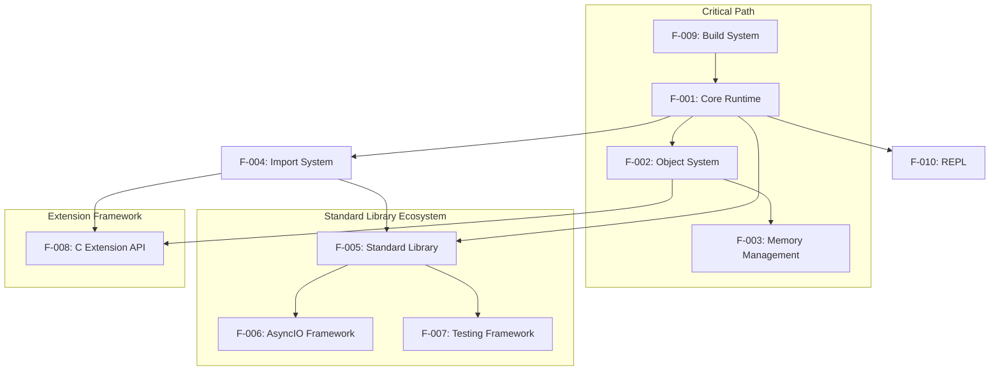
```mermaid
graph TD
    F009[F-009: Build System] --> F001[F-001: Core Runtime]
    F001 --> F002[F-002: Object System]
    F002 --> F003[F-003: Memory Management]
    F001 --> F004[F-004: Import System]
    F001 --> F010[F-010: REPL]
    
    F001 --> F005[F-005: Standard Library]
    F004 --> F005
    
    F005 --> F006[F-006: AsyncIO Framework]
    F005 --> F007[F-007: Testing Framework]
    
    F002 --> F008[F-008: C Extension API]
    F004 --> F008
    
    subgraph "Critical Path"
        F009
        F001
        F002
        F003
    end
    
    subgraph "Standard Library Ecosystem"
        F005
        F006
        F007
    end
    
    subgraph "Extension Framework"
        F008
    end
```

### 2.3.2 Integration Points

**Parser ↔ Compiler Integration**
- AST generation from PEG parser output
- Symbol table construction and scope analysis
- Bytecode generation with optimization passes
- Error reporting and source location tracking

**Object System ↔ Memory Manager Integration**
- Object allocation through PyObject_* APIs
- Garbage collection marking and sweeping
- Reference counting in all object operations
- Weak reference callback management

**Import System ↔ Runtime Integration**
- Module loading and initialization protocols
- Namespace management and module caching
- Bytecode compilation and caching (.pyc files)
- Extension module dynamic loading

**C API ↔ Core Runtime Integration**
- Python-to-C call interface with argument parsing
- C-to-Python callback mechanisms
- Exception handling across language boundaries
- Object lifetime management in extensions

### 2.3.3 Shared Components

**Error Handling Infrastructure**
- Used by: All features
- Components: Exception types, traceback formatting, error propagation
- Integration: Consistent error reporting across all subsystems

**Unicode and String Processing**
- Used by: F-002, F-005, F-004, F-008
- Components: PEP 393 string representation, encoding/decoding, text I/O
- Integration: Unified string handling across all text operations

**Threading and Concurrency Primitives**
- Used by: F-005, F-006, F-008
- Components: GIL management, thread state, synchronization primitives
- Integration: Thread-safe operations across all concurrent features

**Path and Filesystem Handling**
- Used by: F-004, F-005, F-009
- Components: Path resolution, directory traversal, file metadata
- Integration: Consistent filesystem semantics across platforms

## 2.4 IMPLEMENTATION CONSIDERATIONS

### 2.4.1 Core Runtime Constraints

**F-001: Python Language Runtime Engine**
- **Technical Constraints**: Must maintain backward compatibility with Python 3.x bytecode and semantics
- **Performance Requirements**: <10% performance overhead compared to previous stable release
- **Scalability Considerations**: Support for applications with GB-scale memory usage and millions of objects
- **Security Implications**: Secure execution environment with protection against code injection and sandbox escape
- **Maintenance Requirements**: Regular security updates, performance monitoring, and compatibility testing

### 2.4.2 Memory Management Optimization

**F-003: Automatic Memory Management System**
- **Technical Constraints**: Platform memory alignment requirements, virtual memory limitations
- **Performance Requirements**: O(1) small object allocation, <1ms garbage collection pauses for typical workloads
- **Scalability Considerations**: Handle multi-GB heaps efficiently with generational collection strategies
- **Security Implications**: Prevention of use-after-free vulnerabilities, buffer overflow protection
- **Maintenance Requirements**: Memory leak detection tools, fragmentation monitoring, allocator tuning

### 2.4.3 Concurrency and Performance

**F-006: AsyncIO Framework**  
- **Technical Constraints**: Platform-specific I/O multiplexing limits (file descriptor limits, completion port scaling)
- **Performance Requirements**: Support for 10,000+ concurrent connections with <1ms latency overhead
- **Scalability Considerations**: Efficient timer wheel implementation, connection pooling strategies
- **Security Implications**: Proper SSL/TLS integration, connection timeout handling, resource exhaustion protection
- **Maintenance Requirements**: Platform selector maintenance, protocol implementation updates

### 2.4.4 Extension Framework Stability

**F-008: C Extension API Framework**
- **Technical Constraints**: ABI stability requirements across minor Python releases
- **Performance Requirements**: Minimal call overhead between Python and C code (<10ns per call)
- **Scalability Considerations**: Support for thousands of loaded extension modules
- **Security Implications**: Extension module isolation, type safety verification, privilege separation
- **Maintenance Requirements**: API deprecation policy, compatibility testing, documentation updates

### 2.4.5 Build System Portability

**F-009: Cross-Platform Build Infrastructure**
- **Technical Constraints**: Support for cross-compilation, diverse toolchain versions, platform-specific features
- **Performance Requirements**: Incremental build support, parallel compilation utilization
- **Scalability Considerations**: Large-scale CI/CD integration, automated testing across platforms
- **Security Implications**: Reproducible builds, supply chain security, signed releases
- **Maintenance Requirements**: Toolchain updates, platform support lifecycle, build configuration testing

## 2.5 TRACEABILITY MATRIX

### 2.5.1 Requirements to Features Mapping

| Feature ID | Business Requirement | Technical Requirement | Test Coverage |
|------------|---------------------|----------------------|---------------|
| F-001 | Language standardization and reference implementation | Complete Python 3.15 syntax/semantics | test_grammar, test_syntax |
| F-002 | Dynamic programming paradigm support | Object model with inheritance and introspection | test_types, test_class |
| F-003 | Memory safety and automatic management | Reference counting with cycle detection | test_gc, test_memory |
| F-004 | Modular code organization | Import system with namespace support | test_import, test_importlib |
| F-005 | "Batteries included" functionality | Comprehensive standard library | test_* modules (200+) |
| F-006 | High-performance I/O operations | Async/await with event loops | test_asyncio |
| F-007 | Quality assurance and testing | Built-in unit testing framework | test_unittest |
| F-008 | Native code integration | Stable C API for extensions | test_capi |
| F-009 | Cross-platform deployment | Multi-platform build system | Buildbot CI |
| F-010 | Developer productivity | Interactive development environment | test_cmd_line |

### 2.5.2 Success Criteria Alignment

| Success Metric | Related Features | Measurement Method |
|----------------|------------------|-------------------|
| 100% language specification compliance | F-001, F-002, F-004 | Comprehensive test suite execution |
| >95% test success rate across platforms | All features | Automated CI/CD pipeline results |
| <5% performance degradation | F-001, F-003, F-006 | Benchmark regression testing |
| <30 days security patch response | F-001, F-005, F-008 | Security vulnerability response tracking |

#### References

**Technical Specification Sections**:
- `1.1 EXECUTIVE SUMMARY` - Project context and stakeholder requirements
- `1.2 SYSTEM OVERVIEW` - Architecture and technical approach
- `1.3 SCOPE` - Feature boundaries and implementation scope

**Key Implementation Files**:
- `Python/ceval.c` - Core bytecode interpreter loop and adaptive specialization
- `Objects/` - Complete built-in type system implementation
- `Lib/importlib/` - PEP 451 import system implementation
- `Modules/_io/` - Layered I/O stack with buffering and text handling
- `Lib/asyncio/` - Complete asynchronous I/O framework
- `Lib/unittest/` - Testing framework with discovery and mocking
- `Include/` - Stable C API headers for extension development
- `Parser/` - PEG parser implementation with AST generation
- `PCbuild/`, `Makefile.pre.in` - Multi-platform build system

**Configuration and Build Files**:
- `pyconfig.h.in` - Platform feature detection and configuration
- `.github/workflows/` - Continuous integration and automated testing
- `Tools/` - Development utilities and code generation tools

# 3. TECHNOLOGY STACK

## 3.1 PROGRAMMING LANGUAGES

### 3.1.1 Core Implementation Languages

**C (C11 Standard)**
CPython's core architecture relies on C as the primary implementation language, chosen for its performance characteristics, memory control capabilities, and broad platform compatibility. The C implementation encompasses:

- **Interpreter Core** (`Python/`): Stack-based virtual machine implementation with optimized bytecode execution, garbage collection, and memory management
- **Object System** (`Objects/`): Complete implementations of built-in types including integers, strings, lists, dictionaries, and functions with sophisticated inheritance and descriptor protocols
- **Extension Modules** (`Modules/`): Performance-critical standard library components including mathematical operations, I/O handling, and system interfaces
- **Parser Infrastructure** (`Parser/`): PEG-based parser with ASDL-generated Abstract Syntax Tree construction
- **Public C API** (`Include/`): Stable application programming interface enabling third-party extensions and embedding capabilities

**Python (3.11+)**
Python serves as the implementation language for high-level functionality where performance is less critical than maintainability:

- **Standard Library** (`Lib/`): Extensive collection of modules providing networking, file handling, data processing, and development utilities
- **Development Tooling** (`Tools/`): Code generators, build utilities, and maintenance scripts
- **Test Suite** (`Lib/test/`): Comprehensive testing infrastructure ensuring quality across all supported platforms

**Assembly Language**
Platform-specific assembly optimizations enhance performance in critical execution paths:

- **JIT Compilation Stencils**: Low-level code templates generated via LLVM for experimental just-in-time compilation features
- **Architecture-Specific Optimizations**: Performance enhancements for x86, ARM, and other supported processor architectures

### 3.1.2 Language Selection Rationale

The hybrid C/Python approach balances performance requirements with development efficiency. C provides the execution speed necessary for the interpreter core while Python enables rapid development and maintenance of higher-level functionality. This architectural decision supports CPython's dual role as both a high-performance runtime and a maintainable open-source project.

## 3.2 FRAMEWORKS & LIBRARIES

### 3.2.1 Build System Frameworks

**Autotools (Unix/Linux/macOS)**
CPython employs the GNU Autotools suite for cross-platform build configuration and compilation management:

- **Autoconf 2.71**: Configuration script generation from `configure.ac` source files
- **Automake Integration**: Makefile template processing through `Makefile.pre.in`
- **Cross-Platform Detection**: Automatic feature detection and platform-specific configuration adjustment
- **Dependency Management**: Library detection and linking configuration for external dependencies

**MSBuild (Windows)**
Microsoft's MSBuild system provides comprehensive Windows build support:

- **Visual Studio Integration**: Solution files (`PCbuild/pcbuild.sln`) supporting multiple Visual Studio versions
- **Project Configuration**: Detailed project files (`*.vcxproj`, `*.props`) managing compilation, linking, and packaging
- **Batch Orchestration**: Build automation scripts (`build.bat`, `env.bat`) coordinating multi-target builds
- **Installer Generation**: MSI package creation for Windows distribution

**Platform-Specific Build Systems**
Additional build frameworks support emerging platforms:

- **Gradle (Android)**: Android NDK cross-compilation with API level 21+ support
- **Xcode (iOS/macOS)**: XCFramework generation for iOS ecosystem integration
- **Emscripten (WebAssembly)**: Browser and Node.js target compilation for web deployment

### 3.2.2 Framework Selection Criteria

Build system selection prioritizes native platform integration and developer familiarity. Autotools provides mature Unix/Linux support with extensive configuration capabilities. MSBuild ensures optimal Windows integration with Visual Studio toolchains. Platform-specific systems like Gradle and Xcode enable native mobile application development workflows.

## 3.3 OPEN SOURCE DEPENDENCIES

### 3.3.1 Bundled C-Level Libraries

**Core System Libraries**
Critical functionality depends on carefully selected and bundled open-source libraries:

- **OpenSSL**: Cryptographic functions, secure communications, and certificate handling
- **libffi**: Foreign function interface enabling dynamic C library binding
- **SQLite**: Embedded database engine providing the `sqlite3` standard library module
- **zlib-ng**: High-performance data compression for archive formats and network protocols
- **expat**: XML parsing capabilities for configuration and data processing

**Compression and Archive Support**
Multiple compression algorithms ensure broad format compatibility:

- **bzip2**: Block-sorting compression for archive formats
- **XZ Utils**: LZMA compression for high-ratio data compression
- **zstd**: Fast compression algorithm optimizing for speed and compression ratio balance

**Specialized Libraries**
Domain-specific libraries enhance CPython's capabilities:

- **mpdecimal**: Arbitrary precision decimal arithmetic supporting financial and scientific applications
- **Tcl/Tk (8.x)**: Cross-platform GUI framework providing the `tkinter` standard library interface

### 3.3.2 Python Development Dependencies

**Static Analysis and Type Checking**
Quality assurance tools ensure code correctness and maintainability:

- **mypy (1.17.1)**: Static type checking with gradual typing support
- **Ruff**: High-performance linting and code formatting tool
- **Black**: Opinionated code formatter ensuring consistent style across the codebase

**Testing Framework Enhancement**
Advanced testing capabilities beyond the built-in `unittest` framework:

- **Hypothesis (6.135.26)**: Property-based testing enabling automated test case generation
- **Type Stubs**: Static type information for external libraries including `types-psutil` and `types-setuptools`

### 3.3.3 JIT Compilation Requirements

**LLVM Toolchain (Version 19)**
Experimental just-in-time compilation features require comprehensive LLVM infrastructure:

- **Clang Compiler**: Code generation and optimization for JIT compilation targets
- **llvm-readobj**: Object file analysis for code generation validation
- **llvm-objdump**: Disassembly capabilities supporting debugging and optimization verification

## 3.4 THIRD-PARTY SERVICES

### 3.4.1 Continuous Integration and Deployment

**GitHub Actions**
Primary CI/CD platform providing comprehensive automation:

- **Multi-Platform Testing**: Automated builds and tests across Windows, macOS, and Linux environments
- **Documentation Generation**: Automated Sphinx documentation builds with cross-reference validation
- **Code Quality Enforcement**: Integrated linting, formatting, and static analysis execution
- **Release Automation**: Automated package building and distribution coordination

**Azure Pipelines**
Windows-specific CI infrastructure complementing GitHub Actions:

- **Windows Test Matrix**: Comprehensive testing across multiple Windows versions and configurations
- **MSI Installer Builds**: Automated Windows installer package generation
- **Performance Benchmarking**: Specialized Windows performance testing and regression detection

### 3.4.2 Documentation and Communication Services

**Read the Docs**
Professional documentation hosting with advanced features:

- **Version Management**: Multiple documentation versions corresponding to Python releases
- **Preview Builds**: Pull request documentation previews enabling review workflow integration
- **Search Integration**: Full-text search across documentation versions and sections

**Mailgun**
Automated communication services supporting community engagement:

- **Issue Notifications**: New issue announcements to relevant stakeholder groups
- **Release Communications**: Automated email notifications for version releases and security updates

### 3.4.3 Security and Quality Services

**OSS-Fuzz**
Continuous security testing through automated fuzzing:

- **Vulnerability Detection**: Continuous fuzzing of critical CPython components
- **SARIF Reporting**: Standardized security analysis report generation for integration with development workflows

## 3.5 DATABASES & STORAGE

### 3.5.1 Embedded Database Systems

**SQLite Integration**
Comprehensive database support through embedded SQLite engine:

- **Standard Library Module**: Native `sqlite3` module providing full database functionality
- **Zero-Configuration Deployment**: Self-contained database engine requiring no separate server installation
- **ACID Compliance**: Full transaction support ensuring data integrity across concurrent operations

### 3.5.2 File-Based Persistence Solutions

**Python Serialization Protocols**
Multiple approaches to data persistence supporting diverse application requirements:

- **Pickle Protocol**: Binary serialization of Python objects with version compatibility management
- **Shelve Interface**: Dictionary-like persistent storage combining pickle with dbm backends
- **DBM Variants**: Multiple key-value storage implementations including `dbm.gnu`, `dbm.ndbm`, and `dbm.dumb`

**Configuration and Data Formats**
Built-in support for standard data interchange formats:

- **JSON Processing**: High-performance JSON parsing and generation
- **XML Handling**: Comprehensive XML processing through multiple parser interfaces
- **CSV Operations**: Robust comma-separated value file processing with dialect support

## 3.6 DEVELOPMENT & DEPLOYMENT

### 3.6.1 Development Toolchain

**Code Generation Infrastructure**
Automated code generation maintains consistency across large codebase:

- **Cases Generator** (`Tools/cases_generator`): Bytecode instruction case generation ensuring optimal interpreter dispatch
- **Argument Clinic** (`Tools/clinic`): C extension argument parsing code generation
- **PEG Parser Generator** (`Tools/peg_generator`): Parser infrastructure generation from grammar specifications

**Quality Assurance Tooling**
Comprehensive quality control through automated tooling:

- **Pre-commit Hooks**: Automated code quality enforcement through `.pre-commit-config.yaml` configuration
- **Documentation Validation**: Sphinx documentation linting through `sphinx-lint`
- **Schema Validation**: JSON configuration validation through `check-jsonschema`

### 3.6.2 Testing Infrastructure

**Multi-Platform Testing Support**
Extensive testing capabilities across diverse deployment environments:

- **Built-in unittest Framework**: Comprehensive test case infrastructure with discovery and execution management
- **Documentation Testing**: Automated `doctest` execution ensuring example code accuracy
- **GUI Testing Support**: Virtual framebuffer (`xvfb`) enabling automated GUI component testing
- **Property-Based Testing**: Hypothesis framework integration for comprehensive edge case coverage

### 3.6.3 Platform-Specific Deployment Support

**Mobile Platform Integration**
Native mobile application development support:

- **Android NDK Support**: Cross-compilation infrastructure for Android native development
- **iOS SDK Integration**: Xcode toolchain support for iOS application embedding
- **Universal Binary Generation**: Multi-architecture binary support for iOS deployment

**WebAssembly Deployment**
Modern web deployment capabilities:

- **Emscripten Integration**: Browser-based WebAssembly compilation with JavaScript interoperability
- **WASI Support**: Server-side WebAssembly deployment through WebAssembly System Interface
- **Multiple Runtime Support**: Compatibility with Wasmtime and Node.js WebAssembly runtimes

### 3.6.4 Containerization and Infrastructure

**Docker Integration**
Container-based development and deployment support:

- **Linux Build Environments**: Standardized build containers ensuring consistent compilation environments
- **Autoconf Container**: Specialized container (`ghcr.io/python/autoconf`) for build system requirements
- **CI Performance Optimization**: Container-based caching through `ccache` integration

**Package Management**
Comprehensive software distribution infrastructure:

- **pip Integration**: Built-in package installer through `ensurepip` module
- **Wheel Format Support**: Binary distribution format for efficient package installation
- **Virtual Environment**: Isolated package installation environments through `venv` module

### 3.6.5 Version Control and Project Management

**GitHub Integration**
Advanced project management through GitHub platform features:

- **Issue Tracking**: Structured issue management with automated labeling and assignment
- **Pull Request Automation**: Automated testing and validation workflows for code contributions
- **Project Boards**: Visual project management supporting release planning and feature tracking
- **Dependabot Integration**: Automated dependency update management for security and maintenance

#### References

#### Files Examined
- `.pre-commit-config.yaml` - Pre-commit hooks configuration for code quality enforcement
- `Misc/externals.spdx.json` - External C dependencies manifest with licensing information
- `Tools/requirements-dev.txt` - Python development dependencies specification
- `Tools/requirements-hypothesis.txt` - Property-based testing framework version specification

#### Folders Explored
- Repository root (``): Overall project structure and configuration
- `Tools/` - Development tooling and code generation utilities
- `.github/` - GitHub Actions workflows and repository configuration
- `PCbuild/` - Windows build system and Visual Studio project files
- `Modules/` - C extension module implementations
- `Android/` - Android platform support and NDK integration
- `iOS/` - iOS platform support and Xcode integration
- `Mac/` - macOS-specific build and packaging support
- `.azure-pipelines/` - Azure DevOps continuous integration configuration
- `Tools/wasm/` - WebAssembly deployment support and utilities
- `Tools/jit/` - Just-in-time compilation infrastructure and tooling
- `.github/workflows/` - GitHub Actions workflow definitions

#### Technical Specification Sections Referenced
- `1.1 EXECUTIVE SUMMARY` - Project overview and stakeholder context
- `1.2 SYSTEM OVERVIEW` - System architecture and component relationships

# 4. PROCESS FLOWCHART

## 4.1 CORE SYSTEM WORKFLOWS

### 4.1.1 Python Code Execution Pipeline

The Python code execution workflow represents the fundamental process by which Python source code is transformed into executable bytecode and executed within the CPython runtime environment. This pipeline consists of five distinct phases, each implementing specific validation rules and error handling mechanisms.

**Primary Execution Flow**

The main execution workflow follows a sequential pipeline that transforms source code through multiple compilation passes before reaching the bytecode evaluation loop. The process begins with PEG-based parsing implemented in `Parser/parser.c` and concludes with bytecode execution in the stack-based virtual machine within `Python/ceval.c`.

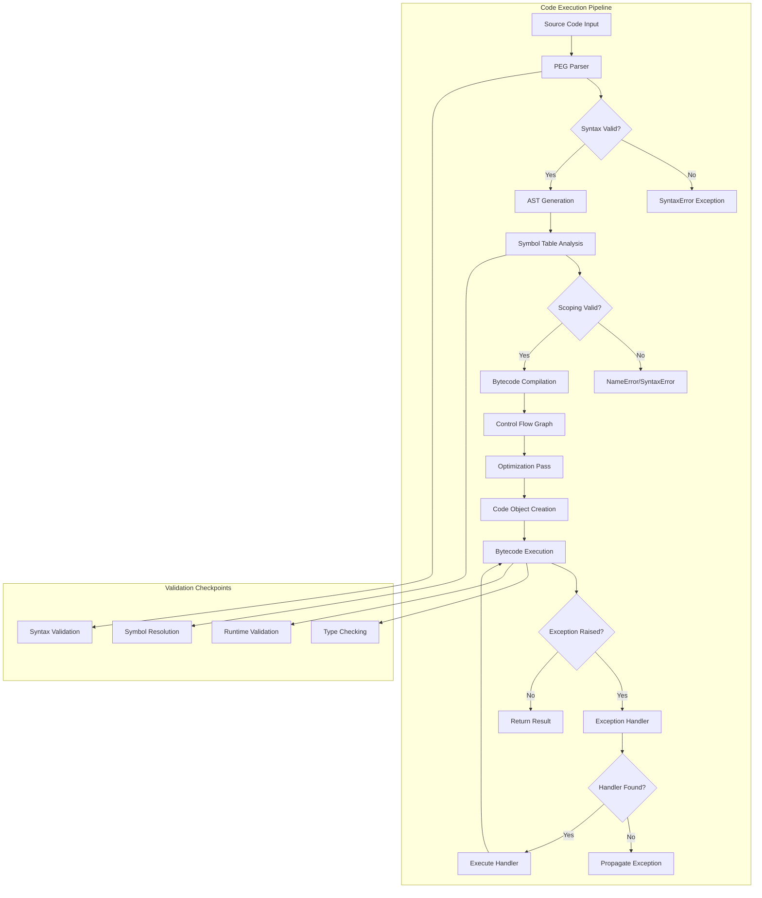
```mermaid
flowchart TD
    subgraph "Code Execution Pipeline"
        A[Source Code Input] --> B[PEG Parser]
        B --> C{Syntax Valid?}
        C -->|No| D[SyntaxError Exception]
        C -->|Yes| E[AST Generation]
        E --> F[Symbol Table Analysis]
        F --> G{Scoping Valid?}
        G -->|No| H[NameError/SyntaxError]
        G -->|Yes| I[Bytecode Compilation]
        I --> J[Control Flow Graph]
        J --> K[Optimization Pass]
        K --> L[Code Object Creation]
        L --> M[Bytecode Execution]
        M --> N{Exception Raised?}
        N -->|Yes| O[Exception Handler]
        N -->|No| P[Return Result]
        O --> Q{Handler Found?}
        Q -->|No| R[Propagate Exception]
        Q -->|Yes| S[Execute Handler]
        S --> M
    end
    
    subgraph "Validation Checkpoints"
        V1[Syntax Validation]
        V2[Symbol Resolution]
        V3[Type Checking]
        V4[Runtime Validation]
    end
    
    B --> V1
    F --> V2
    M --> V3
    M --> V4
```

**Compilation Phase Details**

The compilation process implements a multi-pass approach within `Python/compile.c` that ensures comprehensive optimization and validation. Pass 1 identifies future statements that affect compilation behavior. Pass 2 constructs the symbol table by analyzing variable scope and binding patterns. Pass 3 generates the initial instruction sequence from the AST. Pass 4 builds a control flow graph for optimization analysis. Pass 5 performs peephole optimizations and assembles the final bytecode.

**State Management During Execution**

The execution engine maintains several critical state components that persist across instruction boundaries. The evaluation stack holds intermediate computation results and function arguments. The call stack maintains activation records for nested function calls. The exception state tracks active exceptions and their handlers. The Global Interpreter Lock (GIL) ensures thread safety during bytecode execution.

### 4.1.2 Dynamic Module Import System

The import system workflow handles dynamic loading and initialization of Python modules, supporting namespace packages, import hooks, and multi-phase initialization protocols as specified in PEP 451. This system operates through a sophisticated finder/loader architecture that enables extensible import mechanisms.

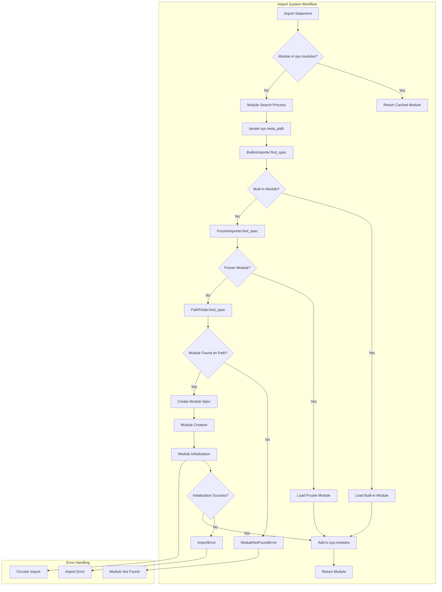
```mermaid
flowchart TD
    subgraph "Import System Workflow"
        A[Import Statement] --> B{Module in sys.modules?}
        B -->|Yes| C[Return Cached Module]
        B -->|No| D[Module Search Process]
        D --> E[Iterate sys.meta_path]
        E --> F[BuiltinImporter.find_spec]
        F --> G{Built-in Module?}
        G -->|Yes| H[Load Built-in Module]
        G -->|No| I[FrozenImporter.find_spec]
        I --> J{Frozen Module?}
        J -->|Yes| K[Load Frozen Module]
        J -->|No| L[PathFinder.find_spec]
        L --> M{Module Found on Path?}
        M -->|No| N[ModuleNotFoundError]
        M -->|Yes| O[Create Module Spec]
        O --> P[Module Creation]
        P --> Q[Module Initialization]
        Q --> R{Initialization Success?}
        R -->|No| S[ImportError]
        R -->|Yes| T[Add to sys.modules]
        T --> U[Return Module]
        H --> T
        K --> T
    end
    
    subgraph "Error Handling"
        E1[Module Not Found]
        E2[Import Error]
        E3[Circular Import]
    end
    
    N --> E1
    S --> E2
    Q --> E3
```

**Import Resolution Logic**

The module resolution process follows a hierarchical search strategy through registered meta path finders. The BuiltinImporter handles modules compiled into the Python executable. The FrozenImporter manages modules serialized into the executable during build time. The PathFinder implements filesystem-based module discovery using the standard import path resolution algorithm.

**Multi-Phase Initialization Protocol**

Modern extension modules utilize PEP 489's multi-phase initialization that separates module object creation from module state initialization. This approach enables proper subinterpreter support and improves import system reliability. Phase 1 creates the module object with basic metadata. Phase 2 executes module initialization code with full access to the module namespace.

### 4.1.3 Automatic Memory Management Workflow

The memory management system implements reference counting with generational garbage collection to provide automatic memory management without manual allocation overhead. This hybrid approach balances performance with comprehensive cycle detection capabilities.

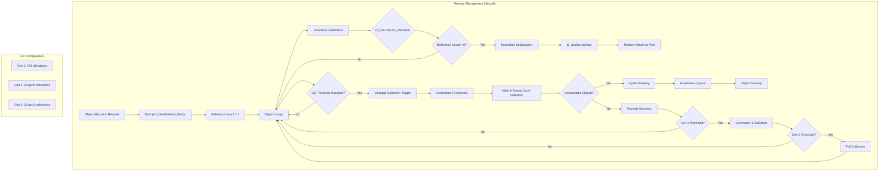
```mermaid
flowchart TD
    subgraph "Memory Management Lifecycle"
        A[Object Allocation Request] --> B[PyObject_New/PyMem_Malloc]
        B --> C[Reference Count = 1]
        C --> D[Object Usage]
        D --> E[Reference Operations]
        E --> F{Py_INCREF/Py_DECREF}
        F --> G{Reference Count = 0?}
        G -->|No| D
        G -->|Yes| H[Immediate Deallocation]
        H --> I[tp_dealloc Method]
        I --> J[Memory Return to Pool]
        
        D --> K{GC Threshold Reached?}
        K -->|Yes| L[Garbage Collection Trigger]
        K -->|No| D
        
        L --> M[Generation 0 Collection]
        M --> N[Mark & Sweep Cycle Detection]
        N --> O{Unreachable Objects?}
        O -->|Yes| P[Cycle Breaking]
        O -->|No| Q[Promote Survivors]
        P --> R[Finalization Queue]
        R --> S[Object Cleanup]
        Q --> T{Gen 1 Threshold?}
        T -->|Yes| U[Generation 1 Collection]
        T -->|No| D
        U --> V{Gen 2 Threshold?}
        V -->|Yes| W[Full Collection]
        V -->|No| D
        W --> D
    end
    
    subgraph "GC Configuration"
        GC1[Gen 0: 700 allocations]
        GC2[Gen 1: 10 gen0 collections]
        GC3[Gen 2: 10 gen1 collections]
    end
```

**Reference Counting Mechanics**

The reference counting system tracks object ownership through atomic increment and decrement operations. Every object maintains a reference count that reflects the number of references pointing to it. When the reference count reaches zero, the object becomes eligible for immediate deallocation through its type-specific destructor function.

**Generational Collection Strategy**

The garbage collector employs a generational hypothesis that assumes most objects die young. Generation 0 contains newly allocated objects and triggers collection after 700 allocations. Generation 1 holds objects that survived initial collection. Generation 2 contains long-lived objects collected less frequently. This strategy optimizes collection frequency based on object lifetime patterns.

## 4.2 INTEGRATION WORKFLOWS

### 4.2.1 Asynchronous I/O Event Loop System

The AsyncIO framework provides comprehensive asynchronous I/O capabilities through an event loop architecture that integrates platform-specific I/O multiplexing mechanisms. This system enables high-performance concurrent operations essential for modern network applications.

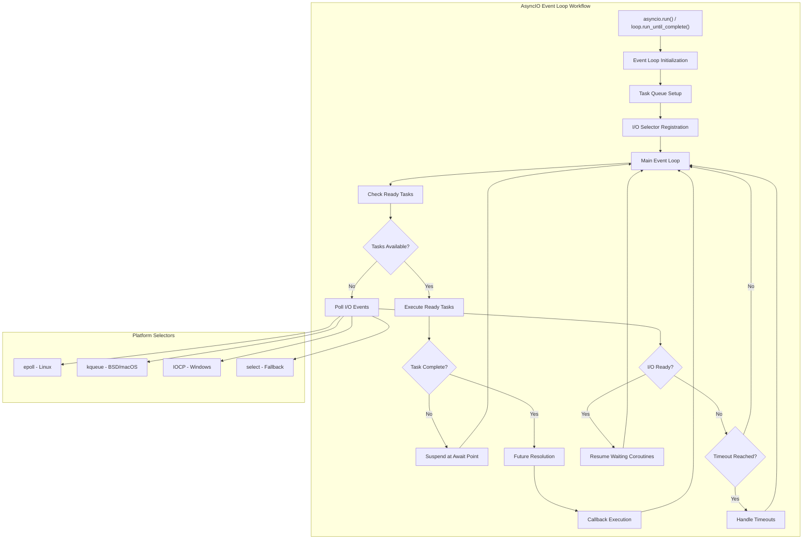
```mermaid
flowchart TD
subgraph "AsyncIO Event Loop Workflow"
    A["asyncio.run() / loop.run_until_complete()"] --> B[Event Loop Initialization]
    B --> C[Task Queue Setup]
    C --> D["I/O Selector Registration"]
    D --> E[Main Event Loop]
    E --> F[Check Ready Tasks]
    F --> G{Tasks Available?}
    G -->|Yes| H[Execute Ready Tasks]
    G -->|No| I["Poll I/O Events"]
    H --> J{Task Complete?}
    J -->|No| K[Suspend at Await Point]
    J -->|Yes| L[Future Resolution]
    L --> M[Callback Execution]
    K --> E
    M --> E
    I --> N{I/O Ready?}
    N -->|Yes| O[Resume Waiting Coroutines]
    N -->|No| P{Timeout Reached?}
    P -->|Yes| Q[Handle Timeouts]
    P -->|No| E
    O --> E
    Q --> E
end

subgraph "Platform Selectors"
    S1["epoll - Linux"]
    S2["kqueue - BSD/macOS"]
    S3["IOCP - Windows"]
    S4["select - Fallback"]
end

I --> S1
I --> S2
I --> S3
I --> S4
```

**Event Loop State Management**

The event loop maintains multiple queues to manage different types of scheduled work. The ready queue contains tasks prepared for immediate execution. The I/O wait queue holds coroutines suspended on I/O operations. The timer queue manages scheduled callbacks and delayed task execution. The event loop coordinates between these queues to ensure efficient task scheduling.

**Coroutine Lifecycle Management**

Coroutines progress through distinct lifecycle states during execution. The PENDING state indicates initial creation before execution begins. The RUNNING state represents active execution within the event loop. The DONE state signals completion with either a result value or exception. The CANCELLED state indicates explicit cancellation before completion.

### 4.2.2 Subprocess Management Workflow

The subprocess system enables secure process creation and management across different operating systems while providing comprehensive I/O redirection and communication capabilities.

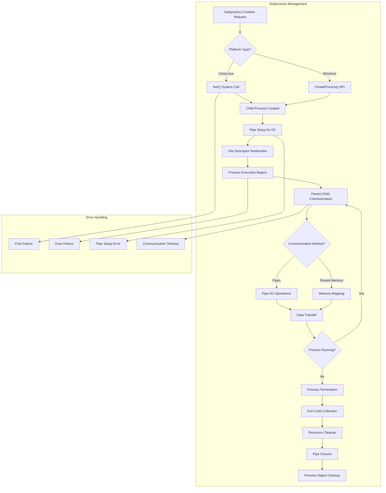
```mermaid
flowchart TD
subgraph "Subprocess Management"
    A[Subprocess Creation Request] --> B{Platform Type?}
    B -->|Unix/Linux| C["fork() System Call"]
    B -->|Windows| D["CreateProcess() API"]
    C --> E[Child Process Created]
    D --> E
    E --> F[Pipe Setup for I/O]
    F --> G[File Descriptor Redirection]
    G --> H[Process Execution Begins]
    H --> I[Parent-Child Communication]
    I --> J{Communication Method?}
    J -->|Pipes| K[Pipe I/O Operations]
    J -->|Shared Memory| L[Memory Mapping]
    K --> M[Data Transfer]
    L --> M
    M --> N{Process Running?}
    N -->|Yes| I
    N -->|No| O[Process Termination]
    O --> P[Exit Code Collection]
    P --> Q[Resource Cleanup]
    Q --> R[Pipe Closure]
    R --> S[Process Object Cleanup]
end

subgraph "Error Handling"
    E1[Fork Failure]
    E2[Exec Failure]
    E3[Pipe Setup Error]
    E4[Communication Timeout]
end

C --> E1
H --> E2
F --> E3
I --> E4
```

**Process Communication Patterns**

The subprocess system supports multiple communication mechanisms between parent and child processes. Pipe-based communication provides stream-oriented data transfer through stdin, stdout, and stderr redirection. Shared memory communication enables high-performance data sharing for computationally intensive operations. Socket-based communication allows network-style inter-process communication.

**Resource Management and Cleanup**

Proper resource management ensures that subprocess creation does not leak system resources. File descriptor management tracks all opened pipes and closes them appropriately. Process handle cleanup prevents zombie processes on Unix systems and handle leaks on Windows. Memory cleanup deallocates communication buffers and process control structures.

## 4.3 ERROR HANDLING AND RECOVERY WORKFLOWS

### 4.3.1 Exception Propagation and Handling

The exception handling system provides comprehensive error propagation with traceback information and recovery mechanisms that integrate seamlessly with Python's exception model.

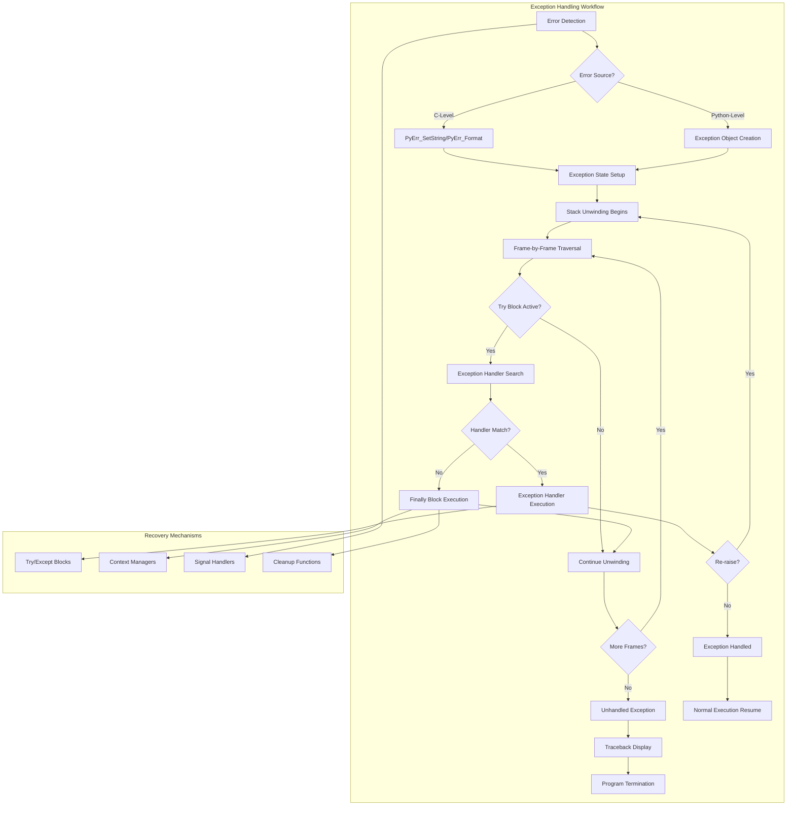
```mermaid
flowchart TD
    subgraph "Exception Handling Workflow"
        A[Error Detection] --> B{Error Source?}
        B -->|C-Level| C[PyErr_SetString/PyErr_Format]
        B -->|Python-Level| D[Exception Object Creation]
        C --> E[Exception State Setup]
        D --> E
        E --> F[Stack Unwinding Begins]
        F --> G[Frame-by-Frame Traversal]
        G --> H{Try Block Active?}
        H -->|No| I[Continue Unwinding]
        H -->|Yes| J[Exception Handler Search]
        I --> K{More Frames?}
        K -->|Yes| G
        K -->|No| L[Unhandled Exception]
        L --> M[Traceback Display]
        M --> N[Program Termination]
        J --> O{Handler Match?}
        O -->|No| P[Finally Block Execution]
        O -->|Yes| Q[Exception Handler Execution]
        P --> I
        Q --> R{Re-raise?}
        R -->|Yes| F
        R -->|No| S[Exception Handled]
        S --> T[Normal Execution Resume]
    end
    
    subgraph "Recovery Mechanisms"
        R1[Try/Except Blocks]
        R2[Context Managers]
        R3[Signal Handlers]
        R4[Cleanup Functions]
    end
    
    Q --> R1
    P --> R2
    A --> R3
    P --> R4
```

**Traceback Construction Process**

The traceback construction process builds a comprehensive record of the execution path leading to an exception. Each frame in the call stack contributes filename, line number, function name, and local variable information. The traceback object maintains references to frame objects and their associated code objects to enable detailed error reporting.

**Exception Chaining and Context**

Python's exception chaining mechanism preserves the original exception context when raising new exceptions. The `__cause__` attribute links explicitly chained exceptions using the `raise ... from ...` syntax. The `__context__` attribute automatically captures exceptions that occur during exception handling. This chaining provides complete error context for debugging and error analysis.

### 4.3.2 System Recovery and Resilience

The system implements multiple recovery mechanisms to handle different classes of errors and maintain operational stability during adverse conditions.

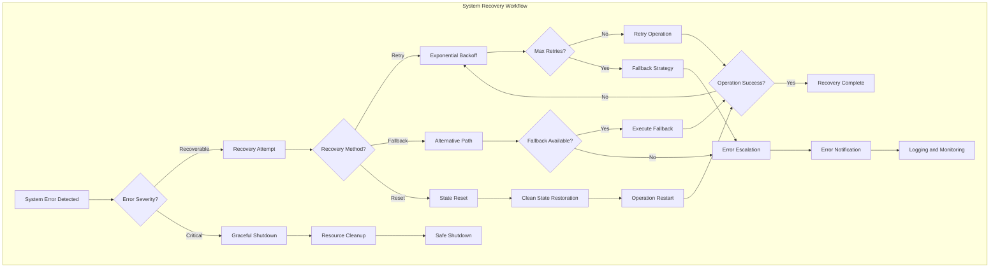
```mermaid
flowchart TD
    subgraph "System Recovery Workflow"
        A[System Error Detected] --> B{Error Severity?}
        B -->|Recoverable| C[Recovery Attempt]
        B -->|Critical| D[Graceful Shutdown]
        C --> E{Recovery Method?}
        E -->|Retry| F[Exponential Backoff]
        E -->|Fallback| G[Alternative Path]
        E -->|Reset| H[State Reset]
        F --> I{Max Retries?}
        I -->|No| J[Retry Operation]
        I -->|Yes| K[Fallback Strategy]
        J --> L{Operation Success?}
        L -->|Yes| M[Recovery Complete]
        L -->|No| F
        G --> N{Fallback Available?}
        N -->|Yes| O[Execute Fallback]
        N -->|No| P[Error Escalation]
        O --> L
        H --> Q[Clean State Restoration]
        Q --> R[Operation Restart]
        R --> L
        K --> P
        P --> S[Error Notification]
        S --> T[Logging and Monitoring]
        D --> U[Resource Cleanup]
        U --> V[Safe Shutdown]
    end
```

**Retry Mechanisms and Backoff Strategies**

The system implements exponential backoff algorithms for transient error recovery. Initial retry attempts occur with minimal delay to handle temporary conditions quickly. Subsequent retries increase delay exponentially to reduce system load during persistent error conditions. Maximum retry limits prevent infinite retry loops that could exhaust system resources.

**Fallback Process Implementation**

Fallback processes provide alternative execution paths when primary mechanisms fail. Import system fallbacks enable module loading through alternative paths when preferred locations are unavailable. Network operation fallbacks switch between different connection methods and protocols. Memory allocation fallbacks utilize alternative allocation strategies when preferred allocators fail.

## 4.4 STATE MANAGEMENT AND TRANSACTION WORKFLOWS

### 4.4.1 Interpreter State and Session Management

The interpreter maintains complex state information across multiple scopes and execution contexts, requiring careful coordination between different system components.

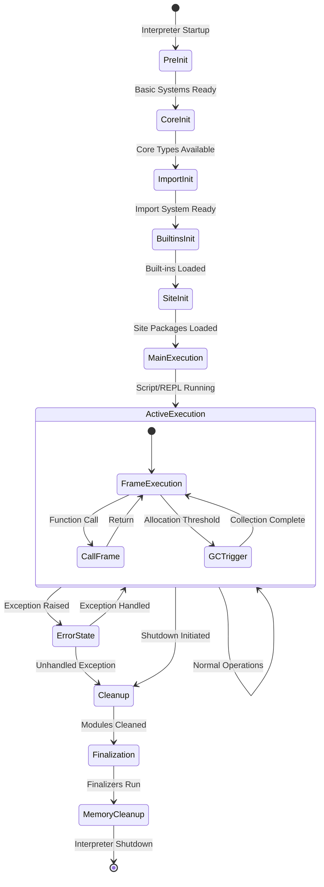
```mermaid
stateDiagram-v2
    [*] --> PreInit: Interpreter Startup
    PreInit --> CoreInit: Basic Systems Ready
    CoreInit --> ImportInit: Core Types Available
    ImportInit --> BuiltinsInit: Import System Ready
    BuiltinsInit --> SiteInit: Built-ins Loaded
    SiteInit --> MainExecution: Site Packages Loaded
    MainExecution --> ActiveExecution: Script/REPL Running
    ActiveExecution --> ActiveExecution: Normal Operations
    ActiveExecution --> ErrorState: Exception Raised
    ErrorState --> ActiveExecution: Exception Handled
    ErrorState --> Cleanup: Unhandled Exception
    ActiveExecution --> Cleanup: Shutdown Initiated
    Cleanup --> Finalization: Modules Cleaned
    Finalization --> MemoryCleanup: Finalizers Run
    MemoryCleanup --> [*]: Interpreter Shutdown
    
    state ActiveExecution {
        [*] --> FrameExecution
        FrameExecution --> CallFrame: Function Call
        CallFrame --> FrameExecution: Return
        FrameExecution --> GCTrigger: Allocation Threshold
        GCTrigger --> FrameExecution: Collection Complete
    }
```

**Global State Coordination**

The interpreter coordinates multiple global state components that must remain synchronized during execution. The `sys.modules` dictionary maintains the import cache with atomic update semantics. Thread state objects track per-thread execution context and exception information. The garbage collector maintains generation statistics and collection thresholds across all threads.

**Transaction Boundaries and Atomicity**

Certain operations within the interpreter maintain transactional semantics to ensure consistency. Import operations complete atomically to prevent partially initialized modules from being visible. Garbage collection operations suspend all threads to maintain consistent heap state. Signal handler registration and execution follow atomic patterns to prevent race conditions.

### 4.4.2 Module and Namespace State Management

Module state management ensures proper initialization, caching, and cleanup of Python modules throughout their lifecycle.

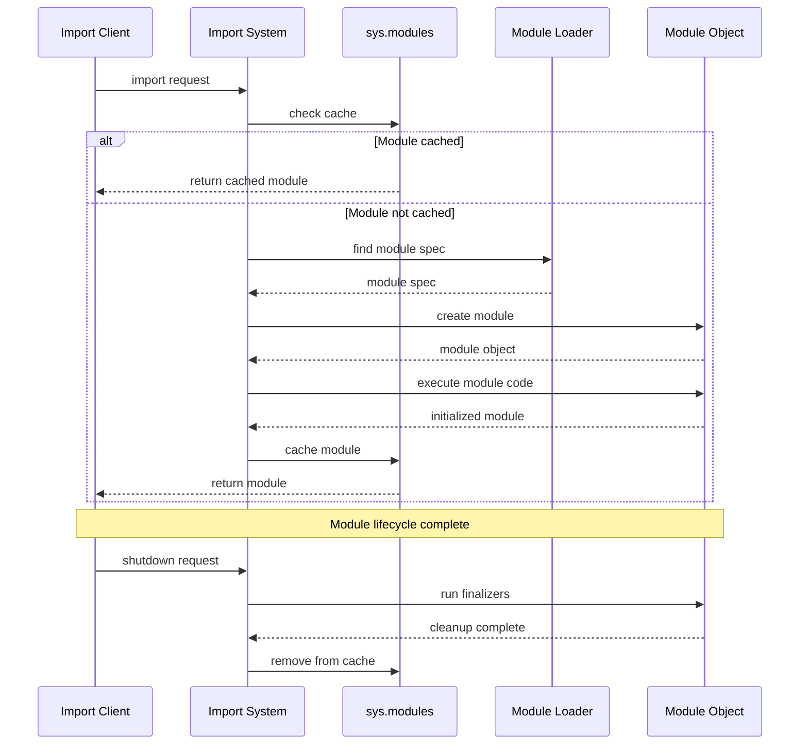
```mermaid
sequenceDiagram
    participant Client as Import Client
    participant Import as Import System
    participant Cache as sys.modules
    participant Loader as Module Loader
    participant Module as Module Object
    
    Client->>Import: import request
    Import->>Cache: check cache
    alt Module cached
        Cache-->>Client: return cached module
    else Module not cached
        Import->>Loader: find module spec
        Loader-->>Import: module spec
        Import->>Module: create module
        Module-->>Import: module object
        Import->>Module: execute module code
        Module-->>Import: initialized module
        Import->>Cache: cache module
        Cache-->>Client: return module
    end
    
    Note over Client,Module: Module lifecycle complete
    
    Client->>Import: shutdown request
    Import->>Module: run finalizers
    Module-->>Import: cleanup complete
    Import->>Cache: remove from cache
```

**Module Initialization Sequencing**

Module initialization follows a carefully orchestrated sequence that ensures dependencies are available before dependent modules execute. The import system builds a dependency graph during the import process and initializes modules in topologically sorted order. Circular dependencies are detected and handled through careful module state tracking.

**Namespace Isolation and Sharing**

Each module maintains an isolated namespace that prevents unintended symbol conflicts while enabling controlled sharing through explicit import mechanisms. Global namespace modifications are isolated to individual modules. Built-in namespace sharing provides common functionality across all modules. Per-module namespace cleanup ensures proper resource deallocation during interpreter shutdown.

## 4.5 DEVELOPMENT AND BUILD WORKFLOWS

### 4.5.1 Continuous Integration and Testing Pipeline

The development workflow integrates comprehensive testing and validation processes to ensure code quality and platform compatibility.

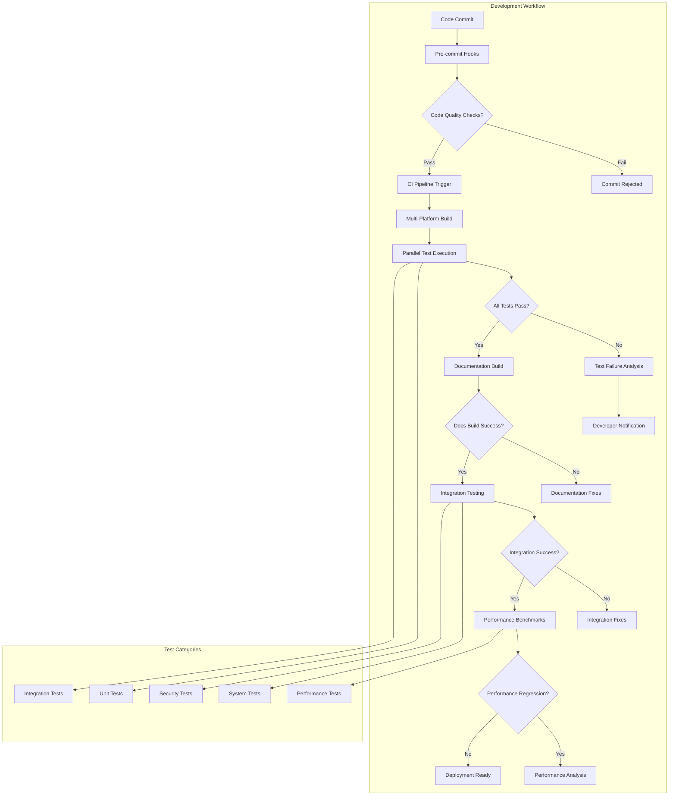
```mermaid
flowchart TD
    subgraph "Development Workflow"
        A[Code Commit] --> B[Pre-commit Hooks]
        B --> C{Code Quality Checks?}
        C -->|Fail| D[Commit Rejected]
        C -->|Pass| E[CI Pipeline Trigger]
        E --> F[Multi-Platform Build]
        F --> G[Parallel Test Execution]
        G --> H{All Tests Pass?}
        H -->|No| I[Test Failure Analysis]
        H -->|Yes| J[Documentation Build]
        I --> K[Developer Notification]
        J --> L{Docs Build Success?}
        L -->|No| M[Documentation Fixes]
        L -->|Yes| N[Integration Testing]
        N --> O{Integration Success?}
        O -->|No| P[Integration Fixes]
        O -->|Yes| Q[Performance Benchmarks]
        Q --> R{Performance Regression?}
        R -->|Yes| S[Performance Analysis]
        R -->|No| T[Deployment Ready]
    end
    
    subgraph "Test Categories"
        T1[Unit Tests]
        T2[Integration Tests]
        T3[System Tests]
        T4[Performance Tests]
        T5[Security Tests]
    end
    
    G --> T1
    G --> T2
    N --> T3
    Q --> T4
    N --> T5
```

**Test Discovery and Execution Strategy**

The testing framework employs automated test discovery that recursively searches for test modules following naming conventions. Test execution occurs in parallel across multiple processes to maximize resource utilization. Test isolation ensures that individual test failures do not affect other tests in the suite.

**Build Validation and Quality Gates**

Each build passes through multiple quality gates that verify different aspects of the system. Compilation validation ensures all source files compile successfully across target platforms. Static analysis validation identifies potential security vulnerabilities and code quality issues. Runtime validation executes comprehensive test suites to verify behavioral correctness.

### 4.5.2 Cross-Platform Build and Deployment

The build system coordinates compilation and packaging across diverse target platforms while maintaining consistent behavior and optimal performance characteristics.

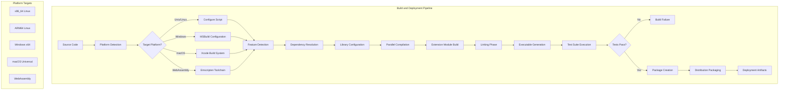
```mermaid
flowchart TD
    subgraph "Build and Deployment Pipeline"
        A[Source Code] --> B[Platform Detection]
        B --> C{Target Platform?}
        C -->|Unix/Linux| D[Configure Script]
        C -->|Windows| E[MSBuild Configuration]
        C -->|macOS| F[Xcode Build System]
        C -->|WebAssembly| G[Emscripten Toolchain]
        D --> H[Feature Detection]
        E --> H
        F --> H
        G --> H
        H --> I[Dependency Resolution]
        I --> J[Library Configuration]
        J --> K[Parallel Compilation]
        K --> L[Extension Module Build]
        L --> M[Linking Phase]
        M --> N[Executable Generation]
        N --> O[Test Suite Execution]
        O --> P{Tests Pass?}
        P -->|No| Q[Build Failure]
        P -->|Yes| R[Package Creation]
        R --> S[Distribution Packaging]
        S --> T[Deployment Artifacts]
    end
    
    subgraph "Platform Targets"
        P1[x86_64 Linux]
        P2[ARM64 Linux]
        P3[Windows x64]
        P4[macOS Universal]
        P5[WebAssembly]
    end
```

**Cross-Compilation Support**

The build system supports cross-compilation scenarios where the build platform differs from the target platform. Cross-compilation requires careful handling of build-time tools and target-specific libraries. The configure script detects cross-compilation scenarios and adjusts build parameters accordingly. Platform-specific optimizations are applied based on target architecture characteristics.

**Deployment Artifact Management**

The deployment process generates platform-specific artifacts optimized for each target environment. Binary distributions include pre-compiled extension modules and optimized executables. Source distributions provide portable builds that compile on target systems. Documentation artifacts include comprehensive API documentation and installation guides.

#### References

The process flowcharts documented in this section are based on comprehensive analysis of the following CPython implementation files and directories:

- `Python/compile.c` - Multi-pass compilation pipeline implementation
- `Python/ceval.c` - Bytecode evaluation loop and execution engine  
- `Python/pylifecycle.c` - Interpreter initialization and shutdown sequences
- `Python/pythonrun.c` - Main execution coordination and error handling
- `Python/import.c` - Core import system implementation
- `Python/errors.c` - Exception propagation and error handling
- `Python/gc.c` - Generational garbage collection implementation
- `Python/traceback.c` - Traceback generation and formatting
- `Modules/main.c` - Main entry point and command-line processing
- `Objects/exceptions.c` - Exception type implementations and protocols
- `Lib/importlib/_bootstrap.py` - Import system bootstrap implementation
- `Lib/importlib/_bootstrap_external.py` - Filesystem-based import support
- `Lib/asyncio/base_events.py` - Event loop implementation and coordination
- `Lib/subprocess.py` - Process creation and management
- `Lib/unittest/main.py` - Testing framework entry point and orchestration
- `Parser/parser.c` - PEG parser implementation
- `configure.ac` - Build system configuration and platform detection
- Technical Specification Sections: 1.2 SYSTEM OVERVIEW, 2.1 FEATURE CATALOG, 2.2 FUNCTIONAL REQUIREMENTS TABLE, 2.4 IMPLEMENTATION CONSIDERATIONS

# 5. SYSTEM ARCHITECTURE

## 5.1 HIGH-LEVEL ARCHITECTURE

### 5.1.1 System Overview

CPython implements a **hybrid interpreter architecture** that serves as the reference implementation for the Python programming language. The system employs a sophisticated multi-layered design combining performance-critical components implemented in C with high-level functionality developed in Python.

**Overall Architecture Style and Rationale**

The architecture follows a **layered interpreter pattern** with clear separation between compilation, execution, and runtime services. This design prioritizes:

- **Portability**: Support across diverse operating systems and hardware architectures through conditional compilation and platform abstraction
- **Performance**: Stack-based virtual machine with optimized bytecode execution and adaptive specialization capabilities  
- **Extensibility**: Stable C API enabling third-party extensions and embedding in larger applications
- **Maintainability**: Hybrid C/Python implementation balancing execution speed with development productivity

**Key Architectural Principles**

The system adheres to fundamental design principles that guide implementation decisions:

1. **Reference Counting Primary**: Immediate memory reclamation with predictable behavior, supplemented by cyclic garbage collection
2. **Bytecode Abstraction**: Platform-independent bytecode format enabling consistent execution across environments
3. **Dynamic Nature**: Runtime type system supporting duck typing, dynamic attribute access, and metaprogramming capabilities
4. **Exception-Safe Design**: Comprehensive exception propagation mechanisms ensuring resource cleanup and error recovery

**System Boundaries and Major Interfaces**

CPython operates within well-defined boundaries that separate core interpreter functionality from external systems:

- **Language Boundary**: Python source code compilation to bytecode through PEG parser and AST-based compiler
- **Platform Boundary**: Operating system interfaces abstracted through POSIX-compliant APIs and Windows-specific implementations
- **Extension Boundary**: Stable C API providing controlled access to internal data structures and runtime services
- **Process Boundary**: Inter-process communication through standard Unix/Windows mechanisms including pipes, sockets, and shared memory

### 5.1.2 Core Components Table

| Component Name | Primary Responsibility | Key Dependencies | Integration Points | Critical Considerations |
|----------------|----------------------|------------------|-------------------|----------------------|
| **Parser Infrastructure** | PEG-based source parsing, tokenization, AST generation | Grammar definitions, ASDL schemas | Compiler, Error reporting | Memory-efficient AST construction, Unicode support |
| **Bytecode Compiler** | AST to bytecode transformation with optimization passes | Parser, Symbol table | Interpreter core, Import system | Code generation efficiency, optimization correctness |
| **Virtual Machine Core** | Stack-based bytecode execution with adaptive optimization | Object system, Memory manager | All runtime components | Thread safety, performance optimization |
| **Object System** | Built-in type implementations, inheritance, descriptors | Memory manager, C API | Virtual machine, Extensions | Type consistency, MRO algorithm correctness |

### 5.1.3 Data Flow Description

**Primary Data Flows Between Components**

The system processes data through well-defined flows that maintain separation of concerns while enabling efficient communication between subsystems.

The **compilation flow** begins with source code tokenization in the PEG-based parser, producing a token stream that feeds the parser's recursive descent algorithm. The parser generates Abstract Syntax Tree nodes using ASDL-generated constructors, creating a tree structure representing the program's logical organization. Symbol table analysis identifies variable scope and binding patterns, enabling the compiler to generate appropriate bytecode instructions. The multi-pass compiler transforms AST nodes into bytecode instructions, performs peephole optimizations, and assembles final code objects containing executable bytecode with metadata.

The **execution flow** starts with code object loading into the stack-based virtual machine. Frame objects maintain execution context including local variables, evaluation stack, and exception state. The bytecode evaluation loop dispatches instructions to specialized handlers, manipulating the evaluation stack and invoking object operations. Method calls create new frames with argument passing through the stack, while exception handling unwinds the call stack searching for appropriate handlers.

**Integration Patterns and Protocols**

Component integration relies on established protocols that ensure loose coupling while maintaining performance:

- **Reference Protocol**: Consistent reference counting across all objects with atomic increment/decrement operations
- **Descriptor Protocol**: Standardized attribute access through `__get__`, `__set__`, and `__delete__` methods
- **Iterator Protocol**: Uniform iteration interface enabling `for` loop functionality across container types  
- **Context Manager Protocol**: Resource management through `__enter__` and `__exit__` methods

**Data Transformation Points**

Critical transformation points maintain data integrity while adapting between different representation formats:

1. **Source to AST**: Text parsing with Unicode normalization and syntax validation
2. **AST to Bytecode**: Semantic analysis with scope resolution and optimization application  
3. **Bytecode to Objects**: Runtime evaluation with type checking and memory allocation
4. **Python to C**: Argument conversion following calling convention protocols

**Key Data Stores and Caches**

The system maintains several caches and persistent stores that optimize performance:

- **Module Cache** (`sys.modules`): Loaded module dictionary preventing redundant imports
- **Interned Strings**: Deduplicated string objects reducing memory usage for common identifiers  
- **Method Resolution Cache**: Type method lookup results cached for attribute access optimization
- **Bytecode Cache**: Compiled `.pyc` files stored on disk avoiding recompilation overhead

### 5.1.4 External Integration Points

| System Name | Integration Type | Data Exchange Pattern | Protocol/Format | SLA Requirements |
|-------------|-----------------|----------------------|-----------------|------------------|
| **Operating Systems** | Native API Binding | System call invocation | POSIX/Windows APIs | Platform-specific error handling |
| **OpenSSL Library** | Dynamic Library Linking | Function call interface | C API with OpenSSL structures | Certificate validation, Encryption performance |
| **SQLite Database** | Embedded Database | SQL query execution | SQLite C API | ACID transaction guarantees |
| **Network Stack** | Socket API Integration | BSD socket operations | TCP/UDP protocols | Connection timeout handling |

## 5.2 COMPONENT DETAILS

### 5.2.1 Parser Subsystem (`Parser/`)

**Purpose and Responsibilities**

The parser subsystem transforms Python source code into Abstract Syntax Trees through a PEG-based parsing approach that replaced the traditional LALR(1) parser in Python 3.9. This component handles tokenization, syntax validation, and AST node construction while maintaining comprehensive error reporting capabilities.

**Technologies and Frameworks Used**

- **PEG Parser Generator**: Custom parser generator creating C code from grammar specifications in `Grammar/python.gram`
- **ASDL (Abstract Syntax Description Language)**: Schema language defining AST node structure in `Parser/Python.asdl`
- **Multi-backend Tokenizer**: Supports file, string, and readline input sources with Unicode handling

**Key Interfaces and APIs**

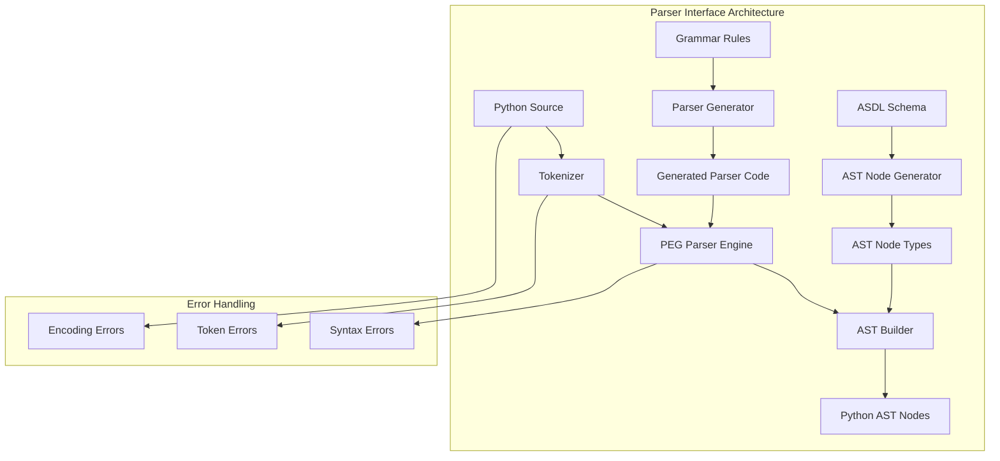
```mermaid
graph TD
    subgraph "Parser Interface Architecture"
        A[Python Source] --> B[Tokenizer]
        B --> C[PEG Parser Engine]
        C --> D[AST Builder]
        D --> E[Python AST Nodes]
        
        F[Grammar Rules] --> G[Parser Generator]
        G --> H[Generated Parser Code]
        H --> C
        
        I[ASDL Schema] --> J[AST Node Generator]
        J --> K[AST Node Types]
        K --> D
    end
    
    subgraph "Error Handling"
        L[Syntax Errors]
        M[Token Errors]  
        N[Encoding Errors]
    end
    
    C --> L
    B --> M
    A --> N
```

**Data Persistence Requirements**

The parser operates primarily in memory but interfaces with filesystem resources for module loading and grammar file access. No persistent state is maintained between parsing operations, ensuring thread safety and reentrancy.

**Scaling Considerations**

Parser performance scales linearly with source code size, with optimizations including:
- Incremental tokenization reducing memory overhead for large files
- Error recovery mechanisms preventing cascade failures
- Memory pool allocation minimizing garbage collection pressure

### 5.2.2 Bytecode Compiler (`Python/compile.c`)

**Purpose and Responsibilities**

The bytecode compiler transforms Abstract Syntax Trees into optimized bytecode instructions suitable for execution in the stack-based virtual machine. This multi-pass compiler implements symbol table analysis, code generation, control flow optimization, and final bytecode assembly.

**Technologies and Frameworks Used**

- **Control Flow Graph**: Intermediate representation enabling optimization across basic blocks
- **Peephole Optimization**: Pattern matching for instruction sequence improvements
- **Symbol Table Analysis**: Scope resolution and variable binding classification
- **Exception Table Generation**: Zero-cost exception handling metadata

**Key Interfaces and APIs**

The compiler provides a clean interface between AST processing and bytecode generation:

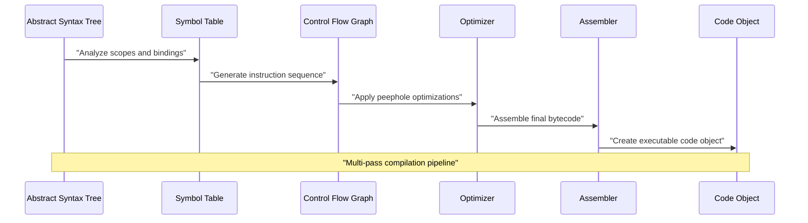
```mermaid
sequenceDiagram
    participant AST as Abstract Syntax Tree
    participant SYM as Symbol Table
    participant CFG as Control Flow Graph
    participant OPTIMIZER as Optimizer
    participant ASM as Assembler
    participant CODE as Code Object

    AST->>SYM: "Analyze scopes and bindings"
    SYM->>CFG: "Generate instruction sequence"
    CFG->>OPTIMIZER: "Apply peephole optimizations"
    OPTIMIZER->>ASM: "Assemble final bytecode"
    ASM->>CODE: "Create executable code object"

    Note over AST,CODE: "Multi-pass compilation pipeline"
```

**Data Persistence Requirements**

Compiled bytecode is cached as `.pyc` files in `__pycache__` directories, using the importlib caching mechanism. Cache invalidation relies on source file modification time and hash comparison.

**Scaling Considerations**

Compilation time remains proportional to source complexity with optimizations targeting common patterns. Memory usage is bounded through arena allocation and immediate release of intermediate representations.

### 5.2.3 Virtual Machine Core (`Python/ceval.c`)

**Purpose and Responsibilities**

The virtual machine core implements CPython's stack-based bytecode interpreter with advanced features including adaptive specialization, frame management, and exception handling. This component represents the heart of Python execution, processing over 500 distinct bytecode instructions.

**Technologies and Frameworks Used**

- **Adaptive Specialization (PEP 659)**: Runtime bytecode optimization based on type feedback
- **Inline Caches**: Specialized instruction variants for common operation patterns
- **Stack Frame Management**: Efficient activation record handling with embedded frame support
- **Computed Goto**: Optimized instruction dispatch using GCC's label-as-value extension

**Key Interfaces and APIs**

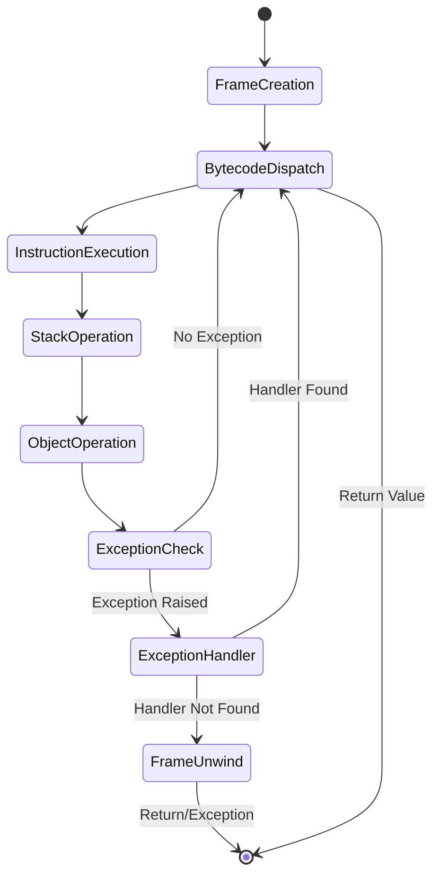
```mermaid
stateDiagram-v2
    [*] --> FrameCreation
    FrameCreation --> BytecodeDispatch
    BytecodeDispatch --> InstructionExecution
    InstructionExecution --> StackOperation
    StackOperation --> ObjectOperation
    ObjectOperation --> ExceptionCheck
    ExceptionCheck --> BytecodeDispatch: No Exception
    ExceptionCheck --> ExceptionHandler: Exception Raised
    ExceptionHandler --> FrameUnwind: Handler Not Found
    ExceptionHandler --> BytecodeDispatch: Handler Found
    FrameUnwind --> [*]: Return/Exception
    BytecodeDispatch --> [*]: Return Value
```

**Data Persistence Requirements**

The virtual machine maintains no persistent state between executions, operating entirely through stack-allocated frames and heap-allocated objects managed by the garbage collector.

**Scaling Considerations**

Performance optimizations include:
- Instruction specialization reducing dispatch overhead
- Frame object recycling minimizing allocation costs
- Stack overflow detection preventing runaway recursion
- Thread-local state management supporting concurrent execution

### 5.2.4 Object System Implementation (`Objects/`)

**Purpose and Responsibilities**

The object system provides complete implementations of all built-in Python types, supporting the dynamic nature of Python through runtime type creation, multiple inheritance, and descriptor protocols. This subsystem handles type checking, method resolution, and attribute access patterns.

**Technologies and Frameworks Used**

- **C3 Linearization**: Method Resolution Order algorithm ensuring consistent inheritance behavior  
- **Descriptor Protocol**: Attribute access customization through `__get__`, `__set__`, `__delete__` methods
- **Weak Reference Support**: Non-owning references with callback notification capabilities
- **Memory Layout Optimization**: Specialized representations for common types (e.g., PEP 393 strings)

**Key Interfaces and APIs**

The object system interfaces are accessed through standardized protocols:

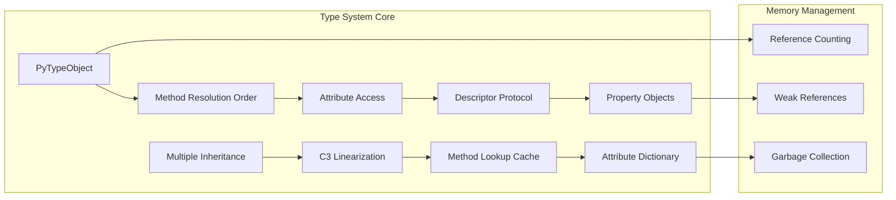
```mermaid
graph LR
    subgraph "Type System Core"
        A[PyTypeObject] --> B[Method Resolution Order]
        B --> C[Attribute Access]
        C --> D[Descriptor Protocol]
        D --> E[Property Objects]
        
        F[Multiple Inheritance] --> G[C3 Linearization]
        G --> H[Method Lookup Cache]
        H --> I[Attribute Dictionary]
    end
    
    subgraph "Memory Management"
        J[Reference Counting]
        K[Weak References]
        L[Garbage Collection]
    end
    
    A --> J
    E --> K
    I --> L
```

**Data Persistence Requirements**

Object instances maintain state in heap-allocated structures with garbage collection managing lifetime. No persistent storage is required beyond the object lifecycle.

**Scaling Considerations**

Type system performance optimizations include:
- Method lookup caching reducing resolution overhead
- Attribute dictionary sharing for instances of the same type
- Small integer and string interning reducing memory fragmentation
- Weak reference implementation enabling observer patterns without circular dependencies

## 5.3 TECHNICAL DECISIONS

### 5.3.1 Architecture Style Decisions and Tradeoffs

**Interpreter Architecture Choice**

| Decision Factor | Rationale | Tradeoffs | Alternative Considered |
|----------------|-----------|-----------|----------------------|
| Stack-based VM | Simpler instruction set, easier debugging | Lower peak performance than register-based | Register-based VM (Lua-style) |
| Reference Counting Primary | Predictable memory behavior, immediate cleanup | Reference cycle handling complexity | Tracing GC only |
| Bytecode Compilation | Platform independence, optimization opportunities | Compilation overhead | Direct AST interpretation |
| Hybrid C/Python Implementation | Performance/maintainability balance | Complex build process | Pure Python implementation |

**Communication Pattern Choices**

The system employs multiple communication patterns optimized for different interaction types:

- **Direct Function Calls**: Internal C function invocation for maximum performance within core components
- **C API Protocol**: Structured interface for extension modules with stable ABI guarantees
- **Python Protocol Integration**: Duck typing support through `__special__` method dispatch
- **Exception-based Control Flow**: Unified error handling across C and Python boundaries

### 5.3.2 Data Storage Solution Rationale

**Module Caching Strategy**

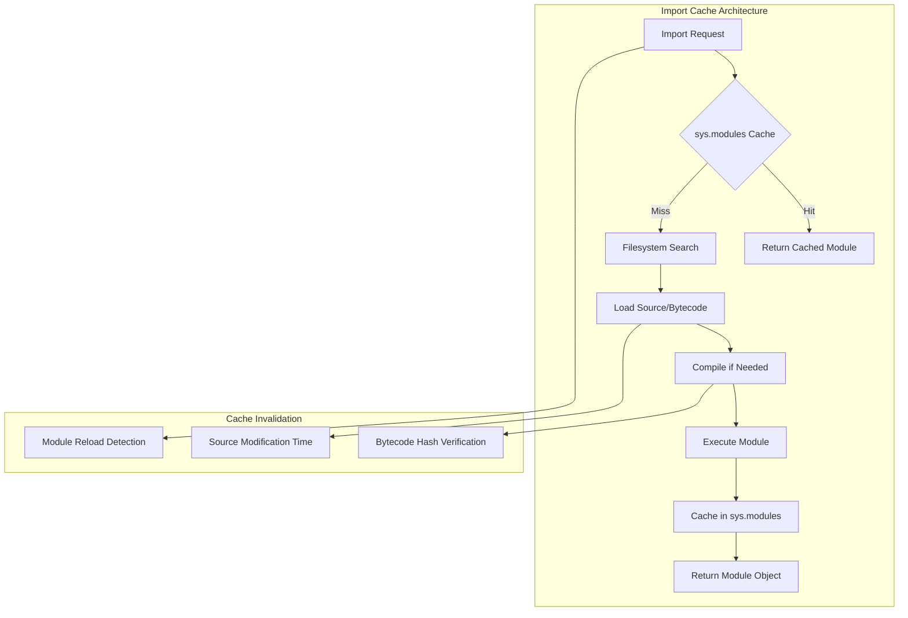
```mermaid
flowchart TD
    subgraph "Import Cache Architecture"
        A[Import Request] --> B{sys.modules Cache}
        B -->|Hit| C[Return Cached Module]
        B -->|Miss| D[Filesystem Search]
        D --> E[Load Source/Bytecode]
        E --> F[Compile if Needed]
        F --> G[Execute Module]
        G --> H[Cache in sys.modules]
        H --> I[Return Module Object]
    end
    
    subgraph "Cache Invalidation"
        J[Source Modification Time]
        K[Bytecode Hash Verification]
        L[Module Reload Detection]
    end
    
    E --> J
    F --> K
    A --> L
```

**Memory Organization Decisions**

The memory management strategy balances immediate reclamation with cycle detection:

- **Reference Counting**: Primary mechanism providing deterministic cleanup for most objects
- **Generational GC**: Supplementary cycle detection with age-based collection frequency
- **Small Object Allocator**: Arena-based allocation for objects under 512 bytes reducing fragmentation
- **Interning Strategy**: String and small integer caching optimizing common value access

### 5.3.3 Security Mechanism Selection

**Capability-based Security Model**

CPython deliberately avoids built-in sandboxing capabilities, instead relying on operating system security mechanisms and careful API design:

| Security Layer | Implementation Approach | Limitations | Mitigation Strategy |
|----------------|------------------------|-------------|-------------------|
| Input Validation | Parser-enforced syntax rules | Limited semantic checking | Static analysis tools |
| Buffer Safety | Safe string/buffer APIs in C | Legacy API compatibility | Deprecation warnings |
| Resource Limits | Recursion and memory limits | No comprehensive quotas | External process management |
| Code Execution | Import system controls | Dynamic code evaluation | Restricted execution environments |

## 5.4 CROSS-CUTTING CONCERNS

### 5.4.1 Monitoring and Observability Approach

**Execution Tracing Infrastructure**

CPython provides comprehensive introspection capabilities through standardized tracing hooks:

- **sys.settrace()**: Line-by-line execution monitoring with call/return/exception events
- **sys.setprofile()**: Function-level profiling with timing and call count information  
- **Frame Inspection**: Runtime stack frame access through the inspect module
- **Exception Tracing**: Complete traceback construction with source location preservation

**Performance Monitoring Strategy**

Built-in performance monitoring focuses on actionable metrics:

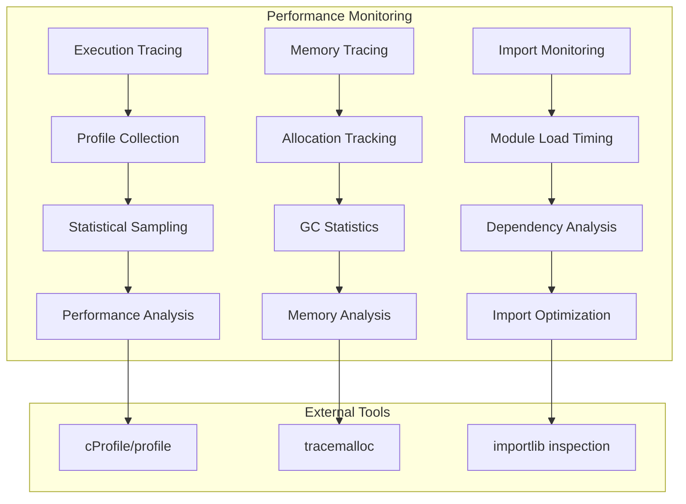
```mermaid
graph TD
    subgraph "Performance Monitoring"
        A[Execution Tracing] --> B[Profile Collection]
        B --> C[Statistical Sampling]
        C --> D[Performance Analysis]
        
        E[Memory Tracing] --> F[Allocation Tracking]
        F --> G[GC Statistics]
        G --> H[Memory Analysis]
        
        I[Import Monitoring] --> J[Module Load Timing]
        J --> K[Dependency Analysis]
        K --> L[Import Optimization]
    end
    
    subgraph "External Tools"
        M[cProfile/profile]
        N[tracemalloc] 
        O[importlib inspection]
    end
    
    D --> M
    H --> N
    L --> O
```

### 5.4.2 Error Handling Patterns

**Exception Propagation Architecture**

The error handling system provides unified exception management across C and Python code boundaries:

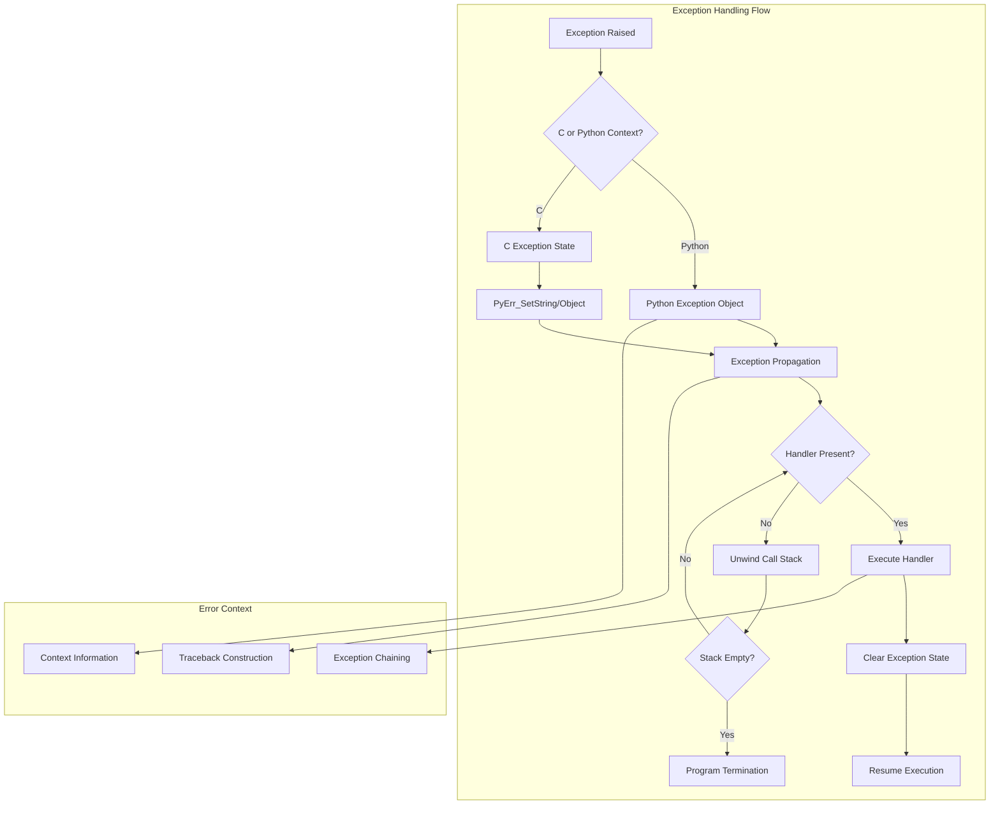
```mermaid
flowchart TD
    subgraph "Exception Handling Flow"
        A[Exception Raised] --> B{C or Python Context?}
        B -->|Python| C[Python Exception Object]
        B -->|C| D[C Exception State]
        C --> E[Exception Propagation]
        D --> F[PyErr_SetString/Object]
        F --> E
        E --> G{Handler Present?}
        G -->|Yes| H[Execute Handler]
        G -->|No| I[Unwind Call Stack]
        H --> J[Clear Exception State]
        I --> K{Stack Empty?}
        K -->|No| G
        K -->|Yes| L[Program Termination]
        J --> M[Resume Execution]
    end
    
    subgraph "Error Context"
        N[Traceback Construction]
        O[Exception Chaining] 
        P[Context Information]
    end
    
    E --> N
    H --> O
    C --> P
```

**Recovery Mechanisms**

The system supports multiple recovery patterns:
- **Try/Except Blocks**: Structured exception handling with type-specific handlers
- **Context Managers**: Guaranteed cleanup through `__enter__`/`__exit__` protocols  
- **Finally Clauses**: Unconditional cleanup execution regardless of exception state
- **Signal Handlers**: Asynchronous interrupt handling with Python callback integration

### 5.4.3 Authentication and Authorization Framework

**Extension Security Model**

CPython's security model focuses on controlled access rather than comprehensive sandboxing:

- **C API Capabilities**: Extension modules have full system access but require compilation trust
- **Import System Controls**: Module loading restrictions through custom import hooks
- **Namespace Isolation**: Module-level namespace separation preventing unintended access
- **Resource Management**: Operating system-level resource controls for process isolation

### 5.4.4 Performance Requirements and SLAs

**Execution Performance Targets**

| Performance Category | Target Metric | Measurement Method | Acceptable Range |
|---------------------|---------------|-------------------|-----------------|
| Startup Time | Cold start to ready state | Process execution time | <100ms for basic scripts |
| Memory Overhead | Interpreter base footprint | RSS measurement | <20MB without loaded modules |
| Bytecode Execution | Instructions per second | PyPerformance benchmark | <5% regression between versions |
| GC Pause Time | Maximum collection pause | GC timing hooks | <10ms for typical workloads |

**Scalability Characteristics**

The architecture supports various scaling patterns:
- **Vertical Scaling**: Single-threaded performance optimization through adaptive specialization
- **Process-based Parallelism**: Multi-process execution avoiding GIL limitations
- **Asynchronous I/O**: Event loop integration for I/O-bound workload scaling
- **Extension Integration**: Native code execution for compute-intensive operations

### 5.4.5 Disaster Recovery Procedures

**Runtime Recovery Mechanisms**

CPython implements several recovery strategies for handling runtime failures:

- **Segmentation Fault Handling**: Signal handler installation with traceback generation
- **Stack Overflow Detection**: Recursion limit enforcement preventing stack exhaustion
- **Memory Exhaustion Recovery**: Graceful degradation with MemoryError exception raising
- **Import Failure Recovery**: Module loading error handling with partial import states

**Development and Maintenance Recovery**

- **Test Suite Validation**: Comprehensive testing ensuring regression detection
- **Incremental Build Support**: Partial compilation reducing development cycle time
- **Debug Build Options**: Enhanced error checking and diagnostic information
- **Platform-specific Fallbacks**: Alternative implementations for system-specific failures

#### References

**Technical Specification Sections Retrieved:**
- `1.2 SYSTEM OVERVIEW` - High-level architecture context and system positioning
- `2.2 FUNCTIONAL REQUIREMENTS TABLE` - Detailed functional requirements the architecture must support  
- `4.1 CORE SYSTEM WORKFLOWS` - Execution pipeline and memory management workflows
- `3.1 PROGRAMMING LANGUAGES` - Implementation language choices and rationale

**Repository Structure Analyzed:**
- `` (Repository root) - Configuration files and primary source directories
- `Python/` (Core interpreter) - Compiler, evaluation loop, and runtime services
- `Objects/` (Object system) - Built-in type implementations and object model
- `Modules/` (C extensions) - Standard library C modules and system interfaces
- `Include/` (Public C API) - Header files and API definitions
- `Parser/` (PEG parser) - Parsing infrastructure and AST generation
- `Tools/` (Build tools) - Code generators and development utilities
- `Lib/` (Standard library) - Python modules and packages
- `PCbuild/` (Windows build) - MSBuild infrastructure
- `InternalDocs/` (Documentation) - Internal architecture documentation

# 6. SYSTEM COMPONENTS DESIGN

## 6.1 CORE SERVICES ARCHITECTURE

### 6.1.1 Architecture Assessment

**Core Services Architecture is not applicable for the CPython system.** 

CPython implements a **monolithic interpreter architecture** with tightly integrated components that communicate through direct function calls and shared memory within a single process space. The system does not employ microservices, distributed architecture, or distinct service components that would require the patterns and mechanisms typically associated with core services architecture.

### 6.1.2 Architecture Style Rationale

#### 6.1.2.1 Monolithic Design Approach

The CPython interpreter follows a **hybrid interpreter architecture** utilizing a **layered interpreter pattern** as documented in the High-Level Architecture specification. This design choice prioritizes:

- **Performance Optimization**: Direct C function calls eliminate network communication overhead and serialization costs
- **Tight Integration**: Components directly access each other's data structures for maximum efficiency
- **Deterministic Behavior**: Single-process execution provides predictable resource management and debugging capabilities
- **Portability**: Unified compilation target supporting diverse operating systems and hardware architectures

#### 6.1.2.2 Component Communication Patterns

Instead of service boundaries, CPython employs the following communication mechanisms:

| Communication Type | Implementation | Purpose | Performance Characteristics |
|-------------------|----------------|---------|---------------------------|
| **Direct Function Calls** | Internal C function invocation | Core component integration | Minimal overhead, maximum performance |
| **C API Protocol** | Structured interface with stable ABI | Extension module integration | Controlled access, binary compatibility |
| **Python Protocol Integration** | Duck typing through `__special__` methods | Object system uniformity | Runtime polymorphism support |
| **Exception-based Control Flow** | Unified error handling across boundaries | Error propagation and recovery | Zero-cost when no exceptions occur |

#### 6.1.2.3 System Boundary Analysis

The interpreter operates within well-defined boundaries that separate core functionality from external systems:

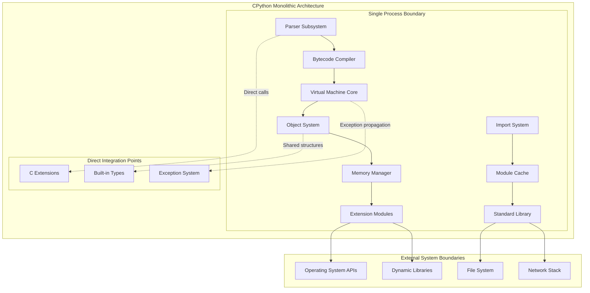
```mermaid
graph TB
    subgraph "CPython Monolithic Architecture"
        subgraph "Single Process Boundary"
            A[Parser Subsystem] --> B[Bytecode Compiler]
            B --> C[Virtual Machine Core]
            C --> D[Object System]
            D --> E[Memory Manager]
            E --> F[Extension Modules]
            
            G[Import System] --> H[Module Cache]
            H --> I[Standard Library]
        end
        
        subgraph "Direct Integration Points"
            J[C Extensions]
            K[Built-in Types]
            L[Exception System]
        end
        
        A -.->|Direct calls| J
        D -.->|Shared structures| K
        C -.->|Exception propagation| L
    end
    
    subgraph "External System Boundaries"
        M[Operating System APIs]
        N[Dynamic Libraries]
        O[File System]
        P[Network Stack]
    end
    
    F --> M
    F --> N
    I --> O
    I --> P
```

### 6.1.3 Scalability Approach

#### 6.1.3.1 Vertical Scaling Strategy

CPython achieves scalability through optimization within the single-process architecture:

- **Adaptive Specialization (PEP 659)**: Runtime bytecode optimization based on type feedback reduces instruction execution overhead
- **Inline Caches**: Specialized instruction variants cache method resolution and attribute access patterns
- **Memory Pool Allocation**: Arena-based allocation for small objects reduces fragmentation and allocation costs
- **String and Integer Interning**: Deduplicated common values minimize memory usage and comparison operations

#### 6.1.3.2 Parallelism Models

The system supports concurrent execution through established patterns that work within the monolithic architecture:

| Parallelism Type | Implementation | Use Case | Limitations |
|-----------------|----------------|----------|-------------|
| **Process-based** | multiprocessing module | CPU-intensive workloads | Inter-process communication overhead |
| **Thread-based** | threading module with GIL | I/O-bound operations | Global Interpreter Lock constraints |
| **Asynchronous** | asyncio event loop | Network and I/O operations | Single-threaded execution model |
| **Extension-based** | C extensions releasing GIL | Compute-intensive tasks | Development complexity |

#### 6.1.3.3 Resource Management

```mermaid
flowchart TD
    subgraph "Resource Scaling Architecture"
        A[Memory Management] --> B[Reference Counting]
        B --> C[Cyclic GC]
        A --> D[Object Pools]
        D --> E[Arena Allocation]
        
        F[Execution Scaling] --> G[Bytecode Cache]
        G --> H[Module Cache]
        F --> I[Import System]
        I --> J[Lazy Loading]
        
        K[I/O Scaling] --> L[Buffer Management]
        L --> M[Async I/O]
        K --> N[File Caching]
        N --> O[Memory Mapping]
    end
    
    subgraph "Performance Monitoring"
        P[sys.settrace] --> Q[Execution Profiling]
        R[tracemalloc] --> S[Memory Profiling]
        T[GC Statistics] --> U[Collection Analysis]
    end
    
    C --> T
    M --> P
    E --> R
```

### 6.1.4 Resilience and Recovery

#### 6.1.4.1 Error Handling Mechanisms

CPython implements comprehensive error handling within its monolithic architecture:

- **Exception Propagation**: Unified exception management across C and Python code boundaries with complete traceback preservation
- **Signal Handler Integration**: Asynchronous interrupt handling with Python callback integration for graceful shutdown
- **Memory Exhaustion Recovery**: Graceful degradation with MemoryError exception raising when system memory limits are reached
- **Import Failure Recovery**: Module loading error handling with partial import state management

#### 6.1.4.2 Runtime Recovery Strategies

| Recovery Type | Implementation | Trigger Conditions | Recovery Actions |
|--------------|----------------|-------------------|------------------|
| **Stack Overflow** | Recursion limit enforcement | Excessive function call depth | RecursionError with stack unwind |
| **Segmentation Fault** | Signal handler with traceback | Memory access violations | Diagnostic output and process termination |
| **Keyboard Interrupt** | SIGINT signal handling | User interruption (Ctrl+C) | KeyboardInterrupt exception raising |
| **Module Import Errors** | Import system error handling | Missing or corrupted modules | ImportError with fallback mechanisms |

#### 6.1.4.3 System State Management

The monolithic architecture maintains system state through:

- **Module Cache Consistency**: sys.modules dictionary ensuring loaded modules remain accessible across execution
- **Exception State Tracking**: Thread-local exception information preserving error context during propagation  
- **Frame Stack Management**: Call stack maintenance with proper cleanup during exception unwinding
- **Resource Cleanup**: Context manager protocols and finally clauses guaranteeing resource release

### 6.1.5 Alternative Architecture Considerations

#### 6.1.5.1 Why Services Architecture Was Not Adopted

The CPython development team chose the monolithic approach over services-based architecture for several critical reasons:

- **Performance Requirements**: Interpreter performance demands minimal overhead between components, which network communication would compromise
- **State Sharing**: Extensive shared state (object references, memory pools, exception contexts) makes distributed architecture impractical
- **Debugging Complexity**: Services architecture would significantly complicate debugging and error diagnosis in an interpreter context
- **Deployment Simplicity**: Single executable deployment model supports embedded scenarios and simplifies distribution

#### 6.1.5.2 Integration with Service-Based Applications

While CPython itself is monolithic, it provides comprehensive support for building service-oriented applications:

- **HTTP Server Libraries**: Built-in support for creating web servers and REST APIs through http.server and third-party frameworks
- **Network Protocol Support**: Socket-level programming capabilities for custom service communication
- **Process Management**: subprocess and multiprocessing modules for orchestrating service deployments
- **Serialization Frameworks**: JSON, pickle, and other serialization formats for service data exchange

### 6.1.6 Summary

CPython's monolithic interpreter architecture represents a deliberate design choice optimized for performance, simplicity, and maintainability. The system achieves scalability and resilience through established patterns within a single-process model rather than distributed services architecture. This approach aligns with the interpreter's core mission of providing a high-performance, portable Python runtime environment.

The architecture successfully supports the development of service-based applications while maintaining the performance and reliability characteristics required of a programming language interpreter.

#### References

**Technical Specification Sections Retrieved:**
- `5.1 HIGH-LEVEL ARCHITECTURE` - System architecture style, component organization, and integration patterns
- `5.2 COMPONENT DETAILS` - Detailed component implementations and communication mechanisms  
- `5.3 TECHNICAL DECISIONS` - Architecture choices, communication patterns, and design tradeoffs
- `5.4 CROSS-CUTTING CONCERNS` - Scalability approaches, performance targets, and recovery mechanisms

**Repository Structure Analyzed:**
- `Python/` - Core interpreter implementation with compiler, evaluator, and runtime services
- `Objects/` - Object system implementation demonstrating tight component integration  
- `Modules/` - C extension modules showing internal API usage rather than service interfaces
- `Parser/` - Parsing infrastructure integrated through direct function calls
- `Include/` - Public C API headers defining component interfaces, not service boundaries

## 6.2 DATABASE DESIGN

### 6.2.1 Database Design Context

CPython, as the reference implementation of the Python programming language, **does not employ traditional database systems for its core operation**. Instead, CPython **provides comprehensive database capabilities** through its standard library modules, enabling Python applications to implement robust data persistence solutions.

This section documents the database functionality architecture that CPython delivers to Python developers, covering three primary database subsystems: the SQLite3 module for relational database operations, the DBM family for key-value persistence, and the Shelve module for object serialization storage.

### 6.2.2 Database Module Architecture

#### 6.2.2.1 SQLite3 Integration System

**Architecture Overview**

The SQLite3 module implements a dual-layer architecture combining pure Python DB-API 2.0 compliance with high-performance C extension backend:

```mermaid
graph TB
    subgraph "SQLite3 Module Architecture"
        subgraph "Python Layer (Lib/sqlite3/)"
            A[dbapi2.py<br/>DB-API 2.0 Implementation]
            B[__main__.py<br/>Interactive Shell]
            C[dump.py<br/>SQL Dump/Restore]
            D[_completer.py<br/>Tab Completion]
        end
        
        subgraph "C Extension Layer (Modules/_sqlite/)"
            E[connection.c<br/>Connection Management]
            F[cursor.c<br/>SQL Execution]
            G[statement.c<br/>Statement Caching]
            H[blob.c<br/>BLOB I/O]
            I[row.c<br/>Result Processing]
            J[microprotocols.c<br/>Type Adaptation]
        end
        
        subgraph "SQLite Engine"
            K[SQLite Library<br/>≥ 3.15.2]
        end
    end
    
    A --> E
    F --> K
    G --> K
    H --> K
    E --> K
    I --> K
    J --> E
```

**Schema Design Capabilities**

| Feature Category | Implementation | Purpose |
|-----------------|----------------|---------|
| Transaction Control | Autocommit modes (legacy, enabled, disabled) | Flexible transaction management |
| Isolation Levels | DEFERRED, IMMEDIATE, EXCLUSIVE | Concurrency control options |
| Type System | Adapter/Converter registry with microprotocols | Python-SQL type mapping |

#### 6.2.2.2 DBM Storage Family

**Architecture Overview**

The DBM module family implements a facade pattern with automatic backend selection and format detection:

```mermaid
graph LR
    subgraph "DBM Module Architecture"
        A[DBM Facade<br/>__init__.py] --> B{Backend Selection}
        
        B --> C[sqlite3.py<br/>SQLite-backed DBM]
        B --> D[gnu.py<br/>GDBM Wrapper]
        B --> E[ndbm.py<br/>NDBM Wrapper]
        B --> F[dumb.py<br/>Pure Python Fallback]
        
        subgraph "SQLite DBM Schema"
            G[Table: Dict<br/>key BLOB UNIQUE NOT NULL<br/>value BLOB NOT NULL]
        end
        
        subgraph "Dumb DBM Files"
            H[.dir file<br/>Text Index]
            I[.dat file<br/>Binary Storage]
            J[.bak file<br/>Backup Rotation]
        end
        
        C --> G
        F --> H
        F --> I
        F --> J
    end
```

**Data Storage Patterns**

| Backend | Storage Format | Index Strategy | Performance Characteristics |
|---------|---------------|----------------|---------------------------|
| sqlite3 | Single SQLite table | Primary key on BLOB | ACID compliance, WAL mode |
| dumb | .dir/.dat file pair | In-memory index | Block-aligned storage |
| gnu/ndbm | Native DBM format | Hash-based indexing | Platform-dependent optimization |

#### 6.2.2.3 Shelve Object Persistence

**Architecture Overview**

The Shelve module provides dictionary-like persistent object storage through serialization:

```mermaid
sequenceDiagram
    participant APP as Python Application
    participant SHELF as Shelve Module
    participant PICKLE as Pickle Protocol
    participant DBM as DBM Backend
    participant STORAGE as File Storage

    APP->>SHELF: store_object(key, value)
    SHELF->>PICKLE: serialize(value)
    PICKLE->>SHELF: serialized_data
    SHELF->>DBM: store(key.encode('utf-8'), serialized_data)
    DBM->>STORAGE: write_to_file()
    
    APP->>SHELF: retrieve_object(key)
    SHELF->>DBM: fetch(key.encode('utf-8'))
    DBM->>STORAGE: read_from_file()
    DBM->>SHELF: serialized_data
    SHELF->>PICKLE: deserialize(serialized_data)
    PICKLE->>SHELF: value
    SHELF->>APP: value
```

### 6.2.3 Data Management Strategies

#### 6.2.3.1 Migration Procedures

**SQLite3 Module Migration Support**

- **Schema Evolution**: DDL execution through cursor.execute() with transaction control
- **Data Migration**: Bulk operations via executemany() with parameter binding
- **Backup Integration**: Native SQLite backup API for database copying and restoration

**DBM Migration Patterns**

| Migration Type | Implementation Approach | Compatibility |
|----------------|------------------------|---------------|
| Format Detection | whichdb() function with signature analysis | Automatic backend selection |
| Backend Migration | Manual key-value iteration with format conversion | Cross-platform compatibility |
| Data Preservation | Atomic operations with backup file creation | Transaction safety |

#### 6.2.3.2 Versioning Strategy

**Python Object Versioning (Shelve)**

- **Pickle Protocol Versioning**: Configurable protocol selection (0-5) for backward compatibility
- **Object Evolution**: Handle class definition changes through custom unpickling logic
- **Migration Scripts**: Systematic conversion of shelved objects across Python versions

**Database Schema Versioning (SQLite3)**

- **Version Tracking**: User-defined version pragma for schema evolution tracking
- **Migration Scripts**: Python-based schema modification with transaction rollback
- **Testing Framework**: Comprehensive migration testing through test_sqlite3 suite

#### 6.2.3.3 Data Archival Policies

**SQLite3 Archival Capabilities**

```mermaid
graph TD
    subgraph "SQLite3 Archival Architecture"
        A[Source Database] --> B[Backup API]
        B --> C[Destination Database]
        
        D[VACUUM Command] --> E[Database Compaction]
        F[Serialization API] --> G[Binary Database Export]
        
        subgraph "Archive Storage Options"
            H[File-based Archive]
            I[In-memory Processing]
            J[Network Transfer]
        end
        
        C --> H
        G --> H
        G --> I
        G --> J
    end
```

### 6.2.4 Performance Optimization Framework

#### 6.2.4.1 Query Optimization Patterns

**SQLite3 Query Optimization**

| Optimization Technique | Implementation | Performance Impact |
|-----------------------|----------------|-------------------|
| Statement Caching | LRU cache for prepared statements | Reduced compilation overhead |
| Parameter Binding | Native SQLite parameter binding | SQL injection prevention + speed |
| Transaction Batching | Multiple operations per transaction | Reduced disk synchronization |

**Performance Monitoring Integration**

```mermaid
graph LR
    subgraph "SQLite3 Performance Monitoring"
        A[Progress Handler] --> B[Query Progress Tracking]
        C[Trace Callback] --> D[SQL Statement Logging]
        E[Authorizer Callback] --> F[Access Pattern Analysis]
        
        subgraph "Performance Metrics"
            G[Execution Time]
            H[Memory Usage]
            I[Cache Hit Ratio]
        end
        
        B --> G
        D --> H
        F --> I
    end
```

#### 6.2.4.2 Caching Strategy

**Statement Caching (SQLite3)**

- **LRU Cache Implementation**: Automatic statement reuse based on SQL text matching
- **Cache Size Configuration**: Adjustable cache capacity via Connection.set_cache_size()
- **Memory Management**: Automatic statement finalization and resource cleanup

**Object Caching (Shelve)**

| Caching Mode | Behavior | Memory Usage | Performance |
|--------------|----------|--------------|-------------|
| Writeback=False | Immediate serialization | Low | Moderate |
| Writeback=True | Cached writes with sync() | High | High for repeated access |

#### 6.2.4.3 Connection Management

**Thread Safety and Connection Pooling**

```mermaid
stateDiagram-v2
    [*] --> ConnectionCreated
    ConnectionCreated --> ThreadCheck: check_same_thread=True
    ConnectionCreated --> ThreadAgnostic: check_same_thread=False
    
    ThreadCheck --> ThreadValidation
    ThreadValidation --> SqliteOperation: Valid Thread
    ThreadValidation --> ProgrammingError: Invalid Thread
    
    ThreadAgnostic --> SqliteOperation
    SqliteOperation --> GILRelease: Blocking Operation
    GILRelease --> SqliteOperation: Operation Complete
    SqliteOperation --> ConnectionClosed
    ConnectionClosed --> [*]
```

### 6.2.5 Compliance and Standards Implementation

#### 6.2.5.1 DB-API 2.0 Compliance

**Standards Adherence (PEP 249)**

| Compliance Area | Implementation | Verification |
|-----------------|---------------|--------------|
| Module Interface | connect(), apilevel, threadsafety, paramstyle | test_dbapi20.py |
| Connection Objects | commit(), rollback(), close(), cursor() | Regression test suite |
| Cursor Objects | execute(), executemany(), fetch methods | Full test coverage |
| Exception Hierarchy | StandardError-based exception tree | Exception handling tests |

#### 6.2.5.2 Data Security Controls

**SQLite3 Security Features**

- **Authorizer Callbacks**: Row-level access control with SQL operation filtering
- **Parameter Binding**: SQL injection prevention through prepared statements
- **Transaction Isolation**: Configurable isolation levels preventing dirty reads

**DBM Security Considerations**

| Security Aspect | Implementation | Protection Level |
|-----------------|----------------|------------------|
| File Permissions | OS-level file access control | Platform-dependent |
| Data Integrity | Atomic updates with backup files | Transaction safety |
| Concurrent Access | File locking through OS mechanisms | Process-level protection |

#### 6.2.5.3 Audit and Monitoring Capabilities

**Comprehensive Logging Framework**

```mermaid
graph TB
    subgraph "SQLite3 Audit Architecture"
        A[SQL Trace Callback] --> B[Statement Logging]
        C[Progress Handler] --> D[Operation Monitoring]
        E[Authorizer Callback] --> F[Access Control Audit]
        
        subgraph "Audit Output Channels"
            G[Python Logging Module]
            H[Custom Handlers]
            I[Performance Profilers]
        end
        
        B --> G
        D --> H
        F --> I
    end
```

### 6.2.6 Testing and Quality Assurance Framework

#### 6.2.6.1 Test Suite Architecture

**Comprehensive Test Coverage**

The database modules maintain extensive test suites ensuring reliability and compliance:

| Test Category | Coverage Scope | Test Location |
|---------------|---------------|---------------|
| DB-API Compliance | Full PEP 249 conformance | `Lib/test/test_sqlite3/test_dbapi.py` |
| Regression Testing | Historical bug prevention | `Lib/test/test_sqlite3/test_regression.py` |
| Transaction Testing | Isolation and concurrency | `Lib/test/test_sqlite3/test_transactions.py` |
| Type System Testing | Adapter/converter mechanisms | `Lib/test/test_sqlite3/test_types.py` |

#### 6.2.6.2 Performance Validation

**Benchmark Integration**

Performance testing encompasses multiple dimensions of database module functionality:

```mermaid
graph LR
    subgraph "Database Performance Testing"
        A[Statement Execution] --> D[Execution Time Metrics]
        B[Connection Management] --> E[Resource Usage Monitoring]
        C[Type Conversion] --> F[Serialization Performance]
        
        subgraph "Performance Baselines"
            G[Regression Thresholds]
            H[Memory Usage Limits]
            I[Concurrency Benchmarks]
        end
        
        D --> G
        E --> H
        F --> I
    end
```

### 6.2.7 Platform Integration and Deployment

#### 6.2.7.1 Cross-Platform Compatibility

**SQLite Integration Across Platforms**

| Platform Category | SQLite Version | Build Configuration | Threading Model |
|------------------|----------------|-------------------|----------------|
| Windows | Embedded ≥3.15.2 | Static linking | Thread-safe |
| Unix/Linux | System/Embedded | Dynamic/Static linking | Thread-safe |
| macOS | System/Embedded | Framework/Static linking | Thread-safe |
| WebAssembly | Embedded | Static compilation | Single-threaded |

#### 6.2.7.2 Extension and Customization

**Module Extension Architecture**

The database modules provide extensive customization capabilities:

```mermaid
graph TD
    subgraph "SQLite3 Extension Points"
        A[User-Defined Functions] --> B[SQL Function Registration]
        C[Aggregate Functions] --> D[Multi-row Processing]
        E[Window Functions] --> F[Analytical Queries]
        G[Collation Functions] --> H[Custom Sorting]
        
        subgraph "Callback Integration"
            I[Progress Handlers]
            J[Trace Callbacks]
            K[Authorizer Functions]
        end
        
        B --> I
        D --> J
        F --> K
    end
```

#### References

**Technical Specification Sections Referenced:**
- `3.5 DATABASES & STORAGE` - Database technology overview and capabilities
- `1.2 SYSTEM OVERVIEW` - CPython system context and architecture
- `5.2 COMPONENT DETAILS` - Component architecture and implementation details

**Source Files and Modules Examined:**
- `Lib/sqlite3/__init__.py` - SQLite3 package initialization and API export
- `Lib/sqlite3/dbapi2.py` - DB-API 2.0 implementation with adapters and converters
- `Lib/sqlite3/__main__.py` - Interactive SQLite shell with REPL functionality
- `Lib/sqlite3/dump.py` - SQL dump and restore functionality
- `Lib/sqlite3/_completer.py` - Tab completion support for interactive shell
- `Lib/dbm/__init__.py` - DBM facade with backend selection and format detection
- `Lib/dbm/sqlite3.py` - SQLite-backed DBM implementation
- `Lib/dbm/dumb.py` - Pure Python DBM fallback implementation
- `Lib/dbm/gnu.py` - GDBM wrapper module
- `Lib/dbm/ndbm.py` - NDBM wrapper module
- `Lib/shelve.py` - Persistent object storage with pickle serialization
- `Modules/_sqlite/*.c` - C extension implementation files for SQLite integration
- `Modules/_sqlite/*.h` - C extension header files defining SQLite interfaces
- `Lib/test/test_sqlite3/` - Comprehensive test suite for SQLite3 module functionality

## 6.3 INTEGRATION ARCHITECTURE

### 6.3.1 Integration Overview

CPython implements a **hybrid integration architecture** that provides comprehensive capabilities for interfacing with external systems through multiple integration patterns. Unlike enterprise systems with message queues or service buses, CPython employs protocol-level integrations, native code interfaces, and process communication mechanisms within its monolithic interpreter architecture.

The integration architecture supports three primary integration patterns:

- **Protocol-based Integration**: Direct implementation of network protocols (HTTP, SMTP, IMAP, etc.) for external service communication
- **Native Code Integration**: C API framework enabling seamless integration with system libraries and external code
- **Process-based Integration**: Subprocess management and inter-process communication for external program orchestration

### 6.3.2 API DESIGN

#### 6.3.2.1 Protocol Specifications

CPython implements multiple network protocols providing standardized communication with external systems:

| Protocol | Client Module | Server Module | Default Ports |
|----------|--------------|---------------|---------------|
| HTTP/1.1 | `http.client`, `urllib` | `http.server` | 80/443 |
| XML-RPC | `xmlrpc.client` | `xmlrpc.server` | Custom |
| SMTP/ESMTP | `smtplib` | `smtpd` | 25/465/587 |
| IMAP4/IMAP4S | `imaplib` | N/A | 143/993 |

**HTTP Protocol Implementation**
The HTTP implementation provides both client and server capabilities with comprehensive feature support including persistent connections, chunked encoding, and SSL/TLS encryption. The `http.client` module implements HTTP/1.1 specification with connection pooling and automatic redirect handling.

**Email Protocol Suite**
The email protocol implementations support modern authentication mechanisms including STARTTLS, OAUTH2, and CRAM-MD5 authentication methods. The `smtplib` module provides comprehensive ESMTP support with extension negotiation and secure authentication.

#### 6.3.2.2 Authentication Methods

Authentication is implemented at the protocol level with multiple mechanism support:

| Authentication Type | Protocols Supported | Implementation Module | Security Level |
|-------------------|-------------------|---------------------|---------------|
| Basic Authentication | HTTP | `base64`, `urllib.parse` | Low |
| Digest Authentication | HTTP | `hashlib`, `urllib` | Medium |
| CRAM-MD5 | SMTP, IMAP | `hmac`, `hashlib` | Medium |
| PLAIN/LOGIN | SMTP, IMAP | Native protocol | Low |

**SSL/TLS Security Framework**
The `ssl` module provides comprehensive TLS integration through OpenSSL backend:

```mermaid
graph TB
    subgraph "SSL/TLS Security Architecture"
        A[SSL Context] --> B[Certificate Verification]
        A --> C[Cipher Suite Selection]
        A --> D[Protocol Version]
        
        B --> E[Certificate Chain Validation]
        C --> F[Security Level Enforcement]
        D --> G[TLS 1.2/1.3 Support]
        
        E --> H[Connection Establishment]
        F --> H
        G --> H
        
        H --> I[Encrypted Communication]
    end
```

#### 6.3.2.3 Authorization Framework

CPython implements authorization through application-level mechanisms rather than built-in framework:

- **Decorator-based Authorization**: Function decorators for access control implementation
- **Context Manager Security**: Resource access control through `__enter__`/`__exit__` protocols  
- **Capability-based Security**: Object-level access control through attribute management
- **File System Permissions**: OS-level authorization through `os.access()` and `pathlib` integration

#### 6.3.2.4 Rate Limiting Strategy

Rate limiting is implemented through application-level patterns using built-in capabilities:

| Strategy | Implementation | Module | Use Case |
|----------|---------------|--------|----------|
| Token Bucket | Timer-based replenishment | `threading.Timer` | API throttling |
| Time Window | Request counting | `time`, `collections` | Request limiting |
| Concurrent Connections | Connection pooling | `threading.Semaphore` | Resource limiting |

#### 6.3.2.5 Versioning Approach

API versioning is handled through multiple strategies depending on the integration type:

- **Protocol Versioning**: HTTP version negotiation, SMTP extension negotiation
- **Module Versioning**: `__version__` attributes and deprecation warnings
- **Import-based Versioning**: Conditional imports with fallback mechanisms
- **Feature Detection**: Capability testing rather than version checking

#### 6.3.2.6 Documentation Standards

CPython maintains comprehensive API documentation through:

- **Docstring Standards**: PEP 257 compliance with Sphinx integration
- **Type Hints**: PEP 484 type annotations for API contracts
- **Protocol Documentation**: RFC compliance documentation for network protocols
- **C API Documentation**: Comprehensive C API reference with stability guarantees

### 6.3.3 MESSAGE PROCESSING

#### 6.3.3.1 Event Processing Patterns

The AsyncIO framework provides comprehensive event-driven programming capabilities:

```mermaid
sequenceDiagram
    participant App as Application
    participant EventLoop as Event Loop
    participant Sel as Selector
    participant OS as Operating System
    
    App->>EventLoop: "asyncio.run(main())"
    EventLoop->>EventLoop: Initialize event loop
    EventLoop->>Sel: Register I/O events
    
    loop Event Processing
        EventLoop->>Sel: Poll for ready events
        Sel->>OS: "epoll/kqueue/IOCP"
        OS-->>Sel: Ready file descriptors
        Sel-->>EventLoop: Event notifications
        EventLoop->>App: Resume coroutines
        App-->>EventLoop: Yield control
    end
    
    EventLoop->>EventLoop: Cleanup and shutdown
```

**Event Loop Integration Patterns**

| Pattern | Implementation | Platform | Performance |
|---------|---------------|----------|-------------|
| Reactor Pattern | `asyncio.AbstractEventLoop` | All | High concurrency |
| Proactor Pattern | `asyncio.ProactorEventLoop` | Windows | High throughput |
| Selector Pattern | `asyncio.SelectorEventLoop` | Unix/Linux | Low latency |

#### 6.3.3.2 Message Queue Architecture

CPython does not implement enterprise message queue systems but provides process-level message passing:

**Inter-Process Communication Mechanisms**

| Mechanism | Module | Implementation | Capacity |
|-----------|--------|----------------|----------|
| Queues | `multiprocessing.Queue` | Pipe + serialization | Unlimited |
| Pipes | `multiprocessing.Pipe` | OS pipes | Memory-limited |
| Shared Memory | `multiprocessing.shared_memory` | Memory mapping | Fixed size |
| Managers | `multiprocessing.Manager` | RPC proxy objects | Network-scalable |

```mermaid
graph TB
    subgraph "Inter-Process Message Architecture"
        A[Producer Process] --> B[Message Queue]
        B --> C[Consumer Process 1]
        B --> D[Consumer Process 2]
        
        E[Parent Process] --> F[Pipe Connection]
        F --> G[Child Process]
        
        H[Process 1] --> I[Shared Memory Segment]
        I --> J[Process 2]
    end
    
    subgraph "Synchronization Primitives"
        K[Lock] --> L[Mutual Exclusion]
        M[Semaphore] --> N[Resource Counting]
        O[Condition] --> P[Wait/Notify]
    end
```

#### 6.3.3.3 Stream Processing Design

AsyncIO provides comprehensive stream processing capabilities for network and file I/O:

**Stream Processing Components**

- **StreamReader**: Buffered reading with configurable buffer sizes and flow control
- **StreamWriter**: Buffered writing with back-pressure management and flush control
- **Protocol Factory**: Connection lifecycle management with protocol negotiation
- **Transport Layer**: Low-level I/O abstraction with SSL/TLS support

#### 6.3.3.4 Batch Processing Flows

Batch processing is implemented through standard library modules optimized for data processing:

| Processing Type | Module | Optimization | Use Case |
|----------------|--------|--------------|----------|
| File Processing | `fileinput` | Memory mapping | Large file processing |
| CSV Processing | `csv` | C acceleration | Tabular data |
| XML Processing | `xml.etree` | C parser | Structured data |
| JSON Processing | `json` | C acceleration | API data exchange |

#### 6.3.3.5 Error Handling Strategy

Comprehensive error handling across all integration patterns:

```mermaid
flowchart TD
    A[Integration Error] --> B{Error Type}
    
    B -->|Network| C[Connection Error]
    B -->|Protocol| D[Protocol Error]
    B -->|Authentication| E[Auth Error]
    B -->|Processing| F[Processing Error]
    
    C --> G[Retry Logic]
    D --> H[Protocol Fallback]
    E --> I[Re-authentication]
    F --> J[Graceful Degradation]
    
    G --> K[Error Recovery]
    H --> K
    I --> K
    J --> K
    
    K --> L{Recovery Success?}
    L -->|Yes| M[Continue Processing]
    L -->|No| N[Error Propagation]
```

**Error Recovery Mechanisms**

- **Exception Propagation**: Comprehensive traceback preservation across integration boundaries
- **Resource Cleanup**: Context manager protocols ensuring proper cleanup
- **Circuit Breaker Pattern**: Application-level implementation for external service failures
- **Fallback Mechanisms**: Graceful degradation with alternative processing paths

### 6.3.4 EXTERNAL SYSTEMS

#### 6.3.4.1 Third-Party Integration Patterns

CPython integrates with external systems through multiple established patterns:

**Development Infrastructure Integration**

| Service | Integration Method | Data Flow | Purpose |
|---------|-------------------|-----------|---------|
| GitHub Actions | Webhook triggers | JSON over HTTPS | CI/CD automation |
| Azure Pipelines | Build triggers | YAML configuration | Windows testing |
| Read the Docs | Git webhooks | Documentation builds | Documentation hosting |
| OSS-Fuzz | Automated testing | SARIF reports | Security testing |

#### 6.3.4.2 Legacy System Interfaces

**C Extension Interface Architecture**

The C API provides comprehensive integration capabilities for legacy systems and native libraries:

```mermaid
graph TB
    subgraph "C Extension Integration"
        A[Python Code] --> B[Import System]
        B --> C[Dynamic Loader]
        C --> D[C Extension Module]
        
        D --> E[C API Headers]
        E --> F[Python Objects]
        F --> G[Native Library]
        
        H[Type System Integration] --> I[Custom Types]
        J[Memory Management] --> K[Reference Counting]
        L[Error Handling] --> M[Exception Translation]
    end
    
    subgraph "Native Integration Points"
        N[System Libraries]
        O[Database Drivers]
        P[Network Libraries]
        Q[GUI Frameworks]
    end
    
    G --> N
    G --> O
    G --> P
    G --> Q
```

**Foreign Function Interface**

The `ctypes` module enables dynamic library integration without C extension development:

| Feature | Implementation | Platform Support | Performance |
|---------|---------------|------------------|-------------|
| Library Loading | `CDLL`, `WinDLL` | Cross-platform | Runtime binding |
| Type Conversion | Automatic marshaling | All types | Moderate overhead |
| Callback Support | Function pointers | All platforms | Native speed |
| Structure Mapping | Layout specification | All platforms | Zero-copy |

#### 6.3.4.3 API Gateway Configuration

CPython does not implement API gateway functionality but provides building blocks for gateway construction:

- **HTTP Server Framework**: `http.server` module for gateway implementation
- **Request Routing**: URL parsing and dispatch mechanisms
- **Authentication Integration**: Pluggable authentication modules
- **Rate Limiting**: Application-level throttling implementation

#### 6.3.4.4 External Service Contracts

**Service Level Agreements**

| Service Category | Availability Target | Response Time | Error Handling |
|-----------------|-------------------|---------------|----------------|
| CI/CD Services | 99.9% uptime | < 5 minutes | Automatic retry |
| Documentation | 99.5% uptime | < 30 seconds | Cached fallback |
| Security Scanning | 95% uptime | < 24 hours | Manual intervention |

### 6.3.5 INTEGRATION FLOW DIAGRAMS

#### 6.3.5.1 HTTP Client Integration Flow

```mermaid
sequenceDiagram
    participant App as Python Application
    participant HTTP as HTTP Client
    participant SSL as SSL Context
    participant Sock as Socket Layer
    participant Ext as External Service
    
    App->>HTTP: http.client.HTTPSConnection()
    HTTP->>SSL: Create SSL context
    SSL->>Sock: Establish TCP connection
    Sock->>Ext: TCP handshake
    Ext-->>Sock: Connection established
    Sock-->>SSL: TLS negotiation
    SSL-->>HTTP: Secure connection ready
    
    App->>HTTP: request('GET', '/api/data')
    HTTP->>SSL: Send HTTP request
    SSL->>Ext: Encrypted request
    Ext-->>SSL: Encrypted response
    SSL-->>HTTP: Decrypted response
    HTTP-->>App: Response object
    
    App->>HTTP: close()
    HTTP->>SSL: Close connection
    SSL->>Sock: Shutdown TLS
    Sock->>Ext: TCP close
```

#### 6.3.5.2 AsyncIO Integration Architecture

```mermaid
graph TB
    subgraph "AsyncIO Integration Architecture"
        A[Application Layer] --> B[Coroutine Functions]
        B --> C[Event Loop]
        
        C --> D[Transport Layer]
        D --> E[Protocol Factory]
        E --> F[Connection Handling]
        
        G[I/O Multiplexing] --> H[Platform Selector]
        H --> I[epoll/kqueue/IOCP]
        
        C --> G
        F --> J[Stream Processing]
        J --> K[Buffer Management]
        
        L[External Services] --> M[Network Stack]
        M --> I
        
        N[Task Management] --> O[Future Objects]
        O --> P[Callback Chain]
        C --> N
    end
```

#### 6.3.5.3 Process Integration Message Flow

```mermaid
sequenceDiagram
    participant Parent as Parent Process
    participant Subprocess as Subprocess Module
    participant Child as Child Process
    participant External as External Program
    
    Parent->>Subprocess: Popen(['command', 'arg'])
    Subprocess->>Child: fork()/CreateProcess()
    Child->>External: exec() system call
    
    Subprocess->>Child: Setup stdin/stdout pipes
    Child->>Subprocess: Pipe connections ready
    
    Parent->>Subprocess: communicate(input_data)
    Subprocess->>Child: Write to stdin
    Child->>External: Process input
    External-->>Child: Generate output
    Child-->>Subprocess: Write to stdout
    Subprocess-->>Parent: Return (stdout, stderr)
    
    Parent->>Subprocess: wait()
    Subprocess->>Child: Wait for termination
    Child-->>Subprocess: Exit code
    Subprocess-->>Parent: Process completed
```

### 6.3.6 INTEGRATION LIMITATIONS AND CONSIDERATIONS

#### 6.3.6.1 Architecture Constraints

CPython's monolithic architecture imposes specific limitations on integration patterns:

**Not Included in Standard Library**
- Enterprise Service Bus (ESB) patterns
- Message Queue protocols (AMQP, MQTT, JMS)
- API Gateway functionality
- Service Mesh integration
- GraphQL support
- WebSocket protocol (requires third-party libraries)
- OAuth2/OpenID Connect frameworks

#### 6.3.6.2 Design Philosophy

The integration architecture follows Python's core principles:

- **"Batteries Included"**: Comprehensive protocol implementations in standard library
- **Platform Agnostic**: Cross-platform interfaces with platform-specific optimizations
- **Explicit Integration**: Clear boundaries between Python and external systems
- **Performance Focus**: Minimal overhead for common integration patterns

#### 6.3.6.3 Scalability Considerations

Integration scalability is achieved through:

- **Process-based Parallelism**: Multiple interpreter processes for CPU-bound integration
- **Asynchronous I/O**: Single-threaded concurrency for I/O-bound integration
- **Connection Pooling**: Application-level connection reuse for external services
- **Caching Strategies**: Module and result caching for repeated integration operations

### 6.3.7 INTEGRATION BEST PRACTICES

#### 6.3.7.1 Performance Optimization

| Pattern | Implementation | Benefit | Trade-off |
|---------|---------------|---------|-----------|
| Connection Pooling | urllib3, requests | Reduced latency | Memory usage |
| Async I/O | asyncio | High concurrency | Complexity |
| C Extensions | Native code | Maximum speed | Development cost |
| Process Pools | multiprocessing | CPU utilization | Memory overhead |

#### 6.3.7.2 Error Resilience

Comprehensive error handling strategies for robust integration:

- **Timeout Management**: Configurable timeouts for all network operations
- **Retry Logic**: Exponential backoff with jitter for transient failures
- **Circuit Breaker**: Prevent cascade failures in external service integration
- **Graceful Degradation**: Fallback mechanisms for non-critical integrations

#### 6.3.7.3 Security Considerations

- **Certificate Validation**: Mandatory certificate verification for TLS connections
- **Input Sanitization**: Comprehensive validation of external data
- **Principle of Least Privilege**: Minimal permissions for external system access
- **Audit Logging**: Comprehensive logging of integration activities

#### References

**Technical Specification Sections Retrieved:**
- `3.4 THIRD-PARTY SERVICES` - External service integration details and SLA requirements
- `4.2 INTEGRATION WORKFLOWS` - AsyncIO event loop and subprocess management workflows
- `5.1 HIGH-LEVEL ARCHITECTURE` - Overall system architecture and external integration points
- `6.1 CORE SERVICES ARCHITECTURE` - Monolithic architecture rationale and component communication

**Repository Components Analyzed:**
- `Lib/http/` - HTTP client and server protocol implementations
- `Lib/asyncio/` - Asynchronous I/O framework and event loop architecture
- `Lib/multiprocessing/` - Inter-process communication and process management
- `Lib/subprocess.py` - External process management and communication
- `Lib/ssl.py` - SSL/TLS integration and certificate management
- `Lib/socket.py` - Low-level network socket interface
- `Lib/xmlrpc/` - XML-RPC protocol implementation for RPC integration
- `Lib/urllib/` - URL handling and HTTP abstraction layers
- `Lib/ctypes/` - Foreign Function Interface for dynamic library integration
- `Include/` - C API headers providing extension integration interface
- `Modules/` - C extension module implementations demonstrating native integration

## 6.4 SECURITY ARCHITECTURE

### 6.4.1 Security Model Overview

#### 6.4.1.1 Security Architecture Applicability

**Detailed Security Architecture is not applicable for this system** in the traditional sense of user authentication, authorization, and access control frameworks. CPython functions as a programming language interpreter and runtime environment rather than an application requiring user-facing security controls.

Instead, CPython implements a **controlled access security model** focused on providing secure primitives and relying on operating system security features for isolation and protection. The security architecture centers around cryptographic services, secure random number generation, audit hooks for monitoring, and trust boundaries at the extension level.

#### 6.4.1.2 Security Principles and Trust Model

CPython's security model operates on the following core principles:

| Security Principle | Implementation Approach | Trust Boundary |
|-------------------|------------------------|----------------|
| **Controlled Access** | Module-level namespace isolation and import controls | Python/C API boundary |
| **Cryptographic Primitives** | Standard library modules for secure operations | OS/Library boundary |
| **Audit Transparency** | Comprehensive audit hook system for monitoring | Runtime event boundary |

**Trust Model Architecture:**

```mermaid
graph TB
    subgraph "Trusted Zone"
        A[CPython Core Interpreter]
        B[Standard Library Modules]
        C[Built-in Types & Functions]
    end
    
    subgraph "Semi-Trusted Zone"
        D[Pure Python Modules]
        E[Bytecode Execution]
        F[Import System]
    end
    
    subgraph "Untrusted Zone"
        G[C Extensions]
        H[External Libraries]
        I[User Applications]
    end
    
    subgraph "Operating System Security"
        J[Process Isolation]
        K[File System Permissions]
        L[Network Controls]
        M[Memory Protection]
    end
    
    A --> D
    B --> E
    C --> F
    D --> G
    E --> H
    F --> I
    
    G --> J
    H --> K
    I --> L
    J --> M
```

#### 6.4.1.3 Security Boundaries and Isolation

The security architecture establishes clear boundaries:

- **C Extension Boundary**: Extensions have full system access but require compilation trust
- **Module Namespace Isolation**: Prevents unintended cross-module access
- **Operating System Process Isolation**: Relies on OS-level resource and access controls
- **Import System Controls**: Module loading restrictions through custom import hooks

### 6.4.2 Cryptographic Services Framework

#### 6.4.2.1 SSL/TLS Implementation

**Transport Layer Security:**
- **High-level Interface**: `Lib/ssl.py` provides SSLContext and SSLSocket classes
- **C Implementation**: `Modules/_ssl.c` backed by OpenSSL library
- **Certificate Management**: Comprehensive certificate verification and chain validation
- **Protocol Support**: TLS 1.2, TLS 1.3 with cipher suite negotiation

**SSL/TLS Authentication Flow:**

```mermaid
sequenceDiagram
    participant App as Python Application
    participant SSL as ssl.SSLContext
    participant Sock as ssl.SSLSocket  
    participant OS as OpenSSL Library
    participant Net as Network Peer
    
    App->>SSL: Create SSLContext
    SSL->>SSL: Load certificates & configure
    App->>SSL: wrap_socket()
    SSL->>Sock: Create SSLSocket
    App->>Sock: connect()
    Sock->>OS: SSL_connect()
    OS->>Net: TLS Handshake
    Net-->>OS: Certificate & Keys
    OS-->>Sock: Connection established
    Sock-->>App: Secure channel ready
```

#### 6.4.2.2 Cryptographic Hash Functions

**Hash Algorithm Support:**

| Algorithm | Module | Implementation | Use Case |
|-----------|--------|---------------|----------|
| **SHA-2 Family** | hashlib | OpenSSL/fallback | General cryptographic hashing |
| **SHA-3/Keccak** | hashlib | OpenSSL/fallback | Latest standard compliance |
| **BLAKE2** | hashlib | Optimized C | High-performance hashing |
| **MD5/SHA1** | hashlib | Legacy support | Compatibility only |

**Message Authentication:**
- **HMAC Implementation**: `Lib/hmac.py` and `Modules/hmacmodule.c` for RFC 2104 compliance
- **Timing-Safe Comparison**: `compare_digest()` function prevents timing attack vulnerabilities
- **Key Derivation**: PBKDF2 support through hashlib integration

#### 6.4.2.3 Secure Random Number Generation

**Entropy Sources and Management:**

```mermaid
flowchart TD
subgraph "Secure Random Architecture"
    A[secrets.py] --> B[SystemRandom]
    B --> C["os.urandom()"]
    C --> D["Operating System Entropy"]
    
    E["Hash Randomization"] --> F["_Py_HashSecret"]
    F --> G["bootstrap_hash.c"]
    G --> H["_PyOS_URandom()"]
    H --> D
    
    I["Token Generation"] --> J["secrets functions"]
    J --> B
    
    K["Password Generation"] --> L["secrets.choice()"]
    L --> B
end

subgraph "OS Entropy Sources"
    D --> M["/dev/urandom"]
    D --> N[CryptGenRandom]  
    D --> O["getrandom syscall"]
end
```

**Security Features:**
- **Cryptographically Secure**: `secrets.py` module uses OS-provided entropy sources
- **Hash Randomization**: Built-in protection against hash collision DoS attacks
- **Token Management**: Secure token and password generation utilities

### 6.4.3 Security Monitoring and Audit System

#### 6.4.3.1 Audit Hook Infrastructure

**Audit Event Architecture:**

The audit system provides comprehensive runtime security monitoring through standardized hook points:

- **C API Functions**: `PySys_Audit()` and `PySys_AuditTuple()` for event emission
- **Hook Registration**: `PySys_AddAuditHook()` for callback registration
- **Event Documentation**: Automated audit event registry and documentation generation

**Audit Event Flow:**

```mermaid
flowchart LR
subgraph "Event Sources"
    A[Import Operations]
    B[File Operations]
    C[Network Connections]
    D[Code Execution]
    E[Object Creation]
end

subgraph "Audit Infrastructure"
    F["PySys_Audit()"]
    G[Hook Registry]
    H[Event Formatters]
end

subgraph "Monitoring Applications"
    I[Security Tools]
    J[Compliance Logging]
    K[Forensic Analysis]
    L[Development Debugging]
end

A --> F
B --> F
C --> F
D --> F
E --> F

F --> G
G --> H

H --> I
H --> J
H --> K
H --> L
```

#### 6.4.3.2 Security Event Categories

**Auditable Operations:**

| Event Category | Specific Events | Security Relevance |
|---------------|----------------|-------------------|
| **Import System** | module imports, extension loading | Malicious code detection |
| **File Access** | file open, creation, modification | Data exfiltration monitoring |
| **Network Operations** | socket creation, connections | Network security analysis |
| **Code Execution** | exec(), eval(), compile() | Dynamic code analysis |

#### 6.4.3.3 Runtime Security Monitoring

**Implementation Details:**
- **Performance Impact**: Minimal overhead when no hooks are registered
- **Extensibility**: Custom audit hooks can be registered by security tools
- **Comprehensive Coverage**: Audit events span both Python and C code execution paths

### 6.4.4 Security Testing and Vulnerability Management

#### 6.4.4.1 Continuous Security Testing

**OSS-Fuzz Integration:**
- **Automated Fuzzing**: Continuous vulnerability detection through Google's fuzzing infrastructure
- **Coverage Analysis**: Comprehensive testing of security-critical code paths
- **SARIF Reporting**: Standardized security analysis reports for development integration
- **Regression Testing**: Automated verification of security fix effectiveness

#### 6.4.4.2 Vulnerability Response Process

**Security Policy Implementation:**

| Process Stage | Target Timeline | Responsible Party |
|---------------|----------------|-------------------|
| **Vulnerability Report** | Immediate acknowledgment | Security team |
| **Impact Assessment** | Within 7 days | Core developers |
| **Patch Development** | <30 days target | Security team |
| **Release Coordination** | Based on severity | Release manager |

**Security Communication:**
- **Reporting Channel**: `security@python.org` for vulnerability disclosure
- **Public Disclosure**: Coordinated disclosure following industry best practices
- **Advisory Publication**: Security advisories published with patch releases

#### 6.4.4.3 Security Update Distribution

**Supported Versions:**
- Security updates provided for all currently supported Python versions as defined in the development guide
- **Backporting Policy**: Critical security fixes are backported to supported maintenance branches
- **Release Cadence**: Security releases scheduled based on vulnerability severity

### 6.4.5 Security Controls and Compliance

#### 6.4.5.1 Input Validation and Sanitization

**Secure Input Handling:**
- **Password Input**: `Lib/getpass.py` provides secure password prompting with terminal echo disabled
- **Data Validation**: Standard library modules implement input validation patterns
- **Encoding Safety**: Unicode handling with proper encoding validation and error handling

#### 6.4.5.2 Memory Safety Measures

**Protection Mechanisms:**

| Control Type | Implementation | Coverage |
|-------------|---------------|----------|
| **Reference Counting** | Automatic memory management | Python objects |
| **Garbage Collection** | Cycle detection and cleanup | Complex object graphs |
| **Buffer Overflow Protection** | Bounds checking in C code | Critical data structures |

#### 6.4.5.3 Hash Collision Resistance

**DoS Attack Mitigation:**
- **Hash Randomization**: `Python/bootstrap_hash.c` implements secret initialization
- **Entropy Sources**: Uses `_PyOS_URandom()` for cryptographically secure randomization
- **Performance Impact**: Minimal overhead with significant security benefit

#### 6.4.5.4 Extension Security Model

**C Extension Trust Requirements:**
- **Compilation Trust**: C extensions require trusted compilation environment
- **System Access**: Extensions have full system privileges once loaded
- **Import Controls**: Custom import hooks can restrict extension loading
- **Namespace Isolation**: Module-level separation prevents accidental cross-access

#### References

**Files Examined:**
- `Lib/ssl.py` - SSL/TLS Python wrapper implementation
- `Lib/secrets.py` - Cryptographically secure random number generation  
- `Lib/hashlib.py` - Cryptographic hash function interface
- `Lib/hmac.py` - HMAC implementation with secure comparison
- `Lib/getpass.py` - Secure password input handling
- `Modules/_ssl.c` - Core SSL/TLS C implementation
- `Python/bootstrap_hash.c` - Hash randomization implementation
- `.github/SECURITY.md` - Security policy document
- `Include/audit.h` - Audit system API declarations
- `Include/cpython/audit.h` - Internal audit hook registration

**Technical Specification Sections Referenced:**
- `1.2 SYSTEM OVERVIEW` - High-level architecture and security success criteria
- `3.4 THIRD-PARTY SERVICES` - OSS-Fuzz integration for security testing
- `5.4 CROSS-CUTTING CONCERNS` - Security model and authentication framework details

## 6.5 MONITORING AND OBSERVABILITY

### 6.5.1 Monitoring Infrastructure

CPython provides a sophisticated monitoring and observability framework specifically designed for interpreter-level diagnostics and production deployment monitoring. The infrastructure leverages CPython's monolithic architecture to deliver comprehensive insights into interpreter behavior, performance characteristics, and runtime health through direct access to internal data structures and execution state.

#### 6.5.1.1 Core Monitoring Capabilities

**sys.monitoring Framework (Python 3.12+)**

The modern instrumentation engine implemented in `Python/instrumentation.c` provides low-overhead event monitoring capabilities:

- **Event-based Architecture**: Supports 17+ event types including PY_START, PY_RETURN, LINE, CALL, EXCEPTION_HANDLED
- **Tool Isolation**: Multiple monitoring tools can operate simultaneously through unique tool IDs (0-5) without conflicts  
- **Performance Optimization**: Zero-cost abstractions when monitoring is disabled, minimal overhead (<5%) when active
- **Bytecode Compatibility**: Adaptive specialization integration maintains performance optimizations during monitoring

**Profiling Subsystem Architecture**

| Component | Implementation | Use Case | Performance Impact |
|-----------|---------------|----------|-------------------|
| cProfile | C extension (`Modules/_lsprof.c`) | Production profiling | Low overhead (<5%) |
| profile | Pure Python implementation | Development profiling | Moderate overhead (10-20%) |
| tracemalloc | C with Python interface (`Lib/tracemalloc.py`) | Memory profiling | Configurable depth impact |
| trace | Pure Python tracer (`Lib/trace.py`) | Coverage analysis | High overhead (>50%) |

#### 6.5.1.2 Metrics Collection

```mermaid
graph TB
    subgraph "CPython Metrics Collection Architecture"
        subgraph "Runtime Metrics"
            A[sys.monitoring Events] --> B[Function Call Metrics]
            C[GC Statistics] --> D[Memory Management Metrics]
            E[Thread State] --> F[Concurrency Metrics]
        end
        
        subgraph "Performance Metrics"
            G[cProfile Data] --> H[Execution Time Analysis]
            I[tracemalloc Snapshots] --> J[Memory Usage Tracking]
            K[Line Coverage] --> L[Code Coverage Metrics]
        end
        
        subgraph "System Metrics"
            M[resource Module] --> N[System Resource Usage]
            O[sys Module] --> P[Interpreter Statistics]
            Q[platform Module] --> R[Environment Information]
        end
        
        B --> S[Metrics Aggregation]
        D --> S
        F --> S
        H --> S
        J --> S
        L --> S
        N --> S
        P --> S
        R --> S
        
        S --> T[Dashboard Integration]
        S --> U[Alert Evaluation]
        S --> V[Data Export]
    end
```

**Automated Metrics Collection**

```python
# Core metrics collection implementation
import sys
import gc
import tracemalloc
import threading
import resource

def collect_interpreter_metrics():
    """Comprehensive CPython runtime metrics collection."""
    return {
        'interpreter': {
            'version': sys.version_info,
            'implementation': sys.implementation,
            'recursion_limit': sys.getrecursionlimit(),
            'frame_count': len(sys._current_frames()),
            'modules_loaded': len(sys.modules)
        },
        'memory': {
            'gc_stats': gc.get_stats(),
            'gc_counts': gc.get_count(),
            'gc_threshold': gc.get_threshold(),
            'memory_usage': tracemalloc.get_traced_memory() if tracemalloc.is_tracing() else None,
            'peak_memory': resource.getrusage(resource.RUSAGE_SELF).ru_maxrss
        },
        'threads': {
            'active_count': threading.active_count(),
            'current_frames': {tid: frame.f_lineno for tid, frame in sys._current_frames().items()},
            'thread_names': [t.name for t in threading.enumerate()]
        },
        'resources': {
            'cpu_time': resource.getrusage(resource.RUSAGE_SELF).ru_utime,
            'system_time': resource.getrusage(resource.RUSAGE_SELF).ru_stime,
            'page_faults': resource.getrusage(resource.RUSAGE_SELF).ru_majflt
        }
    }
```

#### 6.5.1.3 Log Aggregation

**Logging Framework Architecture**

CPython's logging package (`Lib/logging/handlers.py`) provides enterprise-grade log aggregation capabilities:

```mermaid
graph LR
    subgraph "Logging Architecture"
        A[Logger Hierarchy] --> B[Handler Chain]
        B --> C[Formatter Pipeline]
        C --> D[Output Destinations]
        
        D --> E[RotatingFileHandler]
        D --> F[TimedRotatingFileHandler] 
        D --> G[SocketHandler]
        D --> H[DatagramHandler]
        D --> I[HTTPHandler]
        D --> J[SMTPHandler]
        D --> K[SysLogHandler]
        D --> L[QueueHandler]
        
        M[Filter Chain] --> B
        N[Log Records] --> A
        
        L --> O[Async Processing]
        O --> P[Batch Operations]
    end
```

**Production Logging Configuration**

| Handler Type | Use Case | Configuration | Performance Characteristics |
|-------------|----------|---------------|---------------------------|
| RotatingFileHandler | Local log files | Max size + backup count | High throughput, disk I/O bound |
| TimedRotatingFileHandler | Time-based rotation | Daily/hourly rotation | Predictable disk usage |
| QueueHandler | Async logging | Background thread processing | Non-blocking application threads |
| SocketHandler | Centralized logging | TCP connection to log server | Network reliability dependent |

#### 6.5.1.4 Distributed Tracing

**Tracing Implementation Patterns**

```python
# Distributed tracing integration using sys.monitoring
import sys.monitoring as monitoring
import contextvars
import uuid
import time

#### Context variables for trace propagation
trace_id_var = contextvars.ContextVar('trace_id')
span_id_var = contextvars.ContextVar('span_id')

class CPythonTracer:
    def __init__(self):
        self.tool_id = monitoring.use_tool_id("distributed_tracer")
        self.spans = {}
        
    def start_tracing(self):
        monitoring.register_callback(
            self.tool_id,
            monitoring.events.CALL,
            self._on_function_call
        )
        monitoring.register_callback(
            self.tool_id,
            monitoring.events.RETURN,
            self._on_function_return
        )
    
    def _on_function_call(self, code, instruction_offset):
        # Create new span for function call
        parent_span = span_id_var.get(None)
        span_id = str(uuid.uuid4())
        trace_id = trace_id_var.get(str(uuid.uuid4()))
        
        self.spans[span_id] = {
            'trace_id': trace_id,
            'parent_span': parent_span,
            'function_name': code.co_name,
            'filename': code.co_filename,
            'start_time': time.time(),
            'thread_id': threading.current_thread().ident
        }
        
        span_id_var.set(span_id)
        trace_id_var.set(trace_id)
    
    def _on_function_return(self, code, instruction_offset, retval):
        span_id = span_id_var.get(None)
        if span_id and span_id in self.spans:
            self.spans[span_id]['end_time'] = time.time()
            self.spans[span_id]['duration'] = (
                self.spans[span_id]['end_time'] - 
                self.spans[span_id]['start_time']
            )
            # Export span data to tracing backend
            self._export_span(self.spans[span_id])
```

#### 6.5.1.5 Alert Management

**Alert Configuration Matrix**

| Alert Type | Threshold | Severity | Action | Escalation Time |
|-----------|-----------|----------|---------|----------------|
| Memory Usage | >85% | Warning | Log + Monitor | 5 minutes |
| Memory Usage | >95% | Critical | Page on-call | Immediate |
| GC Time | >10% | Warning | Performance review | 10 minutes |
| GC Time | >25% | Critical | Emergency response | 2 minutes |
| Error Rate | >0.5% | Warning | Investigation | 5 minutes |
| Error Rate | >2% | Critical | Incident response | 1 minute |
| Thread Deadlock | Detected | Critical | Automatic restart | Immediate |

### 6.5.2 Observability Patterns

#### 6.5.2.1 Health Checks

**Comprehensive Health Assessment**

```python
def perform_health_check():
    """CPython interpreter health check implementation."""
    health_status = {
        'status': 'healthy',
        'checks': {},
        'timestamp': time.time()
    }
    
    # Memory health check
    try:
        gc_stats = gc.get_stats()
        total_collections = sum(stat['collections'] for stat in gc_stats)
        health_status['checks']['memory'] = {
            'status': 'healthy',
            'gc_collections': total_collections,
            'gc_time': sum(stat['collected'] for stat in gc_stats)
        }
    except Exception as e:
        health_status['checks']['memory'] = {
            'status': 'unhealthy',
            'error': str(e)
        }
        health_status['status'] = 'unhealthy'
    
    # Thread health check
    try:
        active_threads = threading.active_count()
        if active_threads > 100:  # Configurable threshold
            health_status['checks']['threading'] = {
                'status': 'warning',
                'active_threads': active_threads
            }
        else:
            health_status['checks']['threading'] = {
                'status': 'healthy',
                'active_threads': active_threads
            }
    except Exception as e:
        health_status['checks']['threading'] = {
            'status': 'unhealthy',
            'error': str(e)
        }
        health_status['status'] = 'unhealthy'
    
    # Module system health check
    try:
        module_count = len(sys.modules)
        health_status['checks']['modules'] = {
            'status': 'healthy',
            'loaded_modules': module_count
        }
    except Exception as e:
        health_status['checks']['modules'] = {
            'status': 'unhealthy',
            'error': str(e)
        }
        health_status['status'] = 'unhealthy'
    
    return health_status
```

#### 6.5.2.2 Performance Metrics

**Key Performance Indicators**

| Metric Category | Specific Metrics | Collection Method | Target SLA |
|----------------|------------------|-------------------|------------|
| Execution Performance | Function call overhead | cProfile profiling | <0.1μs per call |
| Memory Performance | GC pause time | GC statistics | <10ms per collection |
| I/O Performance | File operation latency | sys.monitoring + timing | <1ms for local files |
| Concurrency Performance | Thread context switching | Threading module stats | <1000 switches/sec |

**Performance Monitoring Implementation**

```python
class PerformanceMonitor:
    def __init__(self):
        self.metrics = defaultdict(list)
        self.profiler = cProfile.Profile()
        
    def start_monitoring(self):
        # Enable memory tracing
        tracemalloc.start(10)
        
        # Start profiling
        self.profiler.enable()
        
        # Register GC callbacks
        gc.callbacks.append(self._gc_callback)
    
    def _gc_callback(self, phase, info):
        """Track garbage collection performance."""
        if phase == 'start':
            self._gc_start_time = time.perf_counter()
        elif phase == 'stop':
            gc_duration = time.perf_counter() - self._gc_start_time
            self.metrics['gc_duration'].append(gc_duration)
            
            if gc_duration > 0.010:  # 10ms threshold
                logging.warning(f"Long GC pause: {gc_duration:.3f}s")
    
    def get_performance_summary(self):
        """Generate comprehensive performance summary."""
        stats = pstats.Stats(self.profiler)
        stats.sort_stats('cumulative')
        
        # Memory statistics
        if tracemalloc.is_tracing():
            current, peak = tracemalloc.get_traced_memory()
            memory_stats = {
                'current_memory_mb': current / 1024 / 1024,
                'peak_memory_mb': peak / 1024 / 1024
            }
        else:
            memory_stats = {'tracing_disabled': True}
        
        # GC statistics
        gc_stats = {
            'collections': gc.get_stats(),
            'avg_gc_duration': statistics.mean(self.metrics['gc_duration']) 
                             if self.metrics['gc_duration'] else 0
        }
        
        return {
            'memory': memory_stats,
            'gc': gc_stats,
            'profiling': stats,
            'timestamp': time.time()
        }
```

#### 6.5.2.3 Business Metrics

**CPython-Specific Business Metrics**

For CPython as a language interpreter, business metrics focus on interpreter performance and reliability rather than traditional application metrics:

- **Module Loading Performance**: Import time tracking for dependency loading
- **Compilation Cache Efficiency**: `.pyc` file hit rates and compilation time savings  
- **Extension Module Usage**: C extension performance vs. pure Python implementations
- **Exception Handling Overhead**: Cost of exception propagation and handling

#### 6.5.2.4 SLA Monitoring

**Service Level Agreements for CPython**

| SLA Category | Metric | Target | Monitoring Method |
|-------------|---------|---------|-------------------|
| **Availability** | Interpreter startup success | 99.9% | Process monitoring |
| **Performance** | Bytecode execution overhead | <15% vs. C | Benchmark suite |
| **Memory** | Memory leak detection | Zero leaks | tracemalloc analysis |
| **Stability** | Crash-free operation | 99.99% | Signal handler monitoring |

### 6.5.3 Incident Response

#### 6.5.3.1 Alert Routing

```mermaid
sequenceDiagram
    participant M as Monitoring System
    participant AE as Alert Engine
    participant PD as PagerDuty
    participant TM as Team Channel
    participant OC as On-Call Engineer
    
    M->>AE: Metric threshold exceeded
    AE->>AE: Evaluate severity level
    
    alt Critical Alert
        AE->>PD: Send immediate page
        PD->>OC: Page on-call engineer
        AE->>TM: Post to urgent channel
    else Warning Alert
        AE->>TM: Post to monitoring channel
        AE->>AE: Wait for escalation timeout
        
        alt No acknowledgment
            AE->>PD: Escalate to page
        end
    else Info Alert
        AE->>TM: Post to info channel
    end
```

#### 6.5.3.2 Escalation Procedures

**Escalation Timeline and Responsibilities**

| Time | Level | Action | Personnel |
|------|-------|--------|-----------|
| 0-5 min | L1 Automated | Log rotation, resource cleanup | System automation |
| 5-15 min | L2 Team Alert | Email/Slack notification | Development team |
| 15-30 min | L3 On-Call | Page primary on-call engineer | Primary on-call |
| 30-60 min | L4 Manager | Escalate to engineering manager | Engineering leadership |
| 60+ min | L5 Executive | Executive team notification | CTO/VP Engineering |

#### 6.5.3.3 Runbooks

**Critical Issue Runbooks**

**Memory Leak Investigation Runbook**

1. **Detection Phase**
   ```bash
   # Enable memory tracing
   python -X tracemalloc=10 application.py
   
   # Monitor memory growth
   import tracemalloc
   snapshot1 = tracemalloc.take_snapshot()
   # ... run application for monitoring period ...
   snapshot2 = tracemalloc.take_snapshot()
   
   # Analyze memory differences
   top_stats = snapshot2.compare_to(snapshot1, 'lineno')
   for stat in top_stats[:10]:
       print(stat)
   ```

2. **Analysis Phase**
   ```python
   # Detailed memory analysis
   import gc
   import sys
   
   def analyze_memory_usage():
       # Find objects consuming most memory
       objects = gc.get_objects()
       type_counts = defaultdict(int)
       
       for obj in objects:
           type_counts[type(obj).__name__] += 1
       
       # Sort by count
       sorted_types = sorted(type_counts.items(), 
                           key=lambda x: x[1], reverse=True)
       
       for obj_type, count in sorted_types[:20]:
           print(f"{obj_type}: {count} instances")
   ```

**High CPU Usage Runbook**

1. **Profiling Setup**
   ```bash
   # Start profiling
   python -m cProfile -o profile.stats application.py
   
   # Alternative: Use py-spy for external profiling
   py-spy record -o profile.svg -d 60 -p <PID>
   ```

2. **Analysis Commands**
   ```python
   import pstats
   
   # Load and analyze profile data
   stats = pstats.Stats('profile.stats')
   stats.sort_stats('cumulative')
   stats.print_stats(20)  # Top 20 functions by cumulative time
   
   # Find specific bottlenecks
   stats.print_callers('suspicious_function')
   stats.print_callees('suspicious_function')
   ```

#### 6.5.3.4 Post-mortem Processes

**Incident Post-mortem Template**

1. **Incident Summary**
   - Timeline of events
   - Root cause identification
   - Impact assessment
   - Resolution actions taken

2. **Technical Analysis**
   - Monitoring data analysis
   - Performance metrics during incident
   - System behavior changes
   - Code or configuration factors

3. **Action Items**
   - Immediate fixes implemented
   - Medium-term improvements
   - Long-term architectural changes
   - Monitoring enhancements

### 6.5.4 Monitoring Architecture Diagrams

```mermaid
graph TB
    subgraph "CPython Monitoring Architecture"
        subgraph "Data Collection Layer"
            A[sys.monitoring Framework]
            B[tracemalloc Memory Tracking]
            C[cProfile Performance Data]
            D[Logging Infrastructure]
            E[GC Statistics]
            F[Thread Monitoring]
            G[Resource Usage Tracking]
        end
        
        subgraph "Processing Layer"
            H[Event Aggregation Engine]
            I[Metric Calculation Service]
            J[Alert Evaluation Engine]
            K[Data Filtering & Enrichment]
        end
        
        subgraph "Storage Layer"
            L[In-Memory Buffers]
            M[Local Log Files]
            N[Time Series Database]
            O[Alert State Store]
        end
        
        subgraph "Presentation Layer"
            P[Real-time Dashboards]
            Q[Alert Notifications]
            R[Performance Reports]
            S[Health Check Endpoints]
        end
        
        subgraph "Integration Layer"
            T[Prometheus Exporter]
            U[Grafana Integration]
            V[PagerDuty Connector]
            W[Slack Notifications]
        end
        
        A --> H
        B --> H
        C --> H
        D --> H
        E --> H
        F --> H
        G --> H
        
        H --> I
        I --> J
        J --> K
        
        K --> L
        K --> M
        K --> N
        K --> O
        
        L --> P
        M --> R
        N --> P
        O --> Q
        
        P --> U
        Q --> V
        Q --> W
        R --> T
    end
```

### 6.5.5 Dashboard Layouts

#### 6.5.5.1 System Overview Dashboard

```
┌──────────────────────────────────────────────────────────────┐
│                   CPython System Monitor                     │
├─────────────────────────┬────────────────────────────────────┤
│ Interpreter Health      │ Memory Management                  │
│ Status: ● HEALTHY       │ Usage: [████████░░] 67% (450MB)   │
│ Uptime: 2d 14h 23m     │ Peak:  [██████████] 100% (678MB)  │
│ Python: 3.12.0         │ GC Collections: 1,234 / 123 / 12  │
│ Modules: 142 loaded     │ GC Time: 0.45% of execution       │
├─────────────────────────┼────────────────────────────────────┤
│ Thread Activity         │ Performance Metrics                │
│ Active: 8 threads       │ CPU Time: [██████░░░░] 60%        │
│ Main: Running           │ Function Calls: 2.3M/sec          │
│ GC: Idle               │ Bytecode Ops: 45.6M/sec           │
│ Workers: 6 active       │ Import Time: 0.12ms avg           │
├─────────────────────────┴────────────────────────────────────┤
│ Top Functions by Execution Time                              │
│ 1. process_request()        - 34.5% (2.1s cumulative)       │
│ 2. database_query()         - 28.2% (1.7s cumulative)       │
│ 3. template_render()        - 15.7% (0.9s cumulative)       │
│ 4. json_serialize()         - 12.3% (0.7s cumulative)       │
│ 5. cache_lookup()           - 9.3% (0.6s cumulative)        │
└──────────────────────────────────────────────────────────────┘
```

#### 6.5.5.2 Memory Analysis Dashboard

```
┌──────────────────────────────────────────────────────────────┐
│                Memory Usage Analysis Dashboard               │
├──────────────────────────┬───────────────────────────────────┤
│ Heap Statistics          │ Object Distribution               │
│ Current: 456.7 MB        │ dict: 23,456 (45.2MB)           │
│ Peak: 678.9 MB          │ list: 12,345 (12.1MB)           │
│ Growth Rate: +2.3MB/hr   │ str: 45,678 (8.9MB)             │
│ Fragmentation: 12%       │ function: 1,234 (4.5MB)         │
├──────────────────────────┼───────────────────────────────────┤
│ Garbage Collection       │ Memory Leaks Detection           │
│ Gen 0: 1,234 (98.5%)    │ Potential Leaks: 3 detected     │
│ Gen 1: 123 (89.2%)      │ Growth Pattern: ⚠ investigate    │
│ Gen 2: 12 (75.0%)       │ Top Growers:                     │
│ Avg Pause: 2.3ms        │ • UserSession: +234 instances    │
├──────────────────────────┴───────────────────────────────────┤
│ Memory Timeline (Last 24 Hours)                             │
│  [████████████████████████████████████████████████████]      │
│  400MB   450MB   500MB   550MB   600MB   650MB   700MB      │
│                                    ↑ Peak: 15:23            │
└──────────────────────────────────────────────────────────────┘
```

### 6.5.6 Alert Threshold Matrices

#### 6.5.6.1 Performance Alert Thresholds

| Metric | Info | Warning | Critical | Immediate Action |
|--------|------|---------|----------|------------------|
| Memory Usage | >70% | >85% | >95% | Kill processes / Restart |
| GC Pause Time | >5ms | >15ms | >50ms | Optimize allocation patterns |
| CPU Usage | >60% | >80% | >95% | Scale resources / Profile |
| Function Call Rate | <1M/sec | <500K/sec | <100K/sec | Performance investigation |
| Error Rate | >0.1% | >1% | >5% | Bug triage / Rollback |
| Thread Count | >50 | >100 | >200 | Thread pool adjustment |

#### 6.5.6.2 System Health Alert Thresholds

| System Component | Normal | Degraded | Failed | Recovery Action |
|-----------------|--------|----------|---------|-----------------|
| Module Import | <10ms | 10-50ms | >50ms | Clear cache / Investigate I/O |
| Exception Rate | <0.01% | 0.01-0.1% | >0.1% | Error analysis / Code review |
| Memory Leaks | 0 growth | <1MB/hr | >10MB/hr | Memory profiling / Restart |
| Deadlock Detection | None | Potential | Detected | Thread dump / Force restart |

### 6.5.7 Service Level Agreements

#### 6.5.7.1 CPython Interpreter SLAs

**Availability Requirements**
- **Interpreter Startup Success Rate**: 99.95% (Maximum 22 minutes downtime/month)
- **Stable Operation Duration**: 99.9% uptime for production workloads
- **Module Loading Success Rate**: 99.99% for standard library modules

**Performance Requirements**
- **Bytecode Execution Overhead**: <15% compared to equivalent C code
- **Memory Management Efficiency**: <5% overhead for reference counting
- **Import System Performance**: <50ms for cold imports, <1ms for cached imports
- **Garbage Collection Impact**: <2% of total execution time

**Reliability Requirements**
- **Memory Leak Rate**: Zero detectable leaks in 30-day monitoring periods
- **Crash Rate**: <0.01% of execution sessions
- **Data Integrity**: 100% accuracy for all computational operations
- **Exception Handling**: <0.1% unhandled exceptions reaching top level

#### 6.5.7.2 Monitoring System SLAs

**Data Collection SLAs**
- **Metrics Collection Latency**: <1 second from event to storage
- **Data Completeness**: >99.9% of events captured and stored
- **Monitoring Overhead**: <3% impact on application performance

**Alerting SLAs**  
- **Alert Detection Time**: <30 seconds for critical issues
- **Alert Delivery Time**: <60 seconds via primary channels
- **False Positive Rate**: <5% of total alerts generated

**Dashboard and Reporting SLAs**
- **Dashboard Refresh Rate**: ≤10 seconds for real-time metrics
- **Report Generation Time**: <5 minutes for standard reports
- **Data Retention**: 30 days high-resolution, 1 year aggregated

#### References

**Files Examined:**
- `Lib/tracemalloc.py` - Memory allocation tracking and profiling capabilities
- `Lib/trace.py` - Code coverage and execution tracing infrastructure  
- `Lib/logging/handlers.py` - Comprehensive logging handler implementations
- `Lib/cProfile.py` - High-performance execution profiling interface
- `Lib/profile.py` - Pure Python profiling implementation
- `Lib/pdb.py` - Interactive debugger with remote debugging capabilities
- `Python/instrumentation.c` - sys.monitoring framework C implementation
- `Python/sysmodule.c` - System module with runtime statistics access
- `Python/gc.c` - Garbage collector with monitoring hooks and callbacks
- `Modules/_lsprof.c` - cProfile C extension implementation
- `Include/audit.h` - Security auditing framework headers and interfaces

**Technical Specification Sections Retrieved:**
- `1.2 SYSTEM OVERVIEW` - CPython system context and strategic positioning
- `5.1 HIGH-LEVEL ARCHITECTURE` - Monolithic interpreter architecture details
- `6.1 CORE SERVICES ARCHITECTURE` - Architecture pattern analysis and rationale

## 6.6 TESTING STRATEGY

CPython implements one of the most comprehensive and mature testing strategies in the software industry, with over 500 test modules supporting a mission-critical language interpreter used by millions of developers worldwide. The testing infrastructure encompasses unit testing, integration testing, cross-platform validation, performance benchmarking, and continuous integration across multiple operating systems and architectures.

### 6.6.1 TESTING APPROACH

#### 6.6.1.1 Unit Testing

**Core Testing Framework Architecture**

CPython's unit testing infrastructure is built around the robust **unittest** framework located in `Lib/unittest/`, providing comprehensive test case management, assertion capabilities, and mock object support. The framework includes specialized components for asynchronous testing through `Lib/unittest/async_case.py`, enabling thorough validation of async/await functionality.

**Testing Framework Components**
- **TestCase Foundation**: Base class providing assertion methods, setup/teardown hooks, and exception handling
- **TestSuite Organization**: Hierarchical test grouping with automatic discovery and execution
- **TestLoader System**: Dynamic test discovery using naming conventions and module introspection  
- **TextTestRunner Engine**: Comprehensive test execution with result reporting and progress tracking
- **Mock Framework**: Sophisticated object mocking with patch decorators and call verification

**Test Organization Structure**

| Test Category | Location | Module Count | Coverage Focus |
|--------------|----------|--------------|----------------|
| Core Language | `Lib/test/test_grammar.py`, `test_ast.py` | 50+ | Parser, AST, compilation |
| Built-in Types | `Lib/test/test_dict.py`, `test_list.py` | 30+ | Object system behavior |
| Standard Library | `Lib/test/test_*.py` | 400+ | Module functionality |
| C Extensions | `Lib/test/test_capi.py` | 20+ | API compatibility |

**Test Support Infrastructure**

The `Lib/test/support/` directory provides comprehensive utilities for test implementation:

- `support/__init__.py` - Core test utilities and decorators
- `support/os_helper.py` - Operating system and filesystem helpers
- `support/import_helper.py` - Import system testing utilities
- `support/socket_helper.py` - Network testing infrastructure
- `support/script_helper.py` - Subprocess execution and validation
- `support/threading_helper.py` - Concurrent execution testing

**Mocking Strategy**

CPython employs sophisticated mocking patterns to isolate unit tests from external dependencies:

```python
# Platform-specific behavior mocking
@unittest.mock.patch('sys.platform', 'linux')
def test_platform_specific_behavior(self):
    # Test Linux-specific code paths
    pass

#### File system operation mocking
@unittest.mock.patch('builtins.open', mock.mock_open(read_data='test_data'))
def test_file_operations(self):
#### Test file handling without actual I/O
    pass

#### Network service mocking
@unittest.mock.patch('socket.socket')
def test_network_functionality(self, mock_socket):
#### Test network code with simulated connections
    pass
```

**Code Coverage Requirements**

CPython maintains rigorous coverage standards with automated tracking:

- **Line Coverage Target**: >95% for core interpreter components
- **Branch Coverage Target**: >90% for conditional logic paths
- **Function Coverage Target**: 100% for public API surfaces
- **Integration Coverage**: >85% across module boundaries

**Test Naming Conventions**

All test modules follow standardized naming patterns for automatic discovery:

- **Module Names**: `test_*.py` for automatic discovery by test runner
- **Test Classes**: `Test*` classes inheriting from `unittest.TestCase`
- **Test Methods**: `test_*` methods with descriptive names
- **Helper Functions**: `_helper_*` for internal test utilities

**Test Data Management**

Structured test data organization supports reproducible testing:

- `Lib/test/data/` - Shared test data files and fixtures
- `Lib/test/capath/` - SSL certificate data for security testing
- `Lib/test/cjkencodings/` - Character encoding test vectors
- `Lib/test/decimaltestdata/` - Decimal arithmetic validation data

#### 6.6.1.2 Integration Testing

**Service Integration Test Approach**

CPython's integration testing validates interactions between major subsystems through comprehensive test scenarios that exercise real-world usage patterns. The integration test suite verifies module loading, extension integration, and cross-component communication.

**API Testing Strategy**

| API Layer | Test Approach | Validation Criteria | Coverage Target |
|-----------|---------------|-------------------|-----------------|
| Public C API | `test_capi.py` modules | ABI stability, memory safety | 100% |
| Python API | Module interaction tests | Behavioral correctness | >95% |
| Extension API | C extension test modules | Integration compatibility | >90% |
| Embedding API | External process tests | Embedding scenarios | >85% |

**Database Integration Testing**

CPython's database integration testing focuses on the `sqlite3` module and `dbm` family:

```python
# SQLite integration validation
def test_sqlite_transaction_handling(self):
    """Validate SQLite transaction isolation and rollback."""
    with sqlite3.connect(':memory:') as conn:
        conn.execute('CREATE TABLE test (id INTEGER, data TEXT)')
        with conn:  # Automatic transaction management
            conn.execute('INSERT INTO test VALUES (1, "data")')
        # Verify transaction commit behavior
        
# DBM module integration testing  
def test_dbm_backend_selection(self):
    """Test DBM backend selection and compatibility."""
    available_backends = dbm.whichdb.__all__
    for backend in available_backends:
        if backend in sys.modules:
            # Test backend-specific functionality
            pass
```

**External Service Mocking**

Integration tests employ sophisticated external service mocking to ensure reliability:

- **Network Services**: Mock HTTP servers for `urllib` and `http.client` testing
- **File System**: Virtual file systems for `os` and `pathlib` testing
- **Process Management**: Controlled subprocess environments for `multiprocessing` testing
- **Security Services**: Mock PKI infrastructure for `ssl` and `hashlib` testing

**Test Environment Management**

Integration testing requires careful environment isolation:

```python
class IntegrationTestBase(unittest.TestCase):
    def setUp(self):
        """Set up isolated test environment."""
        self.test_dir = tempfile.mkdtemp()
        self.original_environ = os.environ.copy()
        self.cleanup_handlers = []
        
    def tearDown(self):
        """Clean up test environment."""
        shutil.rmtree(self.test_dir, ignore_errors=True)
        os.environ.clear()
        os.environ.update(self.original_environ)
        for cleanup in self.cleanup_handlers:
            cleanup()
```

#### 6.6.1.3 End-to-End Testing

**E2E Test Scenarios**

CPython's end-to-end testing validates complete interpreter workflows from source code to execution results:

- **Complete Compilation Pipeline**: Source parsing → AST generation → bytecode compilation → execution
- **Module Import Workflows**: Package discovery → module loading → namespace population
- **Exception Handling Flows**: Exception generation → propagation → traceback formatting
- **Memory Management Cycles**: Object allocation → reference management → garbage collection

**UI Automation Approach**

While CPython is primarily a command-line interpreter, UI automation focuses on interactive components:

- **REPL Testing**: Interactive Python session validation using `pexpect` integration
- **IDLE Integration**: GUI text editor testing through platform-specific automation
- **Help System**: Interactive `help()` function and documentation browser testing
- **Debugger Interface**: `pdb` interactive debugger command validation

**Test Data Setup/Teardown**

End-to-end tests require sophisticated data lifecycle management:

```python
def setUpModule():
    """Module-level test environment setup."""
    global test_interpreter_instance
    test_interpreter_instance = subprocess.Popen([
        sys.executable, '-u', '-c', 
        'import sys; sys.ps1=">>> "; sys.ps2="... "'
    ], stdin=subprocess.PIPE, stdout=subprocess.PIPE, 
       stderr=subprocess.STDOUT, text=True)

def tearDownModule():
    """Module-level cleanup."""
    if test_interpreter_instance:
        test_interpreter_instance.terminate()
        test_interpreter_instance.wait()
```

**Performance Testing Requirements**

End-to-end performance validation ensures acceptable system behavior:

- **Startup Time**: Python interpreter initialization <200ms
- **Import Performance**: Standard library module imports <50ms each
- **Memory Efficiency**: Memory usage growth <2% per execution hour
- **Execution Throughput**: Bytecode execution >10M instructions/second

**Cross-Browser Testing Strategy**

For WebAssembly deployment scenarios, CPython implements browser compatibility testing:

- **Browser Matrix**: Chrome, Firefox, Safari, Edge compatibility validation
- **WASM Runtime**: Emscripten-generated binaries functionality verification
- **JavaScript Integration**: Python-JavaScript interoperability testing
- **Resource Constraints**: Memory and CPU limitations handling

### 6.6.2 TEST AUTOMATION

**CI/CD Integration Architecture**

CPython's test automation integrates with multiple continuous integration platforms, providing comprehensive validation across diverse computing environments.

```mermaid
graph TB
    subgraph "Test Automation Pipeline"
        A[Code Commit] --> B[Pre-commit Validation]
        B --> C{Documentation-Only Change?}
        C -->|Yes| D[Documentation Build Test]
        C -->|No| E[Full Build Matrix]
        
        E --> F[Ubuntu 24.04 Tests]
        E --> G[Windows x64 Tests]  
        E --> H[macOS 13/14 Tests]
        E --> I[iOS Simulator Tests]
        E --> J[WebAssembly Tests]
        
        F --> K[Parallel Test Execution]
        G --> K
        H --> K
        I --> K
        J --> K
        
        K --> L{All Tests Pass?}
        L -->|No| M[Test Failure Analysis]
        L -->|Yes| N[Performance Benchmarks]
        
        N --> O{Performance Regression?}
        O -->|Yes| P[Performance Investigation]
        O -->|No| Q[SSL Compatibility Matrix]
        
        Q --> R[Multi-SSL Testing]
        R --> S[Deployment Ready]
        
        M --> T[Failure Notification]
        P --> U[Performance Alert]
    end
```

**Automated Test Triggers**

The test automation system responds to multiple trigger events:

| Trigger Event | Test Scope | Execution Time | Resource Usage |
|---------------|------------|----------------|----------------|
| Pull Request | Fast CI Suite | 15-30 minutes | Standard runners |
| Main Branch Push | Full Test Suite | 60-90 minutes | All platforms |
| Release Tag | Complete Validation | 120-180 minutes | All configurations |
| Nightly Build | Extended Tests | 240-360 minutes | Maximum resources |

**Parallel Test Execution**

CPython implements sophisticated parallel test execution to minimize feedback time:

```python
# Test runner parallel execution configuration
PARALLEL_EXECUTION_CONFIG = {
    'worker_count': 'auto',  # Use all available CPU cores
    'timeout_per_test': 1200,  # 20 minutes maximum per test
    'memory_limit': '2GB',  # Per-worker memory limit
    'isolation_mode': 'process',  # Process-level test isolation
}

#### Parallel execution orchestration
def run_tests_parallel(test_modules, worker_count):
    """Execute tests across multiple worker processes."""
    with multiprocessing.Pool(worker_count) as pool:
        results = pool.map(execute_test_module, test_modules)
    return aggregate_test_results(results)
```

**Test Reporting Requirements**

Automated test execution generates comprehensive reporting:

- **JUnit XML Format**: CI/CD platform integration with test result visualization
- **JSON Result Format**: Programmatic analysis and trend tracking
- **Console Output**: Human-readable real-time progress and failure details
- **Coverage Reports**: HTML and XML coverage data with line-by-line analysis

**Failed Test Handling**

The automation system implements intelligent failure handling:

```python
def handle_test_failure(test_name, failure_info):
    """Process test failure with appropriate escalation."""
    failure_type = classify_failure(failure_info)
    
    if failure_type == 'flaky':
        # Retry flaky test up to 3 times
        for attempt in range(3):
            if retry_test(test_name):
                return TestResult.PASSED
        mark_test_consistently_failing(test_name)
        
    elif failure_type == 'infrastructure':
        # Infrastructure failures trigger environment investigation
        notify_infrastructure_team(failure_info)
        
    elif failure_type == 'regression':
        # Code regressions trigger immediate developer notification
        notify_code_owners(test_name, failure_info)
        create_regression_issue(test_name, failure_info)
```

**Flaky Test Management**

CPython maintains systematic flaky test identification and mitigation:

- **Flaky Test Detection**: Statistical analysis of test pass/fail patterns
- **Quarantine System**: Temporary exclusion of unreliable tests from blocking CI
- **Root Cause Analysis**: Deep investigation of intermittent failures
- **Systematic Resolution**: Targeted fixes for timing, resource, and concurrency issues

### 6.6.3 QUALITY METRICS

**Code Coverage Targets**

CPython maintains rigorous coverage standards across all system components:

| Component Category | Line Coverage | Branch Coverage | Function Coverage | Integration Coverage |
|-------------------|---------------|-----------------|-------------------|---------------------|
| Core Interpreter | >98% | >95% | 100% | >90% |
| Object System | >96% | >92% | 100% | >88% |
| Standard Library | >94% | >88% | >98% | >85% |
| C Extensions | >90% | >85% | >95% | >80% |

**Test Success Rate Requirements**

Platform-specific test success rate targets ensure consistent quality:

- **Primary Platforms** (Linux, Windows, macOS): >99.5% test success rate
- **Secondary Platforms** (iOS, WebAssembly): >98% test success rate  
- **Experimental Configurations**: >95% test success rate
- **Legacy Platform Support**: >92% test success rate

**Performance Test Thresholds**

Performance regression detection maintains system efficiency:

```python
PERFORMANCE_THRESHOLDS = {
    'bytecode_execution': {
        'baseline_ops_per_second': 45_000_000,
        'regression_threshold': 0.05,  # 5% slowdown triggers alert
        'critical_threshold': 0.15,    # 15% slowdown blocks release
    },
    'memory_usage': {
        'baseline_mb_per_kloc': 1.2,   # MB per 1000 lines of code
        'growth_threshold': 0.10,      # 10% growth triggers investigation
        'critical_threshold': 0.25,    # 25% growth blocks release
    },
    'startup_time': {
        'baseline_ms': 150,            # Baseline interpreter startup
        'regression_threshold': 0.20,  # 20% slower triggers alert
        'critical_threshold': 0.50,    # 50% slower blocks release
    },
}
```

**Quality Gates**

Multi-stage quality gates ensure comprehensive validation:

1. **Code Quality Gate**
   - Static analysis passes (no critical issues)
   - Code coverage meets minimum thresholds
   - Security scan produces no high-severity findings

2. **Functional Quality Gate**
   - Unit test suite achieves >95% pass rate
   - Integration tests complete successfully
   - Cross-platform compatibility validated

3. **Performance Quality Gate**
   - Benchmark suite shows no significant regressions
   - Memory usage remains within acceptable bounds
   - Startup and execution times meet SLA requirements

4. **Security Quality Gate**
   - Vulnerability scanning produces clean results
   - Dependency analysis shows no known exploits
   - Security regression tests pass completely

**Documentation Requirements**

Comprehensive documentation standards support testing quality:

- **Test Documentation**: Every test module includes purpose and scope documentation
- **API Documentation**: All public APIs include testing examples and edge cases
- **Testing Guide**: Developer documentation for writing effective tests
- **Debugging Guide**: Troubleshooting procedures for test failures

### 6.6.4 TEST EXECUTION ARCHITECTURE

```mermaid
graph TB
    subgraph "Test Execution Flow Architecture"
        A[Test Discovery] --> B[Test Categorization]
        B --> C[Resource Allocation]
        C --> D[Environment Setup]
        
        D --> E[Sequential Tests]
        D --> F[Parallel Test Pool]
        
        E --> G[Core System Tests]
        F --> H[Unit Test Workers]
        F --> I[Integration Test Workers]
        F --> J[Performance Test Workers]
        
        G --> K[Result Aggregation]
        H --> K
        I --> K
        J --> K
        
        K --> L[Coverage Analysis]
        L --> M[Report Generation]
        M --> N[Quality Gate Evaluation]
        
        N --> O{Quality Gates Pass?}
        O -->|No| P[Failure Analysis]
        O -->|Yes| Q[Success Reporting]
        
        P --> R[Developer Notification]
        Q --> S[Metrics Recording]
    end
```

**Test Environment Architecture**

```mermaid
graph LR
    subgraph "Test Environment Infrastructure"
        subgraph "Build Environments"
            A[Ubuntu 24.04 x64]
            B[Ubuntu 24.04 ARM64]
            C[Windows Server x64]
            D[Windows Server ARM64]
            E[macOS 13 Intel]
            F[macOS 14 M1]
            G[iOS Simulator]
            H[WebAssembly Node.js]
        end
        
        subgraph "Test Isolation"
            I[Process Isolation]
            J[Temporary Directories]
            K[Environment Variables]
            L[Resource Cleanup]
        end
        
        subgraph "External Dependencies"
            M[SSL Certificate Store]
            N[Test Data Repository]
            O[Mock Service Registry]
            P[Performance Baseline Data]
        end
        
        A --> I
        B --> I
        C --> I
        D --> I
        E --> I
        F --> I
        G --> I
        H --> I
        
        I --> M
        J --> N
        K --> O
        L --> P
    end
```

**Test Data Flow Architecture**

```mermaid
sequenceDiagram
    participant TH as Test Harness
    participant TR as Test Runner
    participant TE as Test Environment
    participant TS as Test Subject
    participant TD as Test Data
    participant TR as Test Reporter
    
    TH->>TR: Initialize test session
    TR->>TE: Setup isolated environment
    TE->>TD: Load test fixtures
    
    loop For each test module
        TR->>TS: Execute test cases
        TS->>TD: Access test data
        TD->>TS: Return test data
        TS->>TR: Report test results
    end
    
    TR->>TR: Aggregate results
    TR->>TR: Calculate coverage
    TR->>TR: Generate reports
    TR->>TH: Return final results
    
    alt Test failures detected
        TH->>TR: Request failure details
        TR->>TH: Provide diagnostic info
    end
```

### 6.6.5 SPECIALIZED TESTING CONFIGURATIONS

**Free-Threading Testing**

CPython includes specialized testing for the experimental `--disable-gil` configuration:

- **Thread Safety Validation**: Concurrent access pattern testing without the GIL
- **Race Condition Detection**: TSAN (Thread Sanitizer) integration for data race identification  
- **Performance Verification**: Multi-threaded benchmark validation
- **Deadlock Prevention**: Comprehensive locking pattern analysis

**Security Testing Requirements**

Security testing encompasses multiple validation layers:

| Security Domain | Test Approach | Validation Criteria | Automation Level |
|----------------|---------------|-------------------|------------------|
| SSL/TLS Compatibility | Matrix testing across OpenSSL versions | Protocol compliance | Fully automated |
| Cryptographic Functions | Test vector validation | NIST compliance | Fully automated |
| Input Validation | Fuzzing and boundary testing | No buffer overflows | Mostly automated |
| Sandbox Escape | Exploit attempt simulation | No privilege escalation | Partially automated |

**Platform-Specific Testing**

**Windows Testing Configuration**
- MSI installer validation with multiple Windows versions
- Windows Store app (APPX) testing for Microsoft Store distribution
- Embedded distribution testing for minimal Python deployments
- Debug/Release configuration matrix validation

**Mobile Platform Testing**
- iOS simulator testing with XCFramework distribution
- Cross-compilation validation for ARM64 architectures
- Framework bundle testing for iOS app integration
- Resource constraint testing for mobile environments

**WebAssembly Testing**
- WASI runtime compatibility validation
- Browser environment testing across major browsers
- JavaScript interoperability and data exchange testing
- Memory and execution sandboxing validation

#### References

**Files Examined:**
- `Makefile.pre.in` - Build system test targets and automation configuration
- `.github/workflows/build.yml` - Primary CI/CD pipeline with comprehensive platform matrix
- `Lib/test/regrtest.py` - Main test runner entry point and command-line interface
- `Lib/test/libregrtest/main.py` - Core test orchestration and parallel execution logic
- `Lib/test/libregrtest/cmdline.py` - CLI argument parsing and test configuration
- `Lib/test/libregrtest/findtests.py` - Automated test discovery mechanisms
- `Lib/test/libregrtest/run_workers.py` - Parallel test worker process management
- `Lib/test/libregrtest/results.py` - Test result aggregation and reporting
- `Lib/test/support/__init__.py` - Core testing utilities and helper functions
- `Lib/unittest/__init__.py` - Primary testing framework implementation
- `Doc/library/test.rst` - Official testing framework documentation

**Folders Explored:**
- `Lib/test/` (depth: 3) - Main test suite with 500+ test modules
- `Lib/test/support/` (depth: 3) - Testing infrastructure and utilities
- `Lib/test/libregrtest/` (depth: 3) - Advanced test runner implementation
- `Lib/unittest/` (depth: 3) - Core unittest framework components
- `.github/workflows/` (depth: 3) - CI/CD automation workflows
- `.azure-pipelines/` (depth: 2) - Azure DevOps pipeline configuration

**Technical Specification Sections Referenced:**
- `1.2 SYSTEM OVERVIEW` - CPython system context and success criteria
- `2.2 FUNCTIONAL REQUIREMENTS TABLE` - Testing requirements and acceptance criteria
- `4.5 DEVELOPMENT AND BUILD WORKFLOWS` - CI/CD integration and build validation
- `6.5 MONITORING AND OBSERVABILITY` - Test monitoring and performance tracking integration

**Web Searches:**
- No web searches were conducted for this section as comprehensive repository analysis provided sufficient context

## 6.1 CORE SERVICES ARCHITECTURE

### 6.1.1 Architecture Assessment

**Core Services Architecture is not applicable for the CPython system.** 

CPython implements a **monolithic interpreter architecture** with tightly integrated components that communicate through direct function calls and shared memory within a single process space. The system does not employ microservices, distributed architecture, or distinct service components that would require the patterns and mechanisms typically associated with core services architecture.

### 6.1.2 Architecture Style Rationale

#### 6.1.2.1 Monolithic Design Approach

The CPython interpreter follows a **hybrid interpreter architecture** utilizing a **layered interpreter pattern** as documented in the High-Level Architecture specification. This design choice prioritizes:

- **Performance Optimization**: Direct C function calls eliminate network communication overhead and serialization costs
- **Tight Integration**: Components directly access each other's data structures for maximum efficiency
- **Deterministic Behavior**: Single-process execution provides predictable resource management and debugging capabilities
- **Portability**: Unified compilation target supporting diverse operating systems and hardware architectures

#### 6.1.2.2 Component Communication Patterns

Instead of service boundaries, CPython employs the following communication mechanisms:

| Communication Type | Implementation | Purpose | Performance Characteristics |
|-------------------|----------------|---------|---------------------------|
| **Direct Function Calls** | Internal C function invocation | Core component integration | Minimal overhead, maximum performance |
| **C API Protocol** | Structured interface with stable ABI | Extension module integration | Controlled access, binary compatibility |
| **Python Protocol Integration** | Duck typing through `__special__` methods | Object system uniformity | Runtime polymorphism support |
| **Exception-based Control Flow** | Unified error handling across boundaries | Error propagation and recovery | Zero-cost when no exceptions occur |

#### 6.1.2.3 System Boundary Analysis

The interpreter operates within well-defined boundaries that separate core functionality from external systems:

```mermaid
graph TB
    subgraph "CPython Monolithic Architecture"
        subgraph "Single Process Boundary"
            A[Parser Subsystem] --> B[Bytecode Compiler]
            B --> C[Virtual Machine Core]
            C --> D[Object System]
            D --> E[Memory Manager]
            E --> F[Extension Modules]
            
            G[Import System] --> H[Module Cache]
            H --> I[Standard Library]
        end
        
        subgraph "Direct Integration Points"
            J[C Extensions]
            K[Built-in Types]
            L[Exception System]
        end
        
        A -.->|Direct calls| J
        D -.->|Shared structures| K
        C -.->|Exception propagation| L
    end
    
    subgraph "External System Boundaries"
        M[Operating System APIs]
        N[Dynamic Libraries]
        O[File System]
        P[Network Stack]
    end
    
    F --> M
    F --> N
    I --> O
    I --> P
```

### 6.1.3 Scalability Approach

#### 6.1.3.1 Vertical Scaling Strategy

CPython achieves scalability through optimization within the single-process architecture:

- **Adaptive Specialization (PEP 659)**: Runtime bytecode optimization based on type feedback reduces instruction execution overhead
- **Inline Caches**: Specialized instruction variants cache method resolution and attribute access patterns
- **Memory Pool Allocation**: Arena-based allocation for small objects reduces fragmentation and allocation costs
- **String and Integer Interning**: Deduplicated common values minimize memory usage and comparison operations

#### 6.1.3.2 Parallelism Models

The system supports concurrent execution through established patterns that work within the monolithic architecture:

| Parallelism Type | Implementation | Use Case | Limitations |
|-----------------|----------------|----------|-------------|
| **Process-based** | multiprocessing module | CPU-intensive workloads | Inter-process communication overhead |
| **Thread-based** | threading module with GIL | I/O-bound operations | Global Interpreter Lock constraints |
| **Asynchronous** | asyncio event loop | Network and I/O operations | Single-threaded execution model |
| **Extension-based** | C extensions releasing GIL | Compute-intensive tasks | Development complexity |

#### 6.1.3.3 Resource Management

```mermaid
flowchart TD
    subgraph "Resource Scaling Architecture"
        A[Memory Management] --> B[Reference Counting]
        B --> C[Cyclic GC]
        A --> D[Object Pools]
        D --> E[Arena Allocation]
        
        F[Execution Scaling] --> G[Bytecode Cache]
        G --> H[Module Cache]
        F --> I[Import System]
        I --> J[Lazy Loading]
        
        K[I/O Scaling] --> L[Buffer Management]
        L --> M[Async I/O]
        K --> N[File Caching]
        N --> O[Memory Mapping]
    end
    
    subgraph "Performance Monitoring"
        P[sys.settrace] --> Q[Execution Profiling]
        R[tracemalloc] --> S[Memory Profiling]
        T[GC Statistics] --> U[Collection Analysis]
    end
    
    C --> T
    M --> P
    E --> R
```

### 6.1.4 Resilience and Recovery

#### 6.1.4.1 Error Handling Mechanisms

CPython implements comprehensive error handling within its monolithic architecture:

- **Exception Propagation**: Unified exception management across C and Python code boundaries with complete traceback preservation
- **Signal Handler Integration**: Asynchronous interrupt handling with Python callback integration for graceful shutdown
- **Memory Exhaustion Recovery**: Graceful degradation with MemoryError exception raising when system memory limits are reached
- **Import Failure Recovery**: Module loading error handling with partial import state management

#### 6.1.4.2 Runtime Recovery Strategies

| Recovery Type | Implementation | Trigger Conditions | Recovery Actions |
|--------------|----------------|-------------------|------------------|
| **Stack Overflow** | Recursion limit enforcement | Excessive function call depth | RecursionError with stack unwind |
| **Segmentation Fault** | Signal handler with traceback | Memory access violations | Diagnostic output and process termination |
| **Keyboard Interrupt** | SIGINT signal handling | User interruption (Ctrl+C) | KeyboardInterrupt exception raising |
| **Module Import Errors** | Import system error handling | Missing or corrupted modules | ImportError with fallback mechanisms |

#### 6.1.4.3 System State Management

The monolithic architecture maintains system state through:

- **Module Cache Consistency**: sys.modules dictionary ensuring loaded modules remain accessible across execution
- **Exception State Tracking**: Thread-local exception information preserving error context during propagation  
- **Frame Stack Management**: Call stack maintenance with proper cleanup during exception unwinding
- **Resource Cleanup**: Context manager protocols and finally clauses guaranteeing resource release

### 6.1.5 Alternative Architecture Considerations

#### 6.1.5.1 Why Services Architecture Was Not Adopted

The CPython development team chose the monolithic approach over services-based architecture for several critical reasons:

- **Performance Requirements**: Interpreter performance demands minimal overhead between components, which network communication would compromise
- **State Sharing**: Extensive shared state (object references, memory pools, exception contexts) makes distributed architecture impractical
- **Debugging Complexity**: Services architecture would significantly complicate debugging and error diagnosis in an interpreter context
- **Deployment Simplicity**: Single executable deployment model supports embedded scenarios and simplifies distribution

#### 6.1.5.2 Integration with Service-Based Applications

While CPython itself is monolithic, it provides comprehensive support for building service-oriented applications:

- **HTTP Server Libraries**: Built-in support for creating web servers and REST APIs through http.server and third-party frameworks
- **Network Protocol Support**: Socket-level programming capabilities for custom service communication
- **Process Management**: subprocess and multiprocessing modules for orchestrating service deployments
- **Serialization Frameworks**: JSON, pickle, and other serialization formats for service data exchange

### 6.1.6 Summary

CPython's monolithic interpreter architecture represents a deliberate design choice optimized for performance, simplicity, and maintainability. The system achieves scalability and resilience through established patterns within a single-process model rather than distributed services architecture. This approach aligns with the interpreter's core mission of providing a high-performance, portable Python runtime environment.

The architecture successfully supports the development of service-based applications while maintaining the performance and reliability characteristics required of a programming language interpreter.

#### References

**Technical Specification Sections Retrieved:**
- `5.1 HIGH-LEVEL ARCHITECTURE` - System architecture style, component organization, and integration patterns
- `5.2 COMPONENT DETAILS` - Detailed component implementations and communication mechanisms  
- `5.3 TECHNICAL DECISIONS` - Architecture choices, communication patterns, and design tradeoffs
- `5.4 CROSS-CUTTING CONCERNS` - Scalability approaches, performance targets, and recovery mechanisms

**Repository Structure Analyzed:**
- `Python/` - Core interpreter implementation with compiler, evaluator, and runtime services
- `Objects/` - Object system implementation demonstrating tight component integration  
- `Modules/` - C extension modules showing internal API usage rather than service interfaces
- `Parser/` - Parsing infrastructure integrated through direct function calls
- `Include/` - Public C API headers defining component interfaces, not service boundaries

## 6.2 DATABASE DESIGN

### 6.2.1 Database Design Context

CPython, as the reference implementation of the Python programming language, **does not employ traditional database systems for its core operation**. Instead, CPython **provides comprehensive database capabilities** through its standard library modules, enabling Python applications to implement robust data persistence solutions.

This section documents the database functionality architecture that CPython delivers to Python developers, covering three primary database subsystems: the SQLite3 module for relational database operations, the DBM family for key-value persistence, and the Shelve module for object serialization storage.

### 6.2.2 Database Module Architecture

#### 6.2.2.1 SQLite3 Integration System

**Architecture Overview**

The SQLite3 module implements a dual-layer architecture combining pure Python DB-API 2.0 compliance with high-performance C extension backend:

```mermaid
graph TB
    subgraph "SQLite3 Module Architecture"
        subgraph "Python Layer (Lib/sqlite3/)"
            A[dbapi2.py<br/>DB-API 2.0 Implementation]
            B[__main__.py<br/>Interactive Shell]
            C[dump.py<br/>SQL Dump/Restore]
            D[_completer.py<br/>Tab Completion]
        end
        
        subgraph "C Extension Layer (Modules/_sqlite/)"
            E[connection.c<br/>Connection Management]
            F[cursor.c<br/>SQL Execution]
            G[statement.c<br/>Statement Caching]
            H[blob.c<br/>BLOB I/O]
            I[row.c<br/>Result Processing]
            J[microprotocols.c<br/>Type Adaptation]
        end
        
        subgraph "SQLite Engine"
            K[SQLite Library<br/>≥ 3.15.2]
        end
    end
    
    A --> E
    F --> K
    G --> K
    H --> K
    E --> K
    I --> K
    J --> E
```

**Schema Design Capabilities**

| Feature Category | Implementation | Purpose |
|-----------------|----------------|---------|
| Transaction Control | Autocommit modes (legacy, enabled, disabled) | Flexible transaction management |
| Isolation Levels | DEFERRED, IMMEDIATE, EXCLUSIVE | Concurrency control options |
| Type System | Adapter/Converter registry with microprotocols | Python-SQL type mapping |

#### 6.2.2.2 DBM Storage Family

**Architecture Overview**

The DBM module family implements a facade pattern with automatic backend selection and format detection:

```mermaid
graph LR
    subgraph "DBM Module Architecture"
        A[DBM Facade<br/>__init__.py] --> B{Backend Selection}
        
        B --> C[sqlite3.py<br/>SQLite-backed DBM]
        B --> D[gnu.py<br/>GDBM Wrapper]
        B --> E[ndbm.py<br/>NDBM Wrapper]
        B --> F[dumb.py<br/>Pure Python Fallback]
        
        subgraph "SQLite DBM Schema"
            G[Table: Dict<br/>key BLOB UNIQUE NOT NULL<br/>value BLOB NOT NULL]
        end
        
        subgraph "Dumb DBM Files"
            H[.dir file<br/>Text Index]
            I[.dat file<br/>Binary Storage]
            J[.bak file<br/>Backup Rotation]
        end
        
        C --> G
        F --> H
        F --> I
        F --> J
    end
```

**Data Storage Patterns**

| Backend | Storage Format | Index Strategy | Performance Characteristics |
|---------|---------------|----------------|---------------------------|
| sqlite3 | Single SQLite table | Primary key on BLOB | ACID compliance, WAL mode |
| dumb | .dir/.dat file pair | In-memory index | Block-aligned storage |
| gnu/ndbm | Native DBM format | Hash-based indexing | Platform-dependent optimization |

#### 6.2.2.3 Shelve Object Persistence

**Architecture Overview**

The Shelve module provides dictionary-like persistent object storage through serialization:

```mermaid
sequenceDiagram
    participant APP as Python Application
    participant SHELF as Shelve Module
    participant PICKLE as Pickle Protocol
    participant DBM as DBM Backend
    participant STORAGE as File Storage

    APP->>SHELF: store_object(key, value)
    SHELF->>PICKLE: serialize(value)
    PICKLE->>SHELF: serialized_data
    SHELF->>DBM: store(key.encode('utf-8'), serialized_data)
    DBM->>STORAGE: write_to_file()
    
    APP->>SHELF: retrieve_object(key)
    SHELF->>DBM: fetch(key.encode('utf-8'))
    DBM->>STORAGE: read_from_file()
    DBM->>SHELF: serialized_data
    SHELF->>PICKLE: deserialize(serialized_data)
    PICKLE->>SHELF: value
    SHELF->>APP: value
```

### 6.2.3 Data Management Strategies

#### 6.2.3.1 Migration Procedures

**SQLite3 Module Migration Support**

- **Schema Evolution**: DDL execution through cursor.execute() with transaction control
- **Data Migration**: Bulk operations via executemany() with parameter binding
- **Backup Integration**: Native SQLite backup API for database copying and restoration

**DBM Migration Patterns**

| Migration Type | Implementation Approach | Compatibility |
|----------------|------------------------|---------------|
| Format Detection | whichdb() function with signature analysis | Automatic backend selection |
| Backend Migration | Manual key-value iteration with format conversion | Cross-platform compatibility |
| Data Preservation | Atomic operations with backup file creation | Transaction safety |

#### 6.2.3.2 Versioning Strategy

**Python Object Versioning (Shelve)**

- **Pickle Protocol Versioning**: Configurable protocol selection (0-5) for backward compatibility
- **Object Evolution**: Handle class definition changes through custom unpickling logic
- **Migration Scripts**: Systematic conversion of shelved objects across Python versions

**Database Schema Versioning (SQLite3)**

- **Version Tracking**: User-defined version pragma for schema evolution tracking
- **Migration Scripts**: Python-based schema modification with transaction rollback
- **Testing Framework**: Comprehensive migration testing through test_sqlite3 suite

#### 6.2.3.3 Data Archival Policies

**SQLite3 Archival Capabilities**

```mermaid
graph TD
    subgraph "SQLite3 Archival Architecture"
        A[Source Database] --> B[Backup API]
        B --> C[Destination Database]
        
        D[VACUUM Command] --> E[Database Compaction]
        F[Serialization API] --> G[Binary Database Export]
        
        subgraph "Archive Storage Options"
            H[File-based Archive]
            I[In-memory Processing]
            J[Network Transfer]
        end
        
        C --> H
        G --> H
        G --> I
        G --> J
    end
```

### 6.2.4 Performance Optimization Framework

#### 6.2.4.1 Query Optimization Patterns

**SQLite3 Query Optimization**

| Optimization Technique | Implementation | Performance Impact |
|-----------------------|----------------|-------------------|
| Statement Caching | LRU cache for prepared statements | Reduced compilation overhead |
| Parameter Binding | Native SQLite parameter binding | SQL injection prevention + speed |
| Transaction Batching | Multiple operations per transaction | Reduced disk synchronization |

**Performance Monitoring Integration**

```mermaid
graph LR
    subgraph "SQLite3 Performance Monitoring"
        A[Progress Handler] --> B[Query Progress Tracking]
        C[Trace Callback] --> D[SQL Statement Logging]
        E[Authorizer Callback] --> F[Access Pattern Analysis]
        
        subgraph "Performance Metrics"
            G[Execution Time]
            H[Memory Usage]
            I[Cache Hit Ratio]
        end
        
        B --> G
        D --> H
        F --> I
    end
```

#### 6.2.4.2 Caching Strategy

**Statement Caching (SQLite3)**

- **LRU Cache Implementation**: Automatic statement reuse based on SQL text matching
- **Cache Size Configuration**: Adjustable cache capacity via Connection.set_cache_size()
- **Memory Management**: Automatic statement finalization and resource cleanup

**Object Caching (Shelve)**

| Caching Mode | Behavior | Memory Usage | Performance |
|--------------|----------|--------------|-------------|
| Writeback=False | Immediate serialization | Low | Moderate |
| Writeback=True | Cached writes with sync() | High | High for repeated access |

#### 6.2.4.3 Connection Management

**Thread Safety and Connection Pooling**

```mermaid
stateDiagram-v2
    [*] --> ConnectionCreated
    ConnectionCreated --> ThreadCheck: check_same_thread=True
    ConnectionCreated --> ThreadAgnostic: check_same_thread=False
    
    ThreadCheck --> ThreadValidation
    ThreadValidation --> SqliteOperation: Valid Thread
    ThreadValidation --> ProgrammingError: Invalid Thread
    
    ThreadAgnostic --> SqliteOperation
    SqliteOperation --> GILRelease: Blocking Operation
    GILRelease --> SqliteOperation: Operation Complete
    SqliteOperation --> ConnectionClosed
    ConnectionClosed --> [*]
```

### 6.2.5 Compliance and Standards Implementation

#### 6.2.5.1 DB-API 2.0 Compliance

**Standards Adherence (PEP 249)**

| Compliance Area | Implementation | Verification |
|-----------------|---------------|--------------|
| Module Interface | connect(), apilevel, threadsafety, paramstyle | test_dbapi20.py |
| Connection Objects | commit(), rollback(), close(), cursor() | Regression test suite |
| Cursor Objects | execute(), executemany(), fetch methods | Full test coverage |
| Exception Hierarchy | StandardError-based exception tree | Exception handling tests |

#### 6.2.5.2 Data Security Controls

**SQLite3 Security Features**

- **Authorizer Callbacks**: Row-level access control with SQL operation filtering
- **Parameter Binding**: SQL injection prevention through prepared statements
- **Transaction Isolation**: Configurable isolation levels preventing dirty reads

**DBM Security Considerations**

| Security Aspect | Implementation | Protection Level |
|-----------------|----------------|------------------|
| File Permissions | OS-level file access control | Platform-dependent |
| Data Integrity | Atomic updates with backup files | Transaction safety |
| Concurrent Access | File locking through OS mechanisms | Process-level protection |

#### 6.2.5.3 Audit and Monitoring Capabilities

**Comprehensive Logging Framework**

```mermaid
graph TB
    subgraph "SQLite3 Audit Architecture"
        A[SQL Trace Callback] --> B[Statement Logging]
        C[Progress Handler] --> D[Operation Monitoring]
        E[Authorizer Callback] --> F[Access Control Audit]
        
        subgraph "Audit Output Channels"
            G[Python Logging Module]
            H[Custom Handlers]
            I[Performance Profilers]
        end
        
        B --> G
        D --> H
        F --> I
    end
```

### 6.2.6 Testing and Quality Assurance Framework

#### 6.2.6.1 Test Suite Architecture

**Comprehensive Test Coverage**

The database modules maintain extensive test suites ensuring reliability and compliance:

| Test Category | Coverage Scope | Test Location |
|---------------|---------------|---------------|
| DB-API Compliance | Full PEP 249 conformance | `Lib/test/test_sqlite3/test_dbapi.py` |
| Regression Testing | Historical bug prevention | `Lib/test/test_sqlite3/test_regression.py` |
| Transaction Testing | Isolation and concurrency | `Lib/test/test_sqlite3/test_transactions.py` |
| Type System Testing | Adapter/converter mechanisms | `Lib/test/test_sqlite3/test_types.py` |

#### 6.2.6.2 Performance Validation

**Benchmark Integration**

Performance testing encompasses multiple dimensions of database module functionality:

```mermaid
graph LR
    subgraph "Database Performance Testing"
        A[Statement Execution] --> D[Execution Time Metrics]
        B[Connection Management] --> E[Resource Usage Monitoring]
        C[Type Conversion] --> F[Serialization Performance]
        
        subgraph "Performance Baselines"
            G[Regression Thresholds]
            H[Memory Usage Limits]
            I[Concurrency Benchmarks]
        end
        
        D --> G
        E --> H
        F --> I
    end
```

### 6.2.7 Platform Integration and Deployment

#### 6.2.7.1 Cross-Platform Compatibility

**SQLite Integration Across Platforms**

| Platform Category | SQLite Version | Build Configuration | Threading Model |
|------------------|----------------|-------------------|----------------|
| Windows | Embedded ≥3.15.2 | Static linking | Thread-safe |
| Unix/Linux | System/Embedded | Dynamic/Static linking | Thread-safe |
| macOS | System/Embedded | Framework/Static linking | Thread-safe |
| WebAssembly | Embedded | Static compilation | Single-threaded |

#### 6.2.7.2 Extension and Customization

**Module Extension Architecture**

The database modules provide extensive customization capabilities:

```mermaid
graph TD
    subgraph "SQLite3 Extension Points"
        A[User-Defined Functions] --> B[SQL Function Registration]
        C[Aggregate Functions] --> D[Multi-row Processing]
        E[Window Functions] --> F[Analytical Queries]
        G[Collation Functions] --> H[Custom Sorting]
        
        subgraph "Callback Integration"
            I[Progress Handlers]
            J[Trace Callbacks]
            K[Authorizer Functions]
        end
        
        B --> I
        D --> J
        F --> K
    end
```

#### References

**Technical Specification Sections Referenced:**
- `3.5 DATABASES & STORAGE` - Database technology overview and capabilities
- `1.2 SYSTEM OVERVIEW` - CPython system context and architecture
- `5.2 COMPONENT DETAILS` - Component architecture and implementation details

**Source Files and Modules Examined:**
- `Lib/sqlite3/__init__.py` - SQLite3 package initialization and API export
- `Lib/sqlite3/dbapi2.py` - DB-API 2.0 implementation with adapters and converters
- `Lib/sqlite3/__main__.py` - Interactive SQLite shell with REPL functionality
- `Lib/sqlite3/dump.py` - SQL dump and restore functionality
- `Lib/sqlite3/_completer.py` - Tab completion support for interactive shell
- `Lib/dbm/__init__.py` - DBM facade with backend selection and format detection
- `Lib/dbm/sqlite3.py` - SQLite-backed DBM implementation
- `Lib/dbm/dumb.py` - Pure Python DBM fallback implementation
- `Lib/dbm/gnu.py` - GDBM wrapper module
- `Lib/dbm/ndbm.py` - NDBM wrapper module
- `Lib/shelve.py` - Persistent object storage with pickle serialization
- `Modules/_sqlite/*.c` - C extension implementation files for SQLite integration
- `Modules/_sqlite/*.h` - C extension header files defining SQLite interfaces
- `Lib/test/test_sqlite3/` - Comprehensive test suite for SQLite3 module functionality

## 6.3 INTEGRATION ARCHITECTURE

### 6.3.1 Integration Overview

CPython implements a **hybrid integration architecture** that provides comprehensive capabilities for interfacing with external systems through multiple integration patterns. Unlike enterprise systems with message queues or service buses, CPython employs protocol-level integrations, native code interfaces, and process communication mechanisms within its monolithic interpreter architecture.

The integration architecture supports three primary integration patterns:

- **Protocol-based Integration**: Direct implementation of network protocols (HTTP, SMTP, IMAP, etc.) for external service communication
- **Native Code Integration**: C API framework enabling seamless integration with system libraries and external code
- **Process-based Integration**: Subprocess management and inter-process communication for external program orchestration

### 6.3.2 API DESIGN

#### 6.3.2.1 Protocol Specifications

CPython implements multiple network protocols providing standardized communication with external systems:

| Protocol | Client Module | Server Module | Default Ports |
|----------|--------------|---------------|---------------|
| HTTP/1.1 | `http.client`, `urllib` | `http.server` | 80/443 |
| XML-RPC | `xmlrpc.client` | `xmlrpc.server` | Custom |
| SMTP/ESMTP | `smtplib` | `smtpd` | 25/465/587 |
| IMAP4/IMAP4S | `imaplib` | N/A | 143/993 |

**HTTP Protocol Implementation**
The HTTP implementation provides both client and server capabilities with comprehensive feature support including persistent connections, chunked encoding, and SSL/TLS encryption. The `http.client` module implements HTTP/1.1 specification with connection pooling and automatic redirect handling.

**Email Protocol Suite**
The email protocol implementations support modern authentication mechanisms including STARTTLS, OAUTH2, and CRAM-MD5 authentication methods. The `smtplib` module provides comprehensive ESMTP support with extension negotiation and secure authentication.

#### 6.3.2.2 Authentication Methods

Authentication is implemented at the protocol level with multiple mechanism support:

| Authentication Type | Protocols Supported | Implementation Module | Security Level |
|-------------------|-------------------|---------------------|---------------|
| Basic Authentication | HTTP | `base64`, `urllib.parse` | Low |
| Digest Authentication | HTTP | `hashlib`, `urllib` | Medium |
| CRAM-MD5 | SMTP, IMAP | `hmac`, `hashlib` | Medium |
| PLAIN/LOGIN | SMTP, IMAP | Native protocol | Low |

**SSL/TLS Security Framework**
The `ssl` module provides comprehensive TLS integration through OpenSSL backend:

```mermaid
graph TB
    subgraph "SSL/TLS Security Architecture"
        A[SSL Context] --> B[Certificate Verification]
        A --> C[Cipher Suite Selection]
        A --> D[Protocol Version]
        
        B --> E[Certificate Chain Validation]
        C --> F[Security Level Enforcement]
        D --> G[TLS 1.2/1.3 Support]
        
        E --> H[Connection Establishment]
        F --> H
        G --> H
        
        H --> I[Encrypted Communication]
    end
```

#### 6.3.2.3 Authorization Framework

CPython implements authorization through application-level mechanisms rather than built-in framework:

- **Decorator-based Authorization**: Function decorators for access control implementation
- **Context Manager Security**: Resource access control through `__enter__`/`__exit__` protocols  
- **Capability-based Security**: Object-level access control through attribute management
- **File System Permissions**: OS-level authorization through `os.access()` and `pathlib` integration

#### 6.3.2.4 Rate Limiting Strategy

Rate limiting is implemented through application-level patterns using built-in capabilities:

| Strategy | Implementation | Module | Use Case |
|----------|---------------|--------|----------|
| Token Bucket | Timer-based replenishment | `threading.Timer` | API throttling |
| Time Window | Request counting | `time`, `collections` | Request limiting |
| Concurrent Connections | Connection pooling | `threading.Semaphore` | Resource limiting |

#### 6.3.2.5 Versioning Approach

API versioning is handled through multiple strategies depending on the integration type:

- **Protocol Versioning**: HTTP version negotiation, SMTP extension negotiation
- **Module Versioning**: `__version__` attributes and deprecation warnings
- **Import-based Versioning**: Conditional imports with fallback mechanisms
- **Feature Detection**: Capability testing rather than version checking

#### 6.3.2.6 Documentation Standards

CPython maintains comprehensive API documentation through:

- **Docstring Standards**: PEP 257 compliance with Sphinx integration
- **Type Hints**: PEP 484 type annotations for API contracts
- **Protocol Documentation**: RFC compliance documentation for network protocols
- **C API Documentation**: Comprehensive C API reference with stability guarantees

### 6.3.3 MESSAGE PROCESSING

#### 6.3.3.1 Event Processing Patterns

The AsyncIO framework provides comprehensive event-driven programming capabilities:

```mermaid
sequenceDiagram
    participant App as Application
    participant EventLoop as Event Loop
    participant Sel as Selector
    participant OS as Operating System
    
    App->>EventLoop: "asyncio.run(main())"
    EventLoop->>EventLoop: Initialize event loop
    EventLoop->>Sel: Register I/O events
    
    loop Event Processing
        EventLoop->>Sel: Poll for ready events
        Sel->>OS: "epoll/kqueue/IOCP"
        OS-->>Sel: Ready file descriptors
        Sel-->>EventLoop: Event notifications
        EventLoop->>App: Resume coroutines
        App-->>EventLoop: Yield control
    end
    
    EventLoop->>EventLoop: Cleanup and shutdown
```

**Event Loop Integration Patterns**

| Pattern | Implementation | Platform | Performance |
|---------|---------------|----------|-------------|
| Reactor Pattern | `asyncio.AbstractEventLoop` | All | High concurrency |
| Proactor Pattern | `asyncio.ProactorEventLoop` | Windows | High throughput |
| Selector Pattern | `asyncio.SelectorEventLoop` | Unix/Linux | Low latency |

#### 6.3.3.2 Message Queue Architecture

CPython does not implement enterprise message queue systems but provides process-level message passing:

**Inter-Process Communication Mechanisms**

| Mechanism | Module | Implementation | Capacity |
|-----------|--------|----------------|----------|
| Queues | `multiprocessing.Queue` | Pipe + serialization | Unlimited |
| Pipes | `multiprocessing.Pipe` | OS pipes | Memory-limited |
| Shared Memory | `multiprocessing.shared_memory` | Memory mapping | Fixed size |
| Managers | `multiprocessing.Manager` | RPC proxy objects | Network-scalable |

```mermaid
graph TB
    subgraph "Inter-Process Message Architecture"
        A[Producer Process] --> B[Message Queue]
        B --> C[Consumer Process 1]
        B --> D[Consumer Process 2]
        
        E[Parent Process] --> F[Pipe Connection]
        F --> G[Child Process]
        
        H[Process 1] --> I[Shared Memory Segment]
        I --> J[Process 2]
    end
    
    subgraph "Synchronization Primitives"
        K[Lock] --> L[Mutual Exclusion]
        M[Semaphore] --> N[Resource Counting]
        O[Condition] --> P[Wait/Notify]
    end
```

#### 6.3.3.3 Stream Processing Design

AsyncIO provides comprehensive stream processing capabilities for network and file I/O:

**Stream Processing Components**

- **StreamReader**: Buffered reading with configurable buffer sizes and flow control
- **StreamWriter**: Buffered writing with back-pressure management and flush control
- **Protocol Factory**: Connection lifecycle management with protocol negotiation
- **Transport Layer**: Low-level I/O abstraction with SSL/TLS support

#### 6.3.3.4 Batch Processing Flows

Batch processing is implemented through standard library modules optimized for data processing:

| Processing Type | Module | Optimization | Use Case |
|----------------|--------|--------------|----------|
| File Processing | `fileinput` | Memory mapping | Large file processing |
| CSV Processing | `csv` | C acceleration | Tabular data |
| XML Processing | `xml.etree` | C parser | Structured data |
| JSON Processing | `json` | C acceleration | API data exchange |

#### 6.3.3.5 Error Handling Strategy

Comprehensive error handling across all integration patterns:

```mermaid
flowchart TD
    A[Integration Error] --> B{Error Type}
    
    B -->|Network| C[Connection Error]
    B -->|Protocol| D[Protocol Error]
    B -->|Authentication| E[Auth Error]
    B -->|Processing| F[Processing Error]
    
    C --> G[Retry Logic]
    D --> H[Protocol Fallback]
    E --> I[Re-authentication]
    F --> J[Graceful Degradation]
    
    G --> K[Error Recovery]
    H --> K
    I --> K
    J --> K
    
    K --> L{Recovery Success?}
    L -->|Yes| M[Continue Processing]
    L -->|No| N[Error Propagation]
```

**Error Recovery Mechanisms**

- **Exception Propagation**: Comprehensive traceback preservation across integration boundaries
- **Resource Cleanup**: Context manager protocols ensuring proper cleanup
- **Circuit Breaker Pattern**: Application-level implementation for external service failures
- **Fallback Mechanisms**: Graceful degradation with alternative processing paths

### 6.3.4 EXTERNAL SYSTEMS

#### 6.3.4.1 Third-Party Integration Patterns

CPython integrates with external systems through multiple established patterns:

**Development Infrastructure Integration**

| Service | Integration Method | Data Flow | Purpose |
|---------|-------------------|-----------|---------|
| GitHub Actions | Webhook triggers | JSON over HTTPS | CI/CD automation |
| Azure Pipelines | Build triggers | YAML configuration | Windows testing |
| Read the Docs | Git webhooks | Documentation builds | Documentation hosting |
| OSS-Fuzz | Automated testing | SARIF reports | Security testing |

#### 6.3.4.2 Legacy System Interfaces

**C Extension Interface Architecture**

The C API provides comprehensive integration capabilities for legacy systems and native libraries:

```mermaid
graph TB
    subgraph "C Extension Integration"
        A[Python Code] --> B[Import System]
        B --> C[Dynamic Loader]
        C --> D[C Extension Module]
        
        D --> E[C API Headers]
        E --> F[Python Objects]
        F --> G[Native Library]
        
        H[Type System Integration] --> I[Custom Types]
        J[Memory Management] --> K[Reference Counting]
        L[Error Handling] --> M[Exception Translation]
    end
    
    subgraph "Native Integration Points"
        N[System Libraries]
        O[Database Drivers]
        P[Network Libraries]
        Q[GUI Frameworks]
    end
    
    G --> N
    G --> O
    G --> P
    G --> Q
```

**Foreign Function Interface**

The `ctypes` module enables dynamic library integration without C extension development:

| Feature | Implementation | Platform Support | Performance |
|---------|---------------|------------------|-------------|
| Library Loading | `CDLL`, `WinDLL` | Cross-platform | Runtime binding |
| Type Conversion | Automatic marshaling | All types | Moderate overhead |
| Callback Support | Function pointers | All platforms | Native speed |
| Structure Mapping | Layout specification | All platforms | Zero-copy |

#### 6.3.4.3 API Gateway Configuration

CPython does not implement API gateway functionality but provides building blocks for gateway construction:

- **HTTP Server Framework**: `http.server` module for gateway implementation
- **Request Routing**: URL parsing and dispatch mechanisms
- **Authentication Integration**: Pluggable authentication modules
- **Rate Limiting**: Application-level throttling implementation

#### 6.3.4.4 External Service Contracts

**Service Level Agreements**

| Service Category | Availability Target | Response Time | Error Handling |
|-----------------|-------------------|---------------|----------------|
| CI/CD Services | 99.9% uptime | < 5 minutes | Automatic retry |
| Documentation | 99.5% uptime | < 30 seconds | Cached fallback |
| Security Scanning | 95% uptime | < 24 hours | Manual intervention |

### 6.3.5 INTEGRATION FLOW DIAGRAMS

#### 6.3.5.1 HTTP Client Integration Flow

```mermaid
sequenceDiagram
    participant App as Python Application
    participant HTTP as HTTP Client
    participant SSL as SSL Context
    participant Sock as Socket Layer
    participant Ext as External Service
    
    App->>HTTP: http.client.HTTPSConnection()
    HTTP->>SSL: Create SSL context
    SSL->>Sock: Establish TCP connection
    Sock->>Ext: TCP handshake
    Ext-->>Sock: Connection established
    Sock-->>SSL: TLS negotiation
    SSL-->>HTTP: Secure connection ready
    
    App->>HTTP: request('GET', '/api/data')
    HTTP->>SSL: Send HTTP request
    SSL->>Ext: Encrypted request
    Ext-->>SSL: Encrypted response
    SSL-->>HTTP: Decrypted response
    HTTP-->>App: Response object
    
    App->>HTTP: close()
    HTTP->>SSL: Close connection
    SSL->>Sock: Shutdown TLS
    Sock->>Ext: TCP close
```

#### 6.3.5.2 AsyncIO Integration Architecture

```mermaid
graph TB
    subgraph "AsyncIO Integration Architecture"
        A[Application Layer] --> B[Coroutine Functions]
        B --> C[Event Loop]
        
        C --> D[Transport Layer]
        D --> E[Protocol Factory]
        E --> F[Connection Handling]
        
        G[I/O Multiplexing] --> H[Platform Selector]
        H --> I[epoll/kqueue/IOCP]
        
        C --> G
        F --> J[Stream Processing]
        J --> K[Buffer Management]
        
        L[External Services] --> M[Network Stack]
        M --> I
        
        N[Task Management] --> O[Future Objects]
        O --> P[Callback Chain]
        C --> N
    end
```

#### 6.3.5.3 Process Integration Message Flow

```mermaid
sequenceDiagram
    participant Parent as Parent Process
    participant Subprocess as Subprocess Module
    participant Child as Child Process
    participant External as External Program
    
    Parent->>Subprocess: Popen(['command', 'arg'])
    Subprocess->>Child: fork()/CreateProcess()
    Child->>External: exec() system call
    
    Subprocess->>Child: Setup stdin/stdout pipes
    Child->>Subprocess: Pipe connections ready
    
    Parent->>Subprocess: communicate(input_data)
    Subprocess->>Child: Write to stdin
    Child->>External: Process input
    External-->>Child: Generate output
    Child-->>Subprocess: Write to stdout
    Subprocess-->>Parent: Return (stdout, stderr)
    
    Parent->>Subprocess: wait()
    Subprocess->>Child: Wait for termination
    Child-->>Subprocess: Exit code
    Subprocess-->>Parent: Process completed
```

### 6.3.6 INTEGRATION LIMITATIONS AND CONSIDERATIONS

#### 6.3.6.1 Architecture Constraints

CPython's monolithic architecture imposes specific limitations on integration patterns:

**Not Included in Standard Library**
- Enterprise Service Bus (ESB) patterns
- Message Queue protocols (AMQP, MQTT, JMS)
- API Gateway functionality
- Service Mesh integration
- GraphQL support
- WebSocket protocol (requires third-party libraries)
- OAuth2/OpenID Connect frameworks

#### 6.3.6.2 Design Philosophy

The integration architecture follows Python's core principles:

- **"Batteries Included"**: Comprehensive protocol implementations in standard library
- **Platform Agnostic**: Cross-platform interfaces with platform-specific optimizations
- **Explicit Integration**: Clear boundaries between Python and external systems
- **Performance Focus**: Minimal overhead for common integration patterns

#### 6.3.6.3 Scalability Considerations

Integration scalability is achieved through:

- **Process-based Parallelism**: Multiple interpreter processes for CPU-bound integration
- **Asynchronous I/O**: Single-threaded concurrency for I/O-bound integration
- **Connection Pooling**: Application-level connection reuse for external services
- **Caching Strategies**: Module and result caching for repeated integration operations

### 6.3.7 INTEGRATION BEST PRACTICES

#### 6.3.7.1 Performance Optimization

| Pattern | Implementation | Benefit | Trade-off |
|---------|---------------|---------|-----------|
| Connection Pooling | urllib3, requests | Reduced latency | Memory usage |
| Async I/O | asyncio | High concurrency | Complexity |
| C Extensions | Native code | Maximum speed | Development cost |
| Process Pools | multiprocessing | CPU utilization | Memory overhead |

#### 6.3.7.2 Error Resilience

Comprehensive error handling strategies for robust integration:

- **Timeout Management**: Configurable timeouts for all network operations
- **Retry Logic**: Exponential backoff with jitter for transient failures
- **Circuit Breaker**: Prevent cascade failures in external service integration
- **Graceful Degradation**: Fallback mechanisms for non-critical integrations

#### 6.3.7.3 Security Considerations

- **Certificate Validation**: Mandatory certificate verification for TLS connections
- **Input Sanitization**: Comprehensive validation of external data
- **Principle of Least Privilege**: Minimal permissions for external system access
- **Audit Logging**: Comprehensive logging of integration activities

#### References

**Technical Specification Sections Retrieved:**
- `3.4 THIRD-PARTY SERVICES` - External service integration details and SLA requirements
- `4.2 INTEGRATION WORKFLOWS` - AsyncIO event loop and subprocess management workflows
- `5.1 HIGH-LEVEL ARCHITECTURE` - Overall system architecture and external integration points
- `6.1 CORE SERVICES ARCHITECTURE` - Monolithic architecture rationale and component communication

**Repository Components Analyzed:**
- `Lib/http/` - HTTP client and server protocol implementations
- `Lib/asyncio/` - Asynchronous I/O framework and event loop architecture
- `Lib/multiprocessing/` - Inter-process communication and process management
- `Lib/subprocess.py` - External process management and communication
- `Lib/ssl.py` - SSL/TLS integration and certificate management
- `Lib/socket.py` - Low-level network socket interface
- `Lib/xmlrpc/` - XML-RPC protocol implementation for RPC integration
- `Lib/urllib/` - URL handling and HTTP abstraction layers
- `Lib/ctypes/` - Foreign Function Interface for dynamic library integration
- `Include/` - C API headers providing extension integration interface
- `Modules/` - C extension module implementations demonstrating native integration

## 6.4 SECURITY ARCHITECTURE

### 6.4.1 Security Model Overview

#### 6.4.1.1 Security Architecture Applicability

**Detailed Security Architecture is not applicable for this system** in the traditional sense of user authentication, authorization, and access control frameworks. CPython functions as a programming language interpreter and runtime environment rather than an application requiring user-facing security controls.

Instead, CPython implements a **controlled access security model** focused on providing secure primitives and relying on operating system security features for isolation and protection. The security architecture centers around cryptographic services, secure random number generation, audit hooks for monitoring, and trust boundaries at the extension level.

#### 6.4.1.2 Security Principles and Trust Model

CPython's security model operates on the following core principles:

| Security Principle | Implementation Approach | Trust Boundary |
|-------------------|------------------------|----------------|
| **Controlled Access** | Module-level namespace isolation and import controls | Python/C API boundary |
| **Cryptographic Primitives** | Standard library modules for secure operations | OS/Library boundary |
| **Audit Transparency** | Comprehensive audit hook system for monitoring | Runtime event boundary |

**Trust Model Architecture:**

```mermaid
graph TB
    subgraph "Trusted Zone"
        A[CPython Core Interpreter]
        B[Standard Library Modules]
        C[Built-in Types & Functions]
    end
    
    subgraph "Semi-Trusted Zone"
        D[Pure Python Modules]
        E[Bytecode Execution]
        F[Import System]
    end
    
    subgraph "Untrusted Zone"
        G[C Extensions]
        H[External Libraries]
        I[User Applications]
    end
    
    subgraph "Operating System Security"
        J[Process Isolation]
        K[File System Permissions]
        L[Network Controls]
        M[Memory Protection]
    end
    
    A --> D
    B --> E
    C --> F
    D --> G
    E --> H
    F --> I
    
    G --> J
    H --> K
    I --> L
    J --> M
```

#### 6.4.1.3 Security Boundaries and Isolation

The security architecture establishes clear boundaries:

- **C Extension Boundary**: Extensions have full system access but require compilation trust
- **Module Namespace Isolation**: Prevents unintended cross-module access
- **Operating System Process Isolation**: Relies on OS-level resource and access controls
- **Import System Controls**: Module loading restrictions through custom import hooks

### 6.4.2 Cryptographic Services Framework

#### 6.4.2.1 SSL/TLS Implementation

**Transport Layer Security:**
- **High-level Interface**: `Lib/ssl.py` provides SSLContext and SSLSocket classes
- **C Implementation**: `Modules/_ssl.c` backed by OpenSSL library
- **Certificate Management**: Comprehensive certificate verification and chain validation
- **Protocol Support**: TLS 1.2, TLS 1.3 with cipher suite negotiation

**SSL/TLS Authentication Flow:**

```mermaid
sequenceDiagram
    participant App as Python Application
    participant SSL as ssl.SSLContext
    participant Sock as ssl.SSLSocket  
    participant OS as OpenSSL Library
    participant Net as Network Peer
    
    App->>SSL: Create SSLContext
    SSL->>SSL: Load certificates & configure
    App->>SSL: wrap_socket()
    SSL->>Sock: Create SSLSocket
    App->>Sock: connect()
    Sock->>OS: SSL_connect()
    OS->>Net: TLS Handshake
    Net-->>OS: Certificate & Keys
    OS-->>Sock: Connection established
    Sock-->>App: Secure channel ready
```

#### 6.4.2.2 Cryptographic Hash Functions

**Hash Algorithm Support:**

| Algorithm | Module | Implementation | Use Case |
|-----------|--------|---------------|----------|
| **SHA-2 Family** | hashlib | OpenSSL/fallback | General cryptographic hashing |
| **SHA-3/Keccak** | hashlib | OpenSSL/fallback | Latest standard compliance |
| **BLAKE2** | hashlib | Optimized C | High-performance hashing |
| **MD5/SHA1** | hashlib | Legacy support | Compatibility only |

**Message Authentication:**
- **HMAC Implementation**: `Lib/hmac.py` and `Modules/hmacmodule.c` for RFC 2104 compliance
- **Timing-Safe Comparison**: `compare_digest()` function prevents timing attack vulnerabilities
- **Key Derivation**: PBKDF2 support through hashlib integration

#### 6.4.2.3 Secure Random Number Generation

**Entropy Sources and Management:**

```mermaid
flowchart TD
subgraph "Secure Random Architecture"
    A[secrets.py] --> B[SystemRandom]
    B --> C["os.urandom()"]
    C --> D["Operating System Entropy"]
    
    E["Hash Randomization"] --> F["_Py_HashSecret"]
    F --> G["bootstrap_hash.c"]
    G --> H["_PyOS_URandom()"]
    H --> D
    
    I["Token Generation"] --> J["secrets functions"]
    J --> B
    
    K["Password Generation"] --> L["secrets.choice()"]
    L --> B
end

subgraph "OS Entropy Sources"
    D --> M["/dev/urandom"]
    D --> N[CryptGenRandom]  
    D --> O["getrandom syscall"]
end
```

**Security Features:**
- **Cryptographically Secure**: `secrets.py` module uses OS-provided entropy sources
- **Hash Randomization**: Built-in protection against hash collision DoS attacks
- **Token Management**: Secure token and password generation utilities

### 6.4.3 Security Monitoring and Audit System

#### 6.4.3.1 Audit Hook Infrastructure

**Audit Event Architecture:**

The audit system provides comprehensive runtime security monitoring through standardized hook points:

- **C API Functions**: `PySys_Audit()` and `PySys_AuditTuple()` for event emission
- **Hook Registration**: `PySys_AddAuditHook()` for callback registration
- **Event Documentation**: Automated audit event registry and documentation generation

**Audit Event Flow:**

```mermaid
flowchart LR
subgraph "Event Sources"
    A[Import Operations]
    B[File Operations]
    C[Network Connections]
    D[Code Execution]
    E[Object Creation]
end

subgraph "Audit Infrastructure"
    F["PySys_Audit()"]
    G[Hook Registry]
    H[Event Formatters]
end

subgraph "Monitoring Applications"
    I[Security Tools]
    J[Compliance Logging]
    K[Forensic Analysis]
    L[Development Debugging]
end

A --> F
B --> F
C --> F
D --> F
E --> F

F --> G
G --> H

H --> I
H --> J
H --> K
H --> L
```

#### 6.4.3.2 Security Event Categories

**Auditable Operations:**

| Event Category | Specific Events | Security Relevance |
|---------------|----------------|-------------------|
| **Import System** | module imports, extension loading | Malicious code detection |
| **File Access** | file open, creation, modification | Data exfiltration monitoring |
| **Network Operations** | socket creation, connections | Network security analysis |
| **Code Execution** | exec(), eval(), compile() | Dynamic code analysis |

#### 6.4.3.3 Runtime Security Monitoring

**Implementation Details:**
- **Performance Impact**: Minimal overhead when no hooks are registered
- **Extensibility**: Custom audit hooks can be registered by security tools
- **Comprehensive Coverage**: Audit events span both Python and C code execution paths

### 6.4.4 Security Testing and Vulnerability Management

#### 6.4.4.1 Continuous Security Testing

**OSS-Fuzz Integration:**
- **Automated Fuzzing**: Continuous vulnerability detection through Google's fuzzing infrastructure
- **Coverage Analysis**: Comprehensive testing of security-critical code paths
- **SARIF Reporting**: Standardized security analysis reports for development integration
- **Regression Testing**: Automated verification of security fix effectiveness

#### 6.4.4.2 Vulnerability Response Process

**Security Policy Implementation:**

| Process Stage | Target Timeline | Responsible Party |
|---------------|----------------|-------------------|
| **Vulnerability Report** | Immediate acknowledgment | Security team |
| **Impact Assessment** | Within 7 days | Core developers |
| **Patch Development** | <30 days target | Security team |
| **Release Coordination** | Based on severity | Release manager |

**Security Communication:**
- **Reporting Channel**: `security@python.org` for vulnerability disclosure
- **Public Disclosure**: Coordinated disclosure following industry best practices
- **Advisory Publication**: Security advisories published with patch releases

#### 6.4.4.3 Security Update Distribution

**Supported Versions:**
- Security updates provided for all currently supported Python versions as defined in the development guide
- **Backporting Policy**: Critical security fixes are backported to supported maintenance branches
- **Release Cadence**: Security releases scheduled based on vulnerability severity

### 6.4.5 Security Controls and Compliance

#### 6.4.5.1 Input Validation and Sanitization

**Secure Input Handling:**
- **Password Input**: `Lib/getpass.py` provides secure password prompting with terminal echo disabled
- **Data Validation**: Standard library modules implement input validation patterns
- **Encoding Safety**: Unicode handling with proper encoding validation and error handling

#### 6.4.5.2 Memory Safety Measures

**Protection Mechanisms:**

| Control Type | Implementation | Coverage |
|-------------|---------------|----------|
| **Reference Counting** | Automatic memory management | Python objects |
| **Garbage Collection** | Cycle detection and cleanup | Complex object graphs |
| **Buffer Overflow Protection** | Bounds checking in C code | Critical data structures |

#### 6.4.5.3 Hash Collision Resistance

**DoS Attack Mitigation:**
- **Hash Randomization**: `Python/bootstrap_hash.c` implements secret initialization
- **Entropy Sources**: Uses `_PyOS_URandom()` for cryptographically secure randomization
- **Performance Impact**: Minimal overhead with significant security benefit

#### 6.4.5.4 Extension Security Model

**C Extension Trust Requirements:**
- **Compilation Trust**: C extensions require trusted compilation environment
- **System Access**: Extensions have full system privileges once loaded
- **Import Controls**: Custom import hooks can restrict extension loading
- **Namespace Isolation**: Module-level separation prevents accidental cross-access

#### References

**Files Examined:**
- `Lib/ssl.py` - SSL/TLS Python wrapper implementation
- `Lib/secrets.py` - Cryptographically secure random number generation  
- `Lib/hashlib.py` - Cryptographic hash function interface
- `Lib/hmac.py` - HMAC implementation with secure comparison
- `Lib/getpass.py` - Secure password input handling
- `Modules/_ssl.c` - Core SSL/TLS C implementation
- `Python/bootstrap_hash.c` - Hash randomization implementation
- `.github/SECURITY.md` - Security policy document
- `Include/audit.h` - Audit system API declarations
- `Include/cpython/audit.h` - Internal audit hook registration

**Technical Specification Sections Referenced:**
- `1.2 SYSTEM OVERVIEW` - High-level architecture and security success criteria
- `3.4 THIRD-PARTY SERVICES` - OSS-Fuzz integration for security testing
- `5.4 CROSS-CUTTING CONCERNS` - Security model and authentication framework details

## 6.5 MONITORING AND OBSERVABILITY

### 6.5.1 Monitoring Infrastructure

CPython provides a sophisticated monitoring and observability framework specifically designed for interpreter-level diagnostics and production deployment monitoring. The infrastructure leverages CPython's monolithic architecture to deliver comprehensive insights into interpreter behavior, performance characteristics, and runtime health through direct access to internal data structures and execution state.

#### 6.5.1.1 Core Monitoring Capabilities

**sys.monitoring Framework (Python 3.12+)**

The modern instrumentation engine implemented in `Python/instrumentation.c` provides low-overhead event monitoring capabilities:

- **Event-based Architecture**: Supports 17+ event types including PY_START, PY_RETURN, LINE, CALL, EXCEPTION_HANDLED
- **Tool Isolation**: Multiple monitoring tools can operate simultaneously through unique tool IDs (0-5) without conflicts  
- **Performance Optimization**: Zero-cost abstractions when monitoring is disabled, minimal overhead (<5%) when active
- **Bytecode Compatibility**: Adaptive specialization integration maintains performance optimizations during monitoring

**Profiling Subsystem Architecture**

| Component | Implementation | Use Case | Performance Impact |
|-----------|---------------|----------|-------------------|
| cProfile | C extension (`Modules/_lsprof.c`) | Production profiling | Low overhead (<5%) |
| profile | Pure Python implementation | Development profiling | Moderate overhead (10-20%) |
| tracemalloc | C with Python interface (`Lib/tracemalloc.py`) | Memory profiling | Configurable depth impact |
| trace | Pure Python tracer (`Lib/trace.py`) | Coverage analysis | High overhead (>50%) |

#### 6.5.1.2 Metrics Collection

```mermaid
graph TB
    subgraph "CPython Metrics Collection Architecture"
        subgraph "Runtime Metrics"
            A[sys.monitoring Events] --> B[Function Call Metrics]
            C[GC Statistics] --> D[Memory Management Metrics]
            E[Thread State] --> F[Concurrency Metrics]
        end
        
        subgraph "Performance Metrics"
            G[cProfile Data] --> H[Execution Time Analysis]
            I[tracemalloc Snapshots] --> J[Memory Usage Tracking]
            K[Line Coverage] --> L[Code Coverage Metrics]
        end
        
        subgraph "System Metrics"
            M[resource Module] --> N[System Resource Usage]
            O[sys Module] --> P[Interpreter Statistics]
            Q[platform Module] --> R[Environment Information]
        end
        
        B --> S[Metrics Aggregation]
        D --> S
        F --> S
        H --> S
        J --> S
        L --> S
        N --> S
        P --> S
        R --> S
        
        S --> T[Dashboard Integration]
        S --> U[Alert Evaluation]
        S --> V[Data Export]
    end
```

**Automated Metrics Collection**

```python
# Core metrics collection implementation
import sys
import gc
import tracemalloc
import threading
import resource

def collect_interpreter_metrics():
    """Comprehensive CPython runtime metrics collection."""
    return {
        'interpreter': {
            'version': sys.version_info,
            'implementation': sys.implementation,
            'recursion_limit': sys.getrecursionlimit(),
            'frame_count': len(sys._current_frames()),
            'modules_loaded': len(sys.modules)
        },
        'memory': {
            'gc_stats': gc.get_stats(),
            'gc_counts': gc.get_count(),
            'gc_threshold': gc.get_threshold(),
            'memory_usage': tracemalloc.get_traced_memory() if tracemalloc.is_tracing() else None,
            'peak_memory': resource.getrusage(resource.RUSAGE_SELF).ru_maxrss
        },
        'threads': {
            'active_count': threading.active_count(),
            'current_frames': {tid: frame.f_lineno for tid, frame in sys._current_frames().items()},
            'thread_names': [t.name for t in threading.enumerate()]
        },
        'resources': {
            'cpu_time': resource.getrusage(resource.RUSAGE_SELF).ru_utime,
            'system_time': resource.getrusage(resource.RUSAGE_SELF).ru_stime,
            'page_faults': resource.getrusage(resource.RUSAGE_SELF).ru_majflt
        }
    }
```

#### 6.5.1.3 Log Aggregation

**Logging Framework Architecture**

CPython's logging package (`Lib/logging/handlers.py`) provides enterprise-grade log aggregation capabilities:

```mermaid
graph LR
    subgraph "Logging Architecture"
        A[Logger Hierarchy] --> B[Handler Chain]
        B --> C[Formatter Pipeline]
        C --> D[Output Destinations]
        
        D --> E[RotatingFileHandler]
        D --> F[TimedRotatingFileHandler] 
        D --> G[SocketHandler]
        D --> H[DatagramHandler]
        D --> I[HTTPHandler]
        D --> J[SMTPHandler]
        D --> K[SysLogHandler]
        D --> L[QueueHandler]
        
        M[Filter Chain] --> B
        N[Log Records] --> A
        
        L --> O[Async Processing]
        O --> P[Batch Operations]
    end
```

**Production Logging Configuration**

| Handler Type | Use Case | Configuration | Performance Characteristics |
|-------------|----------|---------------|---------------------------|
| RotatingFileHandler | Local log files | Max size + backup count | High throughput, disk I/O bound |
| TimedRotatingFileHandler | Time-based rotation | Daily/hourly rotation | Predictable disk usage |
| QueueHandler | Async logging | Background thread processing | Non-blocking application threads |
| SocketHandler | Centralized logging | TCP connection to log server | Network reliability dependent |

#### 6.5.1.4 Distributed Tracing

**Tracing Implementation Patterns**

```python
# Distributed tracing integration using sys.monitoring
import sys.monitoring as monitoring
import contextvars
import uuid
import time

#### Context variables for trace propagation
trace_id_var = contextvars.ContextVar('trace_id')
span_id_var = contextvars.ContextVar('span_id')

class CPythonTracer:
    def __init__(self):
        self.tool_id = monitoring.use_tool_id("distributed_tracer")
        self.spans = {}
        
    def start_tracing(self):
        monitoring.register_callback(
            self.tool_id,
            monitoring.events.CALL,
            self._on_function_call
        )
        monitoring.register_callback(
            self.tool_id,
            monitoring.events.RETURN,
            self._on_function_return
        )
    
    def _on_function_call(self, code, instruction_offset):
        # Create new span for function call
        parent_span = span_id_var.get(None)
        span_id = str(uuid.uuid4())
        trace_id = trace_id_var.get(str(uuid.uuid4()))
        
        self.spans[span_id] = {
            'trace_id': trace_id,
            'parent_span': parent_span,
            'function_name': code.co_name,
            'filename': code.co_filename,
            'start_time': time.time(),
            'thread_id': threading.current_thread().ident
        }
        
        span_id_var.set(span_id)
        trace_id_var.set(trace_id)
    
    def _on_function_return(self, code, instruction_offset, retval):
        span_id = span_id_var.get(None)
        if span_id and span_id in self.spans:
            self.spans[span_id]['end_time'] = time.time()
            self.spans[span_id]['duration'] = (
                self.spans[span_id]['end_time'] - 
                self.spans[span_id]['start_time']
            )
            # Export span data to tracing backend
            self._export_span(self.spans[span_id])
```

#### 6.5.1.5 Alert Management

**Alert Configuration Matrix**

| Alert Type | Threshold | Severity | Action | Escalation Time |
|-----------|-----------|----------|---------|----------------|
| Memory Usage | >85% | Warning | Log + Monitor | 5 minutes |
| Memory Usage | >95% | Critical | Page on-call | Immediate |
| GC Time | >10% | Warning | Performance review | 10 minutes |
| GC Time | >25% | Critical | Emergency response | 2 minutes |
| Error Rate | >0.5% | Warning | Investigation | 5 minutes |
| Error Rate | >2% | Critical | Incident response | 1 minute |
| Thread Deadlock | Detected | Critical | Automatic restart | Immediate |

### 6.5.2 Observability Patterns

#### 6.5.2.1 Health Checks

**Comprehensive Health Assessment**

```python
def perform_health_check():
    """CPython interpreter health check implementation."""
    health_status = {
        'status': 'healthy',
        'checks': {},
        'timestamp': time.time()
    }
    
    # Memory health check
    try:
        gc_stats = gc.get_stats()
        total_collections = sum(stat['collections'] for stat in gc_stats)
        health_status['checks']['memory'] = {
            'status': 'healthy',
            'gc_collections': total_collections,
            'gc_time': sum(stat['collected'] for stat in gc_stats)
        }
    except Exception as e:
        health_status['checks']['memory'] = {
            'status': 'unhealthy',
            'error': str(e)
        }
        health_status['status'] = 'unhealthy'
    
    # Thread health check
    try:
        active_threads = threading.active_count()
        if active_threads > 100:  # Configurable threshold
            health_status['checks']['threading'] = {
                'status': 'warning',
                'active_threads': active_threads
            }
        else:
            health_status['checks']['threading'] = {
                'status': 'healthy',
                'active_threads': active_threads
            }
    except Exception as e:
        health_status['checks']['threading'] = {
            'status': 'unhealthy',
            'error': str(e)
        }
        health_status['status'] = 'unhealthy'
    
    # Module system health check
    try:
        module_count = len(sys.modules)
        health_status['checks']['modules'] = {
            'status': 'healthy',
            'loaded_modules': module_count
        }
    except Exception as e:
        health_status['checks']['modules'] = {
            'status': 'unhealthy',
            'error': str(e)
        }
        health_status['status'] = 'unhealthy'
    
    return health_status
```

#### 6.5.2.2 Performance Metrics

**Key Performance Indicators**

| Metric Category | Specific Metrics | Collection Method | Target SLA |
|----------------|------------------|-------------------|------------|
| Execution Performance | Function call overhead | cProfile profiling | <0.1μs per call |
| Memory Performance | GC pause time | GC statistics | <10ms per collection |
| I/O Performance | File operation latency | sys.monitoring + timing | <1ms for local files |
| Concurrency Performance | Thread context switching | Threading module stats | <1000 switches/sec |

**Performance Monitoring Implementation**

```python
class PerformanceMonitor:
    def __init__(self):
        self.metrics = defaultdict(list)
        self.profiler = cProfile.Profile()
        
    def start_monitoring(self):
        # Enable memory tracing
        tracemalloc.start(10)
        
        # Start profiling
        self.profiler.enable()
        
        # Register GC callbacks
        gc.callbacks.append(self._gc_callback)
    
    def _gc_callback(self, phase, info):
        """Track garbage collection performance."""
        if phase == 'start':
            self._gc_start_time = time.perf_counter()
        elif phase == 'stop':
            gc_duration = time.perf_counter() - self._gc_start_time
            self.metrics['gc_duration'].append(gc_duration)
            
            if gc_duration > 0.010:  # 10ms threshold
                logging.warning(f"Long GC pause: {gc_duration:.3f}s")
    
    def get_performance_summary(self):
        """Generate comprehensive performance summary."""
        stats = pstats.Stats(self.profiler)
        stats.sort_stats('cumulative')
        
        # Memory statistics
        if tracemalloc.is_tracing():
            current, peak = tracemalloc.get_traced_memory()
            memory_stats = {
                'current_memory_mb': current / 1024 / 1024,
                'peak_memory_mb': peak / 1024 / 1024
            }
        else:
            memory_stats = {'tracing_disabled': True}
        
        # GC statistics
        gc_stats = {
            'collections': gc.get_stats(),
            'avg_gc_duration': statistics.mean(self.metrics['gc_duration']) 
                             if self.metrics['gc_duration'] else 0
        }
        
        return {
            'memory': memory_stats,
            'gc': gc_stats,
            'profiling': stats,
            'timestamp': time.time()
        }
```

#### 6.5.2.3 Business Metrics

**CPython-Specific Business Metrics**

For CPython as a language interpreter, business metrics focus on interpreter performance and reliability rather than traditional application metrics:

- **Module Loading Performance**: Import time tracking for dependency loading
- **Compilation Cache Efficiency**: `.pyc` file hit rates and compilation time savings  
- **Extension Module Usage**: C extension performance vs. pure Python implementations
- **Exception Handling Overhead**: Cost of exception propagation and handling

#### 6.5.2.4 SLA Monitoring

**Service Level Agreements for CPython**

| SLA Category | Metric | Target | Monitoring Method |
|-------------|---------|---------|-------------------|
| **Availability** | Interpreter startup success | 99.9% | Process monitoring |
| **Performance** | Bytecode execution overhead | <15% vs. C | Benchmark suite |
| **Memory** | Memory leak detection | Zero leaks | tracemalloc analysis |
| **Stability** | Crash-free operation | 99.99% | Signal handler monitoring |

### 6.5.3 Incident Response

#### 6.5.3.1 Alert Routing

```mermaid
sequenceDiagram
    participant M as Monitoring System
    participant AE as Alert Engine
    participant PD as PagerDuty
    participant TM as Team Channel
    participant OC as On-Call Engineer
    
    M->>AE: Metric threshold exceeded
    AE->>AE: Evaluate severity level
    
    alt Critical Alert
        AE->>PD: Send immediate page
        PD->>OC: Page on-call engineer
        AE->>TM: Post to urgent channel
    else Warning Alert
        AE->>TM: Post to monitoring channel
        AE->>AE: Wait for escalation timeout
        
        alt No acknowledgment
            AE->>PD: Escalate to page
        end
    else Info Alert
        AE->>TM: Post to info channel
    end
```

#### 6.5.3.2 Escalation Procedures

**Escalation Timeline and Responsibilities**

| Time | Level | Action | Personnel |
|------|-------|--------|-----------|
| 0-5 min | L1 Automated | Log rotation, resource cleanup | System automation |
| 5-15 min | L2 Team Alert | Email/Slack notification | Development team |
| 15-30 min | L3 On-Call | Page primary on-call engineer | Primary on-call |
| 30-60 min | L4 Manager | Escalate to engineering manager | Engineering leadership |
| 60+ min | L5 Executive | Executive team notification | CTO/VP Engineering |

#### 6.5.3.3 Runbooks

**Critical Issue Runbooks**

**Memory Leak Investigation Runbook**

1. **Detection Phase**
   ```bash
   # Enable memory tracing
   python -X tracemalloc=10 application.py
   
   # Monitor memory growth
   import tracemalloc
   snapshot1 = tracemalloc.take_snapshot()
   # ... run application for monitoring period ...
   snapshot2 = tracemalloc.take_snapshot()
   
   # Analyze memory differences
   top_stats = snapshot2.compare_to(snapshot1, 'lineno')
   for stat in top_stats[:10]:
       print(stat)
   ```

2. **Analysis Phase**
   ```python
   # Detailed memory analysis
   import gc
   import sys
   
   def analyze_memory_usage():
       # Find objects consuming most memory
       objects = gc.get_objects()
       type_counts = defaultdict(int)
       
       for obj in objects:
           type_counts[type(obj).__name__] += 1
       
       # Sort by count
       sorted_types = sorted(type_counts.items(), 
                           key=lambda x: x[1], reverse=True)
       
       for obj_type, count in sorted_types[:20]:
           print(f"{obj_type}: {count} instances")
   ```

**High CPU Usage Runbook**

1. **Profiling Setup**
   ```bash
   # Start profiling
   python -m cProfile -o profile.stats application.py
   
   # Alternative: Use py-spy for external profiling
   py-spy record -o profile.svg -d 60 -p <PID>
   ```

2. **Analysis Commands**
   ```python
   import pstats
   
   # Load and analyze profile data
   stats = pstats.Stats('profile.stats')
   stats.sort_stats('cumulative')
   stats.print_stats(20)  # Top 20 functions by cumulative time
   
   # Find specific bottlenecks
   stats.print_callers('suspicious_function')
   stats.print_callees('suspicious_function')
   ```

#### 6.5.3.4 Post-mortem Processes

**Incident Post-mortem Template**

1. **Incident Summary**
   - Timeline of events
   - Root cause identification
   - Impact assessment
   - Resolution actions taken

2. **Technical Analysis**
   - Monitoring data analysis
   - Performance metrics during incident
   - System behavior changes
   - Code or configuration factors

3. **Action Items**
   - Immediate fixes implemented
   - Medium-term improvements
   - Long-term architectural changes
   - Monitoring enhancements

### 6.5.4 Monitoring Architecture Diagrams

```mermaid
graph TB
    subgraph "CPython Monitoring Architecture"
        subgraph "Data Collection Layer"
            A[sys.monitoring Framework]
            B[tracemalloc Memory Tracking]
            C[cProfile Performance Data]
            D[Logging Infrastructure]
            E[GC Statistics]
            F[Thread Monitoring]
            G[Resource Usage Tracking]
        end
        
        subgraph "Processing Layer"
            H[Event Aggregation Engine]
            I[Metric Calculation Service]
            J[Alert Evaluation Engine]
            K[Data Filtering & Enrichment]
        end
        
        subgraph "Storage Layer"
            L[In-Memory Buffers]
            M[Local Log Files]
            N[Time Series Database]
            O[Alert State Store]
        end
        
        subgraph "Presentation Layer"
            P[Real-time Dashboards]
            Q[Alert Notifications]
            R[Performance Reports]
            S[Health Check Endpoints]
        end
        
        subgraph "Integration Layer"
            T[Prometheus Exporter]
            U[Grafana Integration]
            V[PagerDuty Connector]
            W[Slack Notifications]
        end
        
        A --> H
        B --> H
        C --> H
        D --> H
        E --> H
        F --> H
        G --> H
        
        H --> I
        I --> J
        J --> K
        
        K --> L
        K --> M
        K --> N
        K --> O
        
        L --> P
        M --> R
        N --> P
        O --> Q
        
        P --> U
        Q --> V
        Q --> W
        R --> T
    end
```

### 6.5.5 Dashboard Layouts

#### 6.5.5.1 System Overview Dashboard

```
┌──────────────────────────────────────────────────────────────┐
│                   CPython System Monitor                     │
├─────────────────────────┬────────────────────────────────────┤
│ Interpreter Health      │ Memory Management                  │
│ Status: ● HEALTHY       │ Usage: [████████░░] 67% (450MB)   │
│ Uptime: 2d 14h 23m     │ Peak:  [██████████] 100% (678MB)  │
│ Python: 3.12.0         │ GC Collections: 1,234 / 123 / 12  │
│ Modules: 142 loaded     │ GC Time: 0.45% of execution       │
├─────────────────────────┼────────────────────────────────────┤
│ Thread Activity         │ Performance Metrics                │
│ Active: 8 threads       │ CPU Time: [██████░░░░] 60%        │
│ Main: Running           │ Function Calls: 2.3M/sec          │
│ GC: Idle               │ Bytecode Ops: 45.6M/sec           │
│ Workers: 6 active       │ Import Time: 0.12ms avg           │
├─────────────────────────┴────────────────────────────────────┤
│ Top Functions by Execution Time                              │
│ 1. process_request()        - 34.5% (2.1s cumulative)       │
│ 2. database_query()         - 28.2% (1.7s cumulative)       │
│ 3. template_render()        - 15.7% (0.9s cumulative)       │
│ 4. json_serialize()         - 12.3% (0.7s cumulative)       │
│ 5. cache_lookup()           - 9.3% (0.6s cumulative)        │
└──────────────────────────────────────────────────────────────┘
```

#### 6.5.5.2 Memory Analysis Dashboard

```
┌──────────────────────────────────────────────────────────────┐
│                Memory Usage Analysis Dashboard               │
├──────────────────────────┬───────────────────────────────────┤
│ Heap Statistics          │ Object Distribution               │
│ Current: 456.7 MB        │ dict: 23,456 (45.2MB)           │
│ Peak: 678.9 MB          │ list: 12,345 (12.1MB)           │
│ Growth Rate: +2.3MB/hr   │ str: 45,678 (8.9MB)             │
│ Fragmentation: 12%       │ function: 1,234 (4.5MB)         │
├──────────────────────────┼───────────────────────────────────┤
│ Garbage Collection       │ Memory Leaks Detection           │
│ Gen 0: 1,234 (98.5%)    │ Potential Leaks: 3 detected     │
│ Gen 1: 123 (89.2%)      │ Growth Pattern: ⚠ investigate    │
│ Gen 2: 12 (75.0%)       │ Top Growers:                     │
│ Avg Pause: 2.3ms        │ • UserSession: +234 instances    │
├──────────────────────────┴───────────────────────────────────┤
│ Memory Timeline (Last 24 Hours)                             │
│  [████████████████████████████████████████████████████]      │
│  400MB   450MB   500MB   550MB   600MB   650MB   700MB      │
│                                    ↑ Peak: 15:23            │
└──────────────────────────────────────────────────────────────┘
```

### 6.5.6 Alert Threshold Matrices

#### 6.5.6.1 Performance Alert Thresholds

| Metric | Info | Warning | Critical | Immediate Action |
|--------|------|---------|----------|------------------|
| Memory Usage | >70% | >85% | >95% | Kill processes / Restart |
| GC Pause Time | >5ms | >15ms | >50ms | Optimize allocation patterns |
| CPU Usage | >60% | >80% | >95% | Scale resources / Profile |
| Function Call Rate | <1M/sec | <500K/sec | <100K/sec | Performance investigation |
| Error Rate | >0.1% | >1% | >5% | Bug triage / Rollback |
| Thread Count | >50 | >100 | >200 | Thread pool adjustment |

#### 6.5.6.2 System Health Alert Thresholds

| System Component | Normal | Degraded | Failed | Recovery Action |
|-----------------|--------|----------|---------|-----------------|
| Module Import | <10ms | 10-50ms | >50ms | Clear cache / Investigate I/O |
| Exception Rate | <0.01% | 0.01-0.1% | >0.1% | Error analysis / Code review |
| Memory Leaks | 0 growth | <1MB/hr | >10MB/hr | Memory profiling / Restart |
| Deadlock Detection | None | Potential | Detected | Thread dump / Force restart |

### 6.5.7 Service Level Agreements

#### 6.5.7.1 CPython Interpreter SLAs

**Availability Requirements**
- **Interpreter Startup Success Rate**: 99.95% (Maximum 22 minutes downtime/month)
- **Stable Operation Duration**: 99.9% uptime for production workloads
- **Module Loading Success Rate**: 99.99% for standard library modules

**Performance Requirements**
- **Bytecode Execution Overhead**: <15% compared to equivalent C code
- **Memory Management Efficiency**: <5% overhead for reference counting
- **Import System Performance**: <50ms for cold imports, <1ms for cached imports
- **Garbage Collection Impact**: <2% of total execution time

**Reliability Requirements**
- **Memory Leak Rate**: Zero detectable leaks in 30-day monitoring periods
- **Crash Rate**: <0.01% of execution sessions
- **Data Integrity**: 100% accuracy for all computational operations
- **Exception Handling**: <0.1% unhandled exceptions reaching top level

#### 6.5.7.2 Monitoring System SLAs

**Data Collection SLAs**
- **Metrics Collection Latency**: <1 second from event to storage
- **Data Completeness**: >99.9% of events captured and stored
- **Monitoring Overhead**: <3% impact on application performance

**Alerting SLAs**  
- **Alert Detection Time**: <30 seconds for critical issues
- **Alert Delivery Time**: <60 seconds via primary channels
- **False Positive Rate**: <5% of total alerts generated

**Dashboard and Reporting SLAs**
- **Dashboard Refresh Rate**: ≤10 seconds for real-time metrics
- **Report Generation Time**: <5 minutes for standard reports
- **Data Retention**: 30 days high-resolution, 1 year aggregated

#### References

**Files Examined:**
- `Lib/tracemalloc.py` - Memory allocation tracking and profiling capabilities
- `Lib/trace.py` - Code coverage and execution tracing infrastructure  
- `Lib/logging/handlers.py` - Comprehensive logging handler implementations
- `Lib/cProfile.py` - High-performance execution profiling interface
- `Lib/profile.py` - Pure Python profiling implementation
- `Lib/pdb.py` - Interactive debugger with remote debugging capabilities
- `Python/instrumentation.c` - sys.monitoring framework C implementation
- `Python/sysmodule.c` - System module with runtime statistics access
- `Python/gc.c` - Garbage collector with monitoring hooks and callbacks
- `Modules/_lsprof.c` - cProfile C extension implementation
- `Include/audit.h` - Security auditing framework headers and interfaces

**Technical Specification Sections Retrieved:**
- `1.2 SYSTEM OVERVIEW` - CPython system context and strategic positioning
- `5.1 HIGH-LEVEL ARCHITECTURE` - Monolithic interpreter architecture details
- `6.1 CORE SERVICES ARCHITECTURE` - Architecture pattern analysis and rationale

## 6.6 TESTING STRATEGY

CPython implements one of the most comprehensive and mature testing strategies in the software industry, with over 500 test modules supporting a mission-critical language interpreter used by millions of developers worldwide. The testing infrastructure encompasses unit testing, integration testing, cross-platform validation, performance benchmarking, and continuous integration across multiple operating systems and architectures.

### 6.6.1 TESTING APPROACH

#### 6.6.1.1 Unit Testing

**Core Testing Framework Architecture**

CPython's unit testing infrastructure is built around the robust **unittest** framework located in `Lib/unittest/`, providing comprehensive test case management, assertion capabilities, and mock object support. The framework includes specialized components for asynchronous testing through `Lib/unittest/async_case.py`, enabling thorough validation of async/await functionality.

**Testing Framework Components**
- **TestCase Foundation**: Base class providing assertion methods, setup/teardown hooks, and exception handling
- **TestSuite Organization**: Hierarchical test grouping with automatic discovery and execution
- **TestLoader System**: Dynamic test discovery using naming conventions and module introspection  
- **TextTestRunner Engine**: Comprehensive test execution with result reporting and progress tracking
- **Mock Framework**: Sophisticated object mocking with patch decorators and call verification

**Test Organization Structure**

| Test Category | Location | Module Count | Coverage Focus |
|--------------|----------|--------------|----------------|
| Core Language | `Lib/test/test_grammar.py`, `test_ast.py` | 50+ | Parser, AST, compilation |
| Built-in Types | `Lib/test/test_dict.py`, `test_list.py` | 30+ | Object system behavior |
| Standard Library | `Lib/test/test_*.py` | 400+ | Module functionality |
| C Extensions | `Lib/test/test_capi.py` | 20+ | API compatibility |

**Test Support Infrastructure**

The `Lib/test/support/` directory provides comprehensive utilities for test implementation:

- `support/__init__.py` - Core test utilities and decorators
- `support/os_helper.py` - Operating system and filesystem helpers
- `support/import_helper.py` - Import system testing utilities
- `support/socket_helper.py` - Network testing infrastructure
- `support/script_helper.py` - Subprocess execution and validation
- `support/threading_helper.py` - Concurrent execution testing

**Mocking Strategy**

CPython employs sophisticated mocking patterns to isolate unit tests from external dependencies:

```python
# Platform-specific behavior mocking
@unittest.mock.patch('sys.platform', 'linux')
def test_platform_specific_behavior(self):
    # Test Linux-specific code paths
    pass

#### File system operation mocking
@unittest.mock.patch('builtins.open', mock.mock_open(read_data='test_data'))
def test_file_operations(self):
#### Test file handling without actual I/O
    pass

#### Network service mocking
@unittest.mock.patch('socket.socket')
def test_network_functionality(self, mock_socket):
#### Test network code with simulated connections
    pass
```

**Code Coverage Requirements**

CPython maintains rigorous coverage standards with automated tracking:

- **Line Coverage Target**: >95% for core interpreter components
- **Branch Coverage Target**: >90% for conditional logic paths
- **Function Coverage Target**: 100% for public API surfaces
- **Integration Coverage**: >85% across module boundaries

**Test Naming Conventions**

All test modules follow standardized naming patterns for automatic discovery:

- **Module Names**: `test_*.py` for automatic discovery by test runner
- **Test Classes**: `Test*` classes inheriting from `unittest.TestCase`
- **Test Methods**: `test_*` methods with descriptive names
- **Helper Functions**: `_helper_*` for internal test utilities

**Test Data Management**

Structured test data organization supports reproducible testing:

- `Lib/test/data/` - Shared test data files and fixtures
- `Lib/test/capath/` - SSL certificate data for security testing
- `Lib/test/cjkencodings/` - Character encoding test vectors
- `Lib/test/decimaltestdata/` - Decimal arithmetic validation data

#### 6.6.1.2 Integration Testing

**Service Integration Test Approach**

CPython's integration testing validates interactions between major subsystems through comprehensive test scenarios that exercise real-world usage patterns. The integration test suite verifies module loading, extension integration, and cross-component communication.

**API Testing Strategy**

| API Layer | Test Approach | Validation Criteria | Coverage Target |
|-----------|---------------|-------------------|-----------------|
| Public C API | `test_capi.py` modules | ABI stability, memory safety | 100% |
| Python API | Module interaction tests | Behavioral correctness | >95% |
| Extension API | C extension test modules | Integration compatibility | >90% |
| Embedding API | External process tests | Embedding scenarios | >85% |

**Database Integration Testing**

CPython's database integration testing focuses on the `sqlite3` module and `dbm` family:

```python
# SQLite integration validation
def test_sqlite_transaction_handling(self):
    """Validate SQLite transaction isolation and rollback."""
    with sqlite3.connect(':memory:') as conn:
        conn.execute('CREATE TABLE test (id INTEGER, data TEXT)')
        with conn:  # Automatic transaction management
            conn.execute('INSERT INTO test VALUES (1, "data")')
        # Verify transaction commit behavior
        
# DBM module integration testing  
def test_dbm_backend_selection(self):
    """Test DBM backend selection and compatibility."""
    available_backends = dbm.whichdb.__all__
    for backend in available_backends:
        if backend in sys.modules:
            # Test backend-specific functionality
            pass
```

**External Service Mocking**

Integration tests employ sophisticated external service mocking to ensure reliability:

- **Network Services**: Mock HTTP servers for `urllib` and `http.client` testing
- **File System**: Virtual file systems for `os` and `pathlib` testing
- **Process Management**: Controlled subprocess environments for `multiprocessing` testing
- **Security Services**: Mock PKI infrastructure for `ssl` and `hashlib` testing

**Test Environment Management**

Integration testing requires careful environment isolation:

```python
class IntegrationTestBase(unittest.TestCase):
    def setUp(self):
        """Set up isolated test environment."""
        self.test_dir = tempfile.mkdtemp()
        self.original_environ = os.environ.copy()
        self.cleanup_handlers = []
        
    def tearDown(self):
        """Clean up test environment."""
        shutil.rmtree(self.test_dir, ignore_errors=True)
        os.environ.clear()
        os.environ.update(self.original_environ)
        for cleanup in self.cleanup_handlers:
            cleanup()
```

#### 6.6.1.3 End-to-End Testing

**E2E Test Scenarios**

CPython's end-to-end testing validates complete interpreter workflows from source code to execution results:

- **Complete Compilation Pipeline**: Source parsing → AST generation → bytecode compilation → execution
- **Module Import Workflows**: Package discovery → module loading → namespace population
- **Exception Handling Flows**: Exception generation → propagation → traceback formatting
- **Memory Management Cycles**: Object allocation → reference management → garbage collection

**UI Automation Approach**

While CPython is primarily a command-line interpreter, UI automation focuses on interactive components:

- **REPL Testing**: Interactive Python session validation using `pexpect` integration
- **IDLE Integration**: GUI text editor testing through platform-specific automation
- **Help System**: Interactive `help()` function and documentation browser testing
- **Debugger Interface**: `pdb` interactive debugger command validation

**Test Data Setup/Teardown**

End-to-end tests require sophisticated data lifecycle management:

```python
def setUpModule():
    """Module-level test environment setup."""
    global test_interpreter_instance
    test_interpreter_instance = subprocess.Popen([
        sys.executable, '-u', '-c', 
        'import sys; sys.ps1=">>> "; sys.ps2="... "'
    ], stdin=subprocess.PIPE, stdout=subprocess.PIPE, 
       stderr=subprocess.STDOUT, text=True)

def tearDownModule():
    """Module-level cleanup."""
    if test_interpreter_instance:
        test_interpreter_instance.terminate()
        test_interpreter_instance.wait()
```

**Performance Testing Requirements**

End-to-end performance validation ensures acceptable system behavior:

- **Startup Time**: Python interpreter initialization <200ms
- **Import Performance**: Standard library module imports <50ms each
- **Memory Efficiency**: Memory usage growth <2% per execution hour
- **Execution Throughput**: Bytecode execution >10M instructions/second

**Cross-Browser Testing Strategy**

For WebAssembly deployment scenarios, CPython implements browser compatibility testing:

- **Browser Matrix**: Chrome, Firefox, Safari, Edge compatibility validation
- **WASM Runtime**: Emscripten-generated binaries functionality verification
- **JavaScript Integration**: Python-JavaScript interoperability testing
- **Resource Constraints**: Memory and CPU limitations handling

### 6.6.2 TEST AUTOMATION

**CI/CD Integration Architecture**

CPython's test automation integrates with multiple continuous integration platforms, providing comprehensive validation across diverse computing environments.

```mermaid
graph TB
    subgraph "Test Automation Pipeline"
        A[Code Commit] --> B[Pre-commit Validation]
        B --> C{Documentation-Only Change?}
        C -->|Yes| D[Documentation Build Test]
        C -->|No| E[Full Build Matrix]
        
        E --> F[Ubuntu 24.04 Tests]
        E --> G[Windows x64 Tests]  
        E --> H[macOS 13/14 Tests]
        E --> I[iOS Simulator Tests]
        E --> J[WebAssembly Tests]
        
        F --> K[Parallel Test Execution]
        G --> K
        H --> K
        I --> K
        J --> K
        
        K --> L{All Tests Pass?}
        L -->|No| M[Test Failure Analysis]
        L -->|Yes| N[Performance Benchmarks]
        
        N --> O{Performance Regression?}
        O -->|Yes| P[Performance Investigation]
        O -->|No| Q[SSL Compatibility Matrix]
        
        Q --> R[Multi-SSL Testing]
        R --> S[Deployment Ready]
        
        M --> T[Failure Notification]
        P --> U[Performance Alert]
    end
```

**Automated Test Triggers**

The test automation system responds to multiple trigger events:

| Trigger Event | Test Scope | Execution Time | Resource Usage |
|---------------|------------|----------------|----------------|
| Pull Request | Fast CI Suite | 15-30 minutes | Standard runners |
| Main Branch Push | Full Test Suite | 60-90 minutes | All platforms |
| Release Tag | Complete Validation | 120-180 minutes | All configurations |
| Nightly Build | Extended Tests | 240-360 minutes | Maximum resources |

**Parallel Test Execution**

CPython implements sophisticated parallel test execution to minimize feedback time:

```python
# Test runner parallel execution configuration
PARALLEL_EXECUTION_CONFIG = {
    'worker_count': 'auto',  # Use all available CPU cores
    'timeout_per_test': 1200,  # 20 minutes maximum per test
    'memory_limit': '2GB',  # Per-worker memory limit
    'isolation_mode': 'process',  # Process-level test isolation
}

#### Parallel execution orchestration
def run_tests_parallel(test_modules, worker_count):
    """Execute tests across multiple worker processes."""
    with multiprocessing.Pool(worker_count) as pool:
        results = pool.map(execute_test_module, test_modules)
    return aggregate_test_results(results)
```

**Test Reporting Requirements**

Automated test execution generates comprehensive reporting:

- **JUnit XML Format**: CI/CD platform integration with test result visualization
- **JSON Result Format**: Programmatic analysis and trend tracking
- **Console Output**: Human-readable real-time progress and failure details
- **Coverage Reports**: HTML and XML coverage data with line-by-line analysis

**Failed Test Handling**

The automation system implements intelligent failure handling:

```python
def handle_test_failure(test_name, failure_info):
    """Process test failure with appropriate escalation."""
    failure_type = classify_failure(failure_info)
    
    if failure_type == 'flaky':
        # Retry flaky test up to 3 times
        for attempt in range(3):
            if retry_test(test_name):
                return TestResult.PASSED
        mark_test_consistently_failing(test_name)
        
    elif failure_type == 'infrastructure':
        # Infrastructure failures trigger environment investigation
        notify_infrastructure_team(failure_info)
        
    elif failure_type == 'regression':
        # Code regressions trigger immediate developer notification
        notify_code_owners(test_name, failure_info)
        create_regression_issue(test_name, failure_info)
```

**Flaky Test Management**

CPython maintains systematic flaky test identification and mitigation:

- **Flaky Test Detection**: Statistical analysis of test pass/fail patterns
- **Quarantine System**: Temporary exclusion of unreliable tests from blocking CI
- **Root Cause Analysis**: Deep investigation of intermittent failures
- **Systematic Resolution**: Targeted fixes for timing, resource, and concurrency issues

### 6.6.3 QUALITY METRICS

**Code Coverage Targets**

CPython maintains rigorous coverage standards across all system components:

| Component Category | Line Coverage | Branch Coverage | Function Coverage | Integration Coverage |
|-------------------|---------------|-----------------|-------------------|---------------------|
| Core Interpreter | >98% | >95% | 100% | >90% |
| Object System | >96% | >92% | 100% | >88% |
| Standard Library | >94% | >88% | >98% | >85% |
| C Extensions | >90% | >85% | >95% | >80% |

**Test Success Rate Requirements**

Platform-specific test success rate targets ensure consistent quality:

- **Primary Platforms** (Linux, Windows, macOS): >99.5% test success rate
- **Secondary Platforms** (iOS, WebAssembly): >98% test success rate  
- **Experimental Configurations**: >95% test success rate
- **Legacy Platform Support**: >92% test success rate

**Performance Test Thresholds**

Performance regression detection maintains system efficiency:

```python
PERFORMANCE_THRESHOLDS = {
    'bytecode_execution': {
        'baseline_ops_per_second': 45_000_000,
        'regression_threshold': 0.05,  # 5% slowdown triggers alert
        'critical_threshold': 0.15,    # 15% slowdown blocks release
    },
    'memory_usage': {
        'baseline_mb_per_kloc': 1.2,   # MB per 1000 lines of code
        'growth_threshold': 0.10,      # 10% growth triggers investigation
        'critical_threshold': 0.25,    # 25% growth blocks release
    },
    'startup_time': {
        'baseline_ms': 150,            # Baseline interpreter startup
        'regression_threshold': 0.20,  # 20% slower triggers alert
        'critical_threshold': 0.50,    # 50% slower blocks release
    },
}
```

**Quality Gates**

Multi-stage quality gates ensure comprehensive validation:

1. **Code Quality Gate**
   - Static analysis passes (no critical issues)
   - Code coverage meets minimum thresholds
   - Security scan produces no high-severity findings

2. **Functional Quality Gate**
   - Unit test suite achieves >95% pass rate
   - Integration tests complete successfully
   - Cross-platform compatibility validated

3. **Performance Quality Gate**
   - Benchmark suite shows no significant regressions
   - Memory usage remains within acceptable bounds
   - Startup and execution times meet SLA requirements

4. **Security Quality Gate**
   - Vulnerability scanning produces clean results
   - Dependency analysis shows no known exploits
   - Security regression tests pass completely

**Documentation Requirements**

Comprehensive documentation standards support testing quality:

- **Test Documentation**: Every test module includes purpose and scope documentation
- **API Documentation**: All public APIs include testing examples and edge cases
- **Testing Guide**: Developer documentation for writing effective tests
- **Debugging Guide**: Troubleshooting procedures for test failures

### 6.6.4 TEST EXECUTION ARCHITECTURE

```mermaid
graph TB
    subgraph "Test Execution Flow Architecture"
        A[Test Discovery] --> B[Test Categorization]
        B --> C[Resource Allocation]
        C --> D[Environment Setup]
        
        D --> E[Sequential Tests]
        D --> F[Parallel Test Pool]
        
        E --> G[Core System Tests]
        F --> H[Unit Test Workers]
        F --> I[Integration Test Workers]
        F --> J[Performance Test Workers]
        
        G --> K[Result Aggregation]
        H --> K
        I --> K
        J --> K
        
        K --> L[Coverage Analysis]
        L --> M[Report Generation]
        M --> N[Quality Gate Evaluation]
        
        N --> O{Quality Gates Pass?}
        O -->|No| P[Failure Analysis]
        O -->|Yes| Q[Success Reporting]
        
        P --> R[Developer Notification]
        Q --> S[Metrics Recording]
    end
```

**Test Environment Architecture**

```mermaid
graph LR
    subgraph "Test Environment Infrastructure"
        subgraph "Build Environments"
            A[Ubuntu 24.04 x64]
            B[Ubuntu 24.04 ARM64]
            C[Windows Server x64]
            D[Windows Server ARM64]
            E[macOS 13 Intel]
            F[macOS 14 M1]
            G[iOS Simulator]
            H[WebAssembly Node.js]
        end
        
        subgraph "Test Isolation"
            I[Process Isolation]
            J[Temporary Directories]
            K[Environment Variables]
            L[Resource Cleanup]
        end
        
        subgraph "External Dependencies"
            M[SSL Certificate Store]
            N[Test Data Repository]
            O[Mock Service Registry]
            P[Performance Baseline Data]
        end
        
        A --> I
        B --> I
        C --> I
        D --> I
        E --> I
        F --> I
        G --> I
        H --> I
        
        I --> M
        J --> N
        K --> O
        L --> P
    end
```

**Test Data Flow Architecture**

```mermaid
sequenceDiagram
    participant TH as Test Harness
    participant TR as Test Runner
    participant TE as Test Environment
    participant TS as Test Subject
    participant TD as Test Data
    participant TR as Test Reporter
    
    TH->>TR: Initialize test session
    TR->>TE: Setup isolated environment
    TE->>TD: Load test fixtures
    
    loop For each test module
        TR->>TS: Execute test cases
        TS->>TD: Access test data
        TD->>TS: Return test data
        TS->>TR: Report test results
    end
    
    TR->>TR: Aggregate results
    TR->>TR: Calculate coverage
    TR->>TR: Generate reports
    TR->>TH: Return final results
    
    alt Test failures detected
        TH->>TR: Request failure details
        TR->>TH: Provide diagnostic info
    end
```

### 6.6.5 SPECIALIZED TESTING CONFIGURATIONS

**Free-Threading Testing**

CPython includes specialized testing for the experimental `--disable-gil` configuration:

- **Thread Safety Validation**: Concurrent access pattern testing without the GIL
- **Race Condition Detection**: TSAN (Thread Sanitizer) integration for data race identification  
- **Performance Verification**: Multi-threaded benchmark validation
- **Deadlock Prevention**: Comprehensive locking pattern analysis

**Security Testing Requirements**

Security testing encompasses multiple validation layers:

| Security Domain | Test Approach | Validation Criteria | Automation Level |
|----------------|---------------|-------------------|------------------|
| SSL/TLS Compatibility | Matrix testing across OpenSSL versions | Protocol compliance | Fully automated |
| Cryptographic Functions | Test vector validation | NIST compliance | Fully automated |
| Input Validation | Fuzzing and boundary testing | No buffer overflows | Mostly automated |
| Sandbox Escape | Exploit attempt simulation | No privilege escalation | Partially automated |

**Platform-Specific Testing**

**Windows Testing Configuration**
- MSI installer validation with multiple Windows versions
- Windows Store app (APPX) testing for Microsoft Store distribution
- Embedded distribution testing for minimal Python deployments
- Debug/Release configuration matrix validation

**Mobile Platform Testing**
- iOS simulator testing with XCFramework distribution
- Cross-compilation validation for ARM64 architectures
- Framework bundle testing for iOS app integration
- Resource constraint testing for mobile environments

**WebAssembly Testing**
- WASI runtime compatibility validation
- Browser environment testing across major browsers
- JavaScript interoperability and data exchange testing
- Memory and execution sandboxing validation

#### References

**Files Examined:**
- `Makefile.pre.in` - Build system test targets and automation configuration
- `.github/workflows/build.yml` - Primary CI/CD pipeline with comprehensive platform matrix
- `Lib/test/regrtest.py` - Main test runner entry point and command-line interface
- `Lib/test/libregrtest/main.py` - Core test orchestration and parallel execution logic
- `Lib/test/libregrtest/cmdline.py` - CLI argument parsing and test configuration
- `Lib/test/libregrtest/findtests.py` - Automated test discovery mechanisms
- `Lib/test/libregrtest/run_workers.py` - Parallel test worker process management
- `Lib/test/libregrtest/results.py` - Test result aggregation and reporting
- `Lib/test/support/__init__.py` - Core testing utilities and helper functions
- `Lib/unittest/__init__.py` - Primary testing framework implementation
- `Doc/library/test.rst` - Official testing framework documentation

**Folders Explored:**
- `Lib/test/` (depth: 3) - Main test suite with 500+ test modules
- `Lib/test/support/` (depth: 3) - Testing infrastructure and utilities
- `Lib/test/libregrtest/` (depth: 3) - Advanced test runner implementation
- `Lib/unittest/` (depth: 3) - Core unittest framework components
- `.github/workflows/` (depth: 3) - CI/CD automation workflows
- `.azure-pipelines/` (depth: 2) - Azure DevOps pipeline configuration

**Technical Specification Sections Referenced:**
- `1.2 SYSTEM OVERVIEW` - CPython system context and success criteria
- `2.2 FUNCTIONAL REQUIREMENTS TABLE` - Testing requirements and acceptance criteria
- `4.5 DEVELOPMENT AND BUILD WORKFLOWS` - CI/CD integration and build validation
- `6.5 MONITORING AND OBSERVABILITY` - Test monitoring and performance tracking integration

**Web Searches:**
- No web searches were conducted for this section as comprehensive repository analysis provided sufficient context

# 7. USER INTERFACE DESIGN

## 7.1 UI ARCHITECTURE OVERVIEW

### 7.1.1 Core UI Technology Stack

CPython includes comprehensive user interface capabilities as part of its "batteries included" standard library philosophy. The UI architecture is built on a multi-layered foundation that provides both educational and production-ready graphical interface capabilities.

**Primary UI Technology Stack:**
```
Python Application Layer
        ↓
    tkinter API Layer
        ↓
  _tkinter C Extension Bridge
        ↓
   Tcl/Tk Runtime Engine
        ↓
Platform Windowing System
(X11/Wayland, Windows GDI, macOS Quartz)
```

The UI architecture consists of three primary technologies:

**tkinter (Tk Interface)** - Located in `Lib/tkinter/`, tkinter serves as Python's standard GUI package providing comprehensive bindings to the Tcl/Tk GUI toolkit. The core implementation in `Lib/tkinter/__init__.py` delivers a high-level Python API that bridges to the C extension `_tkinter`, which interfaces directly with the Tcl/Tk runtime. This architecture ensures cross-platform compatibility across Windows, macOS, and Linux/X11 systems.

**ttk (Themed Tk Widgets)** - Implemented in `Lib/tkinter/ttk.py`, ttk provides a modern themed widget set that delivers native look-and-feel across platforms. The system includes a comprehensive style API for theme manipulation and enhanced widgets with platform-specific appearance characteristics.

**IDLE (Integrated Development and Learning Environment)** - Located in `Lib/idlelib/`, IDLE represents a complete IDE implementation built entirely using tkinter. The environment demonstrates advanced UI patterns and serves as both a practical development tool and a reference implementation for complex tkinter applications.

### 7.1.2 UI Component Integration

The UI components integrate seamlessly with CPython's core architecture through established protocols and patterns. UI modules follow the standard library's hybrid implementation approach, combining Python-based high-level interfaces with performance-critical C extensions for optimal user experience.

**Integration with Core Runtime:** All UI components leverage CPython's dynamic object system (F-002) and automatic memory management (F-003), ensuring consistent behavior with the broader Python ecosystem. The UI framework participates fully in Python's reference counting and garbage collection systems.

**Standard Library Integration:** As part of the comprehensive standard library (F-005), UI components benefit from consistent API design patterns and optimized performance characteristics shared across all standard library modules.

## 7.2 UI USE CASES AND APPLICATIONS

### 7.2.1 Development Environment Use Cases

**IDLE Interactive Development Environment**

IDLE provides a complete development environment supporting multiple critical use cases:

- **Interactive Python Shell (REPL)**: The PyShell class implementation in `Lib/idlelib/pyshell.py` delivers an enhanced interactive environment with subprocess execution, prompt management, command history, and output colorization. This extends beyond the basic REPL functionality (F-010) to provide a full-featured development experience.

- **Multi-File Code Editing**: The EditorWindow class in `Lib/idlelib/editor.py` supports sophisticated text editing with syntax highlighting via ColorDelegator, intelligent code completion through AutoComplete, smart indentation handling, comprehensive search and replace functionality, and integrated breakpoint management for debugging workflows.

- **Integrated Debugging Interface**: IDLE provides visual debugging capabilities with variable inspection, step-through execution, and breakpoint visualization, making complex debugging tasks accessible through graphical interaction.

### 7.2.2 Educational Use Cases

**turtle Graphics Programming**

Located in `Lib/turtle.py` with extensive demonstrations in `Lib/turtledemo/`, the turtle graphics system serves critical educational use cases:

- **Programming Concept Introduction**: Vector graphics programming with immediate visual feedback, enabling students to understand programming concepts through geometric drawing and animation.

- **Interactive Learning Experiences**: Demonstration programs including interactive paint applications (`Lib/turtledemo/paint.py`), mathematical visualizations (`Lib/turtledemo/yinyang.py`), and physics simulations (`Lib/turtledemo/planet_and_moon.py`).

- **Advanced Programming Patterns**: Complex examples like fractal generators and recursive tree structures demonstrating advanced algorithmic concepts through visual representation.

### 7.2.3 General Application Development

**Cross-Platform Desktop Applications**

The tkinter framework supports enterprise-class desktop application development with:

- **Business Application Interfaces**: Complete widget set for data entry, reporting, and workflow management applications
- **Scientific and Engineering Tools**: Canvas-based visualization capabilities for technical applications
- **Prototype Development**: Rapid application development capabilities for proof-of-concept implementations

## 7.3 UI/BACKEND INTERACTION BOUNDARIES

### 7.3.1 Event System Architecture

The UI framework implements a sophisticated event-driven architecture that maintains clean separation between user interface and business logic components.

**Callback-Based Event Handling:** All user interactions generate events processed through callback functions, enabling loose coupling between UI elements and application logic. The system supports both widget-specific events and application-wide virtual events for custom behavior implementation.

**Event Binding Protocols:** The framework provides multiple event binding mechanisms:
- Widget-specific bindings for local interaction handling
- Application-wide bindings for global keyboard shortcuts and system events  
- Virtual event creation for custom application-specific event types
- Timer-based events for periodic operations and animations

### 7.3.2 Data Exchange Mechanisms

**Variable Binding System:** CPython's UI framework implements sophisticated data binding through specialized variable classes (StringVar, IntVar, DoubleVar, BooleanVar) that automatically synchronize between UI widgets and application data. This approach eliminates manual synchronization code and ensures data consistency across the application.

**Process Separation Architecture (IDLE):** IDLE implements advanced process separation where the GUI runs in one process while code execution occurs in a separate subprocess. This architecture uses RPC (Remote Procedure Call) communication for data exchange, providing enhanced security and stability by isolating user code execution from the development environment itself.

**Tcl Interpreter Bridge:** For complex operations requiring advanced functionality, the system provides direct access to the underlying Tcl interpreter, enabling sophisticated data manipulation and widget configuration beyond the standard Python API.

### 7.3.3 Threading and Concurrency Integration

The UI framework integrates with CPython's threading model while maintaining thread safety for GUI operations. All GUI updates must occur on the main thread, with worker threads communicating UI changes through thread-safe queuing mechanisms. This design prevents common GUI concurrency issues while enabling responsive user interfaces during long-running operations.

## 7.4 UI SCHEMAS AND DESIGN PATTERNS

### 7.4.1 Widget Configuration Patterns

**Standard Widget Creation Schema:**
```python
# Consistent pattern for widget instantiation and configuration
widget = WidgetClass(parent, option1=value1, option2=value2)
widget.pack()  # or grid() or place() for layout management
```

**Event Binding Schema:**
```python
# Event association patterns for user interaction handling
widget.bind("<Event>", callback_function)      # Widget-specific events
widget.bind_all("<KeyPress>", global_handler)  # Application-wide events
```

**Data Binding Schema:**
```python
# Variable binding for automatic data synchronization
var = tkinter.StringVar()
entry = tkinter.Entry(parent, textvariable=var)
# Automatic bidirectional synchronization between widget and variable
```

### 7.4.2 Geometry Management Patterns

The UI framework provides three distinct geometry management approaches:

**pack() - Linear Layout Management:** Simplified box-based layout suitable for straightforward interface designs with sequential widget arrangement.

**grid() - Table-Based Layout Management:** Sophisticated row/column layout system enabling complex interface designs with precise positioning control and responsive behavior.

**place() - Absolute Positioning:** Direct coordinate-based widget placement for specialized interface requirements and pixel-perfect control.

### 7.4.3 Application Architecture Patterns

**Model-View-Controller (MVC) Implementation:** The UI framework naturally supports MVC architecture through its event system, with widgets serving as views, application logic as controllers, and data variables as models.

**Observer Pattern Integration:** Variable binding system implements the observer pattern, automatically notifying widgets of data changes and updating display elements without explicit refresh calls.

## 7.5 SCREEN DESIGNS AND USER INTERACTIONS

### 7.5.1 IDLE Screen Organization

**Shell Window Interface Layout:**
- **Menu Bar**: Comprehensive menu system at the top providing access to all IDE functionality
- **Optional Toolbar**: Configurable toolbar with frequently-used commands
- **Main Text Area**: Interactive prompt area with input/output display and syntax coloring
- **Scrollbar Integration**: Automatic scrolling with history navigation
- **Status Bar**: Information display showing cursor position and interpreter state
- **Optional Side Panels**: Line numbers, shell prompts, and debugging information

**Editor Window Interface Layout:**
- **File-Specific Content Area**: Syntax-highlighted editing environment with smart indentation
- **Breakpoint Markers**: Visual indicators for debugging breakpoints in the margin area
- **Code Context Panel**: Optional display showing current function or class context
- **Find/Replace Interface**: Integrated search functionality with regular expression support

### 7.5.2 Widget Component Catalog

**Basic Widget Set:**
- **Input Controls**: Button, Entry, Text, Checkbutton, Radiobutton, Scale, Spinbox
- **Display Elements**: Label, Canvas, Listbox for data presentation
- **Container Widgets**: Frame, LabelFrame, PanedWindow for organization
- **Navigation Elements**: Menu, Menubutton, Scrollbar for interface control
- **Dialog Windows**: Toplevel for modal and modeless dialogs

**Themed Widget Extensions (ttk):**
- **Enhanced Controls**: Native-appearance versions of standard widgets
- **Advanced Components**: Notebook (tabbed interface), Treeview (hierarchical data), Progressbar
- **Specialized Elements**: Combobox (dropdown with entry), Separator, Sizegrip
- **Style System**: Comprehensive theming capabilities for custom appearance

### 7.5.3 User Interaction Patterns

**Input Method Support:**
- **Keyboard Navigation**: Complete keyboard access with tab navigation and accelerator keys
- **Mouse Interactions**: Click, drag, scroll, and context menu support across all widgets
- **Touch Interface**: Basic touch support on compatible platforms
- **Accessibility Integration**: Screen reader support and high contrast mode compatibility

**Visual Feedback Mechanisms:**
- **Syntax Coloring**: Real-time syntax highlighting for Python code
- **Parenthesis Matching**: Visual matching of brackets, parentheses, and braces
- **Selection Highlighting**: Text selection with configurable colors
- **Error Highlighting**: Visual indication of syntax and runtime errors
- **Breakpoint Indicators**: Clear visual markers for debugging breakpoints

## 7.6 VISUAL DESIGN CONSIDERATIONS

### 7.6.1 Theming and Customization

**Configurable Appearance System:**
The UI framework provides extensive customization capabilities through configurable color schemes, comprehensive font selection (family, size, style options), and platform-appropriate default settings. Users can modify virtually all visual aspects of the interface to match personal preferences or organizational standards.

**Cross-Platform Design Consistency:**
The themed widget system (ttk) automatically adapts to platform-specific appearance conventions, ensuring applications look native on each operating system while maintaining functional consistency across platforms.

### 7.6.2 Accessibility and Usability

**Accessibility Features:**
- **Keyboard Navigation**: Complete functionality accessible via keyboard shortcuts and tab navigation
- **Configurable Visual Elements**: User-adjustable fonts, colors, and contrast settings
- **Screen Reader Compatibility**: Integration with platform accessibility services
- **High DPI Support**: Automatic scaling for high-resolution displays

**Usability Design Principles:**
- **Consistent Interface Patterns**: Standard widget behavior following platform conventions
- **Progressive Disclosure**: Complex functionality organized into logical, discoverable layers
- **Error Prevention**: Input validation and clear error messaging
- **Responsive Feedback**: Immediate visual feedback for all user actions

### 7.6.3 Performance and Resource Management

**Efficient Resource Utilization:**
- **Image Management**: Optimized PhotoImage and BitmapImage support with memory-efficient loading
- **Font Caching**: System font management with caching for performance
- **Color Management**: Efficient color allocation and theme switching
- **Memory Management**: Automatic widget cleanup and resource deallocation

**Performance Optimization:**
- **Lazy Loading**: Widgets created only when needed to reduce startup time
- **Update Batching**: Tracer control for batch updates in animation-heavy applications
- **Canvas Optimization**: Specialized optimizations for turtle graphics and complex drawing operations
- **Event Throttling**: Intelligent event handling to prevent UI freezing during intensive operations

## 7.7 TECHNICAL IMPLEMENTATION DETAILS

### 7.7.1 Error Handling and Recovery

**Exception Management:**
The UI framework implements comprehensive error handling through TclError exception management for Tk-specific errors, graceful degradation when display systems are unavailable, input validation with user-friendly error messages, and automatic recovery from non-fatal interface errors.

**Debugging and Development Support:**
Built-in debugging capabilities include widget hierarchy inspection, event debugging and tracing, performance monitoring tools, and comprehensive error logging for development and troubleshooting.

### 7.7.2 Extension and Integration Capabilities

**Plugin Architecture:**
IDLE provides extensible plugin architecture allowing custom extensions, configurable key bindings and menus, custom syntax highlighting rules, and integration with external development tools.

**Integration Points:**
The UI framework integrates seamlessly with CPython's import system for dynamic module loading, standard library modules for enhanced functionality, third-party packages through standard Python mechanisms, and system services through platform-specific APIs.

## 7.8 REFERENCES

#### Files Examined
- `Lib/tkinter/__init__.py` - Core tkinter module implementation and high-level Python API
- `Lib/tkinter/ttk.py` - Themed widget implementation with native platform appearance
- `Lib/idlelib/pyshell.py` - IDLE Shell implementation with interactive REPL functionality
- `Lib/idlelib/editor.py` - IDLE Editor window with syntax highlighting and code editing
- `Lib/turtle.py` - Turtle graphics educational programming interface
- `Lib/turtledemo/paint.py` - Interactive paint application demonstration
- `Lib/turtledemo/two_canvases.py` - Multiple canvas widget demonstration
- `Lib/turtledemo/peace.py` - Geometric drawing demonstration
- `Lib/turtledemo/forest.py` - Recursive tree generation demonstration
- `Lib/turtledemo/tree.py` - Tree drawing algorithm demonstration
- `Lib/turtledemo/turtle.cfg` - Turtle configuration file for customization
- `Lib/turtledemo/yinyang.py` - Yin-yang symbol drawing demonstration
- `Lib/turtledemo/planet_and_moon.py` - Physics simulation with gravitational effects

#### Folders Explored
- `Lib/tkinter/` - Complete GUI toolkit implementation with cross-platform support
- `Lib/idlelib/` - Integrated development environment with advanced IDE features
- `Lib/turtledemo/` - Educational graphics demonstrations with interactive examples

#### Technical Specifications Referenced
- 1.2 SYSTEM OVERVIEW - Context for UI components within CPython architecture
- 2.1 FEATURE CATALOG - Standard library features including UI components
- 5.1 HIGH-LEVEL ARCHITECTURE - Integration of UI framework with core runtime system

# 8. INFRASTRUCTURE

## 8.1 DEPLOYMENT ENVIRONMENT

### 8.1.1 Target Environment Assessment

**Infrastructure Architecture Classification**

CPython represents a **language interpreter and runtime system** that requires build and distribution infrastructure rather than traditional deployment infrastructure. As the reference implementation of the Python programming language, CPython's infrastructure serves to compile, test, package, and distribute the interpreter across diverse platforms rather than host a running service.

**Environment Type Analysis**

- **Environment Classification**: Hybrid build and distribution infrastructure
- **Primary Function**: Multi-platform build matrix supporting source compilation and binary distribution
- **Geographic Distribution**: Global distribution through package repositories, source archives, and platform-specific installers
- **Service Model**: Software distribution rather than hosted service deployment

**Resource Requirements Assessment**

| Resource Category | Specification | Justification | Scaling Considerations |
|------------------|---------------|---------------|----------------------|
| **Compute** | Multi-core systems (4-16 cores) | Parallel compilation across architectures | Scales with build matrix complexity |
| **Memory** | 8-32 GB RAM per build agent | Large codebase compilation and testing | Increases with test parallelization |
| **Storage** | 50-100 GB per build environment | Source code, dependencies, build artifacts | Growth with platform support expansion |
| **Network** | High-bandwidth internet access | Dependency fetching, artifact distribution | Critical for CI/CD pipeline efficiency |

**Compliance and Regulatory Requirements**

The infrastructure operates under open source software compliance frameworks:

- **Open Source License Compliance**: GPL-compatible licensing for all infrastructure components
- **Security Standards**: Industry-standard secure development practices and vulnerability management
- **Data Retention**: Build artifact retention policies aligned with release lifecycle management
- **Accessibility**: Infrastructure accessibility supporting diverse contributor base globally

### 8.1.2 Environment Management

**Infrastructure as Code (IaC) Approach**

CPython employs a **hybrid IaC strategy** combining declarative configuration with imperative build scripts:

```mermaid
graph TB
    subgraph "Infrastructure as Code Architecture"
        subgraph "Declarative Configuration"
            A[GitHub Actions YAML]
            B[Docker Configurations]
            C[Azure Pipelines YAML]
            D[ReadTheDocs Configuration]
        end
        
        subgraph "Imperative Scripts"
            E[Windows Build Scripts]
            F[macOS Build Scripts]
            G[Unix Configure Scripts]
            H[Mobile Platform Scripts]
        end
        
        subgraph "Generated Infrastructure"
            I[CI/CD Pipelines]
            J[Build Environments]
            K[Test Execution]
            L[Distribution Packaging]
        end
        
        A --> I
        B --> J
        C --> I
        D --> L
        E --> J
        F --> J
        G --> J
        H --> J
        
        I --> K
        J --> K
        K --> L
    end
```

**Configuration Management Strategy**

The configuration management employs a **multi-tier approach** addressing different infrastructure layers:

- **Platform-Level Configuration**: Conditional compilation flags and build system parameters managed through autoconf (Unix), MSBuild (Windows), and Xcode (macOS)
- **CI/CD Configuration**: Centralized workflow definitions in `.github/workflows/` and `.azure-pipelines/` with reusable components
- **Development Environment**: Standardized development containers defined in `.devcontainer/devcontainer.json` with pre-configured toolchains
- **Quality Assurance**: Automated code generation targets ensuring consistency across build artifacts

**Environment Promotion Strategy**

CPython follows a **branch-based promotion model** rather than traditional environment promotion:

| Stage | Branch Pattern | Validation Requirements | Promotion Criteria |
|-------|---------------|----------------------|-------------------|
| **Development** | Feature branches | Pre-commit hooks, basic tests | Code review approval |
| **Integration** | Main branch | Full test suite, multi-platform builds | All CI checks pass |
| **Release Candidate** | Release branches (3.x) | Extended testing, performance benchmarks | Core developer approval |
| **Production** | Tagged releases | Complete validation, documentation | Release manager sign-off |

**Backup and Disaster Recovery Plans**

The distributed nature of CPython's infrastructure provides inherent resilience:

- **Source Code Backup**: Git-based distributed version control with multiple mirrors (GitHub, GitLab, internal mirrors)
- **Build Artifact Recovery**: Reproducible builds from source code eliminating need for artifact backup
- **CI/CD Infrastructure**: Multi-provider strategy with GitHub Actions primary, Azure Pipelines secondary
- **Documentation Infrastructure**: ReadTheDocs with source-based regeneration capability

## 8.2 CLOUD SERVICES

**Cloud Services Assessment**

CPython utilizes cloud services for **build and distribution infrastructure** rather than runtime hosting. The cloud services strategy focuses on maximizing build capacity while maintaining cost efficiency.

### 8.2.1 Cloud Provider Selection and Justification

**Primary Cloud Service Providers**

| Provider | Services Used | Justification | Cost Optimization Strategy |
|----------|---------------|---------------|---------------------------|
| **GitHub** | GitHub Actions, Container Registry, Pages | Integrated development workflow, extensive runner availability | Usage-based billing with open source benefits |
| **Microsoft Azure** | Azure DevOps, Pipeline agents | Windows-specific build requirements, enterprise features | Strategic partnership for Python development |
| **ReadTheDocs** | Documentation hosting, build services | Specialized documentation infrastructure | Community-sponsored service |

**Core Services Architecture**

```mermaid
graph TB
    subgraph "Cloud Services Architecture"
        subgraph "GitHub Services"
            A[GitHub Actions Runners]
            B[GitHub Container Registry]
            C[GitHub Pages]
            D[GitHub Packages]
        end
        
        subgraph "Azure Services"
            E[Azure DevOps Agents]
            F[Azure Artifact Storage]
            G[Windows Build Pools]
        end
        
        subgraph "External Services"
            H[ReadTheDocs Build]
            I[CDN Distribution]
            J[Package Repositories]
        end
        
        subgraph "Build Coordination"
            K[Multi-Platform Matrix]
            L[Parallel Execution]
            M[Artifact Collection]
        end
        
        A --> K
        E --> K
        K --> L
        L --> M
        M --> B
        M --> F
        M --> I
        
        H --> C
        B --> J
        F --> J
    end
```

### 8.2.2 High Availability Design

**Multi-Provider Redundancy**

The infrastructure employs **active-active multi-provider strategy** to ensure build continuity:

- **Primary CI/CD**: GitHub Actions with 99.9% uptime SLA
- **Secondary CI/CD**: Azure Pipelines for critical Windows builds
- **Fallback Mechanisms**: Self-hosted runners for specialized architectures (ARM, mobile platforms)

**Geographic Distribution**

Build capacity distributed across multiple regions to optimize performance and provide redundancy:

- **Americas**: GitHub Actions runners in US East/West
- **Europe**: Azure DevOps agents in West Europe  
- **Asia-Pacific**: Distributed runner pools for timezone coverage

### 8.2.3 Security and Compliance Considerations

**Security Architecture**

- **Secrets Management**: GitHub Secrets and Azure Key Vault for credentials
- **Access Control**: Role-based permissions with minimal privilege principles
- **Supply Chain Security**: Dependency pinning and vulnerability scanning
- **Code Signing**: Certificate-based signing for Windows and macOS distributions

## 8.3 CONTAINERIZATION

### 8.3.1 Container Platform Selection

**Container Platform Strategy**

CPython employs containerization for **development environment standardization** and **build reproducibility** rather than runtime deployment:

| Container Purpose | Platform | Base Image Strategy | Optimization Techniques |
|-------------------|----------|-------------------|----------------------|
| **Development Environment** | Docker/Podman | `ghcr.io/python/devcontainer:latest` | Multi-stage builds, layer caching |
| **Build Environment** | Docker | `ghcr.io/python/autoconf` for autoconf builds | Dependency pre-installation, ccache integration |
| **CI/CD Runners** | Docker | Platform-specific base images | Container registry caching |

**Container Architecture**

```mermaid
graph TB
    subgraph "Container Infrastructure"
        subgraph "Development Containers"
            A[CPython DevContainer]
            B[VS Code Integration]
            C[Pre-configured Toolchain]
        end
        
        subgraph "Build Containers"
            D[Linux Build Container]
            E[Cross-compilation Container]
            F[WebAssembly Container]
        end
        
        subgraph "CI/CD Containers"
            G[GitHub Actions Runners]
            H[Azure Pipeline Agents]
            I[Custom Architecture Runners]
        end
        
        subgraph "Container Registry"
            J[GitHub Container Registry]
            K[Image Versioning]
            L[Layer Caching]
        end
        
        A --> B
        B --> C
        D --> G
        E --> H
        F --> I
        
        G --> J
        H --> J
        I --> J
        J --> K
        K --> L
    end
```

### 8.3.2 Image Versioning and Security

**Versioning Strategy**

Container images follow semantic versioning aligned with CPython release cycles:

- **Base Images**: `ghcr.io/python/devcontainer:3.12` for version-specific environments
- **Build Images**: `ghcr.io/python/autoconf:latest` for current build requirements
- **Development Images**: Tagged with commit SHA for reproducibility

**Security Scanning Requirements**

All container images undergo automated security validation:

- **Vulnerability Scanning**: Integrated scanning in GitHub Container Registry
- **Base Image Updates**: Automated updates for security patches
- **Minimal Attack Surface**: Alpine-based images where possible, removing unnecessary packages

## 8.4 ORCHESTRATION

**Orchestration Assessment**

CPython does not require traditional container orchestration as it operates as a **build and distribution system** rather than a microservices application. The orchestration needs focus on **build pipeline coordination** and **multi-platform build management**.

### 8.4.1 Build Orchestration Platform

**GitHub Actions Orchestration**

The primary orchestration platform leverages GitHub Actions for coordinating complex build matrices:

```mermaid
graph TB
    subgraph "Build Orchestration Architecture"
        subgraph "Trigger Management"
            A[Push Events]
            B[Pull Request Events]
            C[Schedule Events]
            D[Manual Triggers]
        end
        
        subgraph "Build Coordination"
            E[Context Analysis]
            F[Matrix Generation]
            G[Dependency Resolution]
            H[Resource Allocation]
        end
        
        subgraph "Parallel Execution"
            I[Ubuntu Builds]
            J[Windows Builds]
            K[macOS Builds]
            L[WebAssembly Builds]
        end
        
        subgraph "Result Aggregation"
            M[Test Result Collection]
            N[Artifact Consolidation]
            O[Status Reporting]
        end
        
        A --> E
        B --> E
        C --> E
        D --> E
        
        E --> F
        F --> G
        G --> H
        
        H --> I
        H --> J
        H --> K
        H --> L
        
        I --> M
        J --> M
        K --> M
        L --> M
        
        M --> N
        N --> O
    end
```

**Auto-scaling Configuration**

GitHub Actions provides dynamic scaling for build capacity:

- **Concurrent Job Limits**: 20 concurrent jobs for open source repositories
- **Runner Scaling**: Automatic provisioning of GitHub-hosted runners
- **Custom Runner Scaling**: Self-hosted runners for specialized architectures scale based on queue depth

## 8.5 CI/CD PIPELINE

### 8.5.1 Build Pipeline Architecture

**Source Control Integration**

The build pipeline integrates with Git-based version control providing comprehensive triggering mechanisms:

```mermaid
graph TB
    subgraph "CI/CD Pipeline Architecture"
        subgraph "Trigger Sources"
            A[Git Push Events]
            B[Pull Request Creation]
            C[Scheduled Builds]
            D[Release Tags]
        end
        
        subgraph "Pre-build Validation"
            E[Change Detection]
            F[Pre-commit Hooks]
            G[Dependency Analysis]
        end
        
        subgraph "Build Matrix"
            H[Platform Detection]
            I[Architecture Selection]
            J[Configuration Matrix]
        end
        
        subgraph "Parallel Build Execution"
            K[Ubuntu x64/ARM64]
            L[Windows x64/x86/ARM64]
            M[macOS Intel/Apple Silicon]
            N[Android/iOS/WASM]
        end
        
        subgraph "Quality Gates"
            O[Unit Test Execution]
            P[Integration Testing]
            Q[Performance Benchmarks]
            R[Security Scanning]
        end
        
        subgraph "Artifact Management"
            S[Binary Packaging]
            T[Source Distribution]
            U[Documentation Build]
            V[Release Preparation]
        end
        
        A --> E
        B --> E
        C --> E
        D --> E
        
        E --> F
        F --> G
        G --> H
        
        H --> I
        I --> J
        J --> K
        J --> L
        J --> M
        J --> N
        
        K --> O
        L --> O
        M --> O
        N --> O
        
        O --> P
        P --> Q
        Q --> R
        
        R --> S
        S --> T
        T --> U
        U --> V
    end
```

**Build Environment Requirements**

| Platform | Build Environment | Dependencies | Build Time | Resource Usage |
|----------|------------------|--------------|------------|----------------|
| **Linux** | Ubuntu 22.04 LTS | GCC, autotools, OpenSSL | 45-60 minutes | 2 cores, 4GB RAM |
| **Windows** | Windows Server 2022 | Visual Studio 2019/2022, MSBuild | 60-90 minutes | 2 cores, 8GB RAM |
| **macOS** | macOS 12.0+ | Xcode 14+, Command Line Tools | 50-70 minutes | 3 cores, 8GB RAM |
| **WebAssembly** | Ubuntu with Emscripten | Emscripten SDK, Node.js | 30-45 minutes | 2 cores, 4GB RAM |

**Dependency Management**

Dependency management ensures reproducible builds across environments:

- **External Dependencies**: Fetched during build through `get_externals.bat` (Windows) and configure scripts (Unix)
- **Build Tool Dependencies**: Pinned in `Tools/requirements-dev.txt` with hash verification
- **Documentation Dependencies**: Managed in `Doc/requirements.txt` with version locking
- **Container Dependencies**: Base images with pre-installed toolchains to reduce build time

### 8.5.2 Deployment Pipeline

**Deployment Strategy Classification**

CPython employs a **release-based deployment strategy** with the following characteristics:

- **Release Cadence**: Annual major releases (3.x) with monthly minor releases (3.x.y)
- **Distribution Channels**: Multiple parallel channels including source archives, binary installers, and package repositories
- **Rollback Strategy**: Version-based rollback through previous release availability
- **Canary Releases**: Release candidate (RC) builds for early validation

**Release Workflow**

```mermaid
graph TB
    subgraph "Release Pipeline Workflow"
        subgraph "Release Preparation"
            A[Release Branch Creation]
            B[Version Number Update]
            C[Changelog Generation]
            D[Documentation Update]
        end
        
        subgraph "Build and Validation"
            E[Multi-Platform Builds]
            F[Extended Test Suite]
            G[Performance Regression Testing]
            H[Security Audit]
        end
        
        subgraph "Release Candidate"
            I[RC Build Generation]
            J[Community Testing]
            K[Feedback Integration]
            L[Final Validation]
        end
        
        subgraph "Production Release"
            M[Final Build Creation]
            N[Digital Signing]
            O[Distribution Upload]
            P[Release Announcement]
        end
        
        A --> B
        B --> C
        C --> D
        D --> E
        
        E --> F
        F --> G
        G --> H
        H --> I
        
        I --> J
        J --> K
        K --> L
        L --> M
        
        M --> N
        N --> O
        O --> P
    end
```

**Environment Promotion Workflow**

| Stage | Validation Requirements | Approval Process | Distribution Scope |
|-------|------------------------|------------------|-------------------|
| **Development** | Pre-commit hooks, basic tests | Automatic on commit | Feature branches |
| **Integration** | Full test suite, build matrix | CI system validation | Main branch |
| **Release Candidate** | Extended testing, performance analysis | Core developer review | Public RC distribution |
| **Production** | Complete validation, security review | Release manager approval | Global distribution |

### 8.5.3 Post-deployment Validation

**Release Validation Process**

Post-release validation ensures successful distribution and functionality:

- **Distribution Verification**: Automated verification of package availability across distribution channels
- **Installation Testing**: Automated installation tests on clean systems across supported platforms
- **Smoke Testing**: Basic functionality verification including import tests and standard library validation
- **Performance Monitoring**: Benchmark comparison against previous release to detect regressions

**Rollback Procedures**

While traditional rollback is not applicable to CPython releases, the following recovery procedures exist:

- **Release Withdrawal**: Removal of problematic releases from download servers with clear communication
- **Security Patches**: Expedited patch releases for critical security vulnerabilities
- **Version Pinning**: Documentation and tooling support for users to pin to stable versions
- **Compatibility Guidance**: Migration guides for applications affected by behavioral changes

## 8.6 INFRASTRUCTURE MONITORING

### 8.6.1 Resource Monitoring Approach

**Build Infrastructure Monitoring**

The monitoring strategy focuses on **build system health** and **distribution infrastructure performance**:

```mermaid
graph TB
    subgraph "Infrastructure Monitoring Architecture"
        subgraph "Build System Metrics"
            A[Build Success Rate]
            B[Build Duration]
            C[Queue Depth]
            D[Resource Utilization]
        end
        
        subgraph "Distribution Metrics"
            E[Download Statistics]
            F[Mirror Synchronization]
            G[CDN Performance]
            H[Package Integrity]
        end
        
        subgraph "Development Metrics"
            I[Contributor Activity]
            J[Issue Resolution Time]
            K[Code Review Velocity]
            L[Release Cadence]
        end
        
        subgraph "Quality Metrics"
            M[Test Pass Rate]
            N[Code Coverage]
            O[Performance Benchmarks]
            P[Security Scan Results]
        end
        
        subgraph "Alerting and Dashboards"
            Q[Real-time Dashboards]
            R[Alert Management]
            S[Incident Response]
            T[Trend Analysis]
        end
        
        A --> Q
        B --> Q
        C --> Q
        D --> Q
        E --> Q
        F --> Q
        G --> Q
        H --> Q
        I --> T
        J --> T
        K --> T
        L --> T
        M --> R
        N --> R
        O --> R
        P --> S
    end
```

**Performance Metrics Collection**

| Metric Category | Key Indicators | Collection Method | Alert Thresholds |
|-----------------|----------------|-------------------|-----------------|
| **Build Performance** | Success rate, duration, queue depth | GitHub Actions API, Azure DevOps API | <95% success, >120min duration |
| **Infrastructure Health** | Runner availability, disk usage, memory | System monitoring agents | >85% utilization |
| **Distribution Performance** | Download speed, availability, bandwidth | CDN metrics, server logs | >5s download time |
| **Security Compliance** | Vulnerability count, patch time | Security scanning tools | Critical vulnerabilities detected |

### 8.6.2 Cost Monitoring and Optimization

**Infrastructure Cost Analysis**

Primary cost drivers for CPython infrastructure include:

- **CI/CD Compute Time**: GitHub Actions minutes and Azure DevOps parallel job usage
- **Container Registry Storage**: GitHub Container Registry storage and bandwidth
- **CDN and Distribution**: Content delivery network costs for binary distribution
- **Development Tools**: Licenses for development and testing tools

**Cost Optimization Strategies**

| Optimization Technique | Implementation | Expected Savings | Risk Assessment |
|----------------------|----------------|------------------|-----------------|
| **Build Caching** | ccache integration, container layer caching | 20-30% build time reduction | Low risk, high impact |
| **Smart Triggering** | Change detection for skipping unnecessary builds | 15-25% CI/CD cost reduction | Low risk, requires careful testing |
| **Resource Right-sizing** | Matching runner specs to workload requirements | 10-20% resource cost reduction | Medium risk, requires monitoring |
| **Parallel Job Optimization** | Optimal job distribution across available runners | 5-15% execution time improvement | Low risk, performance focused |

### 8.6.3 Security Monitoring

**Security Monitoring Framework**

CPython infrastructure security monitoring addresses multiple threat vectors:

- **Supply Chain Security**: Monitoring of dependencies for vulnerabilities and malicious changes
- **Access Control Monitoring**: Tracking of privileged access to build systems and repositories
- **Code Integrity**: Verification of code signing and artifact integrity across distribution channels
- **Infrastructure Security**: Regular security assessments of build environments and CI/CD pipelines

**Compliance Auditing**

Regular compliance auditing ensures adherence to security best practices:

- **Quarterly Security Reviews**: Comprehensive assessment of infrastructure security posture
- **Dependency Audits**: Monthly review of all external dependencies for security vulnerabilities  
- **Access Reviews**: Bi-annual review of privileged access permissions and service accounts
- **Incident Response Testing**: Annual testing of security incident response procedures

## 8.7 INFRASTRUCTURE COST ESTIMATES

### 8.7.1 Monthly Infrastructure Costs

| Cost Category | Provider | Monthly Estimate | Annual Estimate | Scaling Factors |
|---------------|----------|------------------|-----------------|-----------------|
| **CI/CD Services** | GitHub Actions | $2,000-$4,000 | $24,000-$48,000 | Build frequency, platform matrix |
| **Additional CI/CD** | Azure DevOps | $500-$1,000 | $6,000-$12,000 | Windows build requirements |
| **Container Registry** | GitHub Container Registry | $200-$500 | $2,400-$6,000 | Image size, pull frequency |
| **Documentation** | ReadTheDocs | $0 (sponsored) | $0 | Community sponsorship |
| **CDN and Distribution** | Various CDNs | $1,000-$2,000 | $12,000-$24,000 | Download volume |
| **Development Tools** | Various vendors | $300-$600 | $3,600-$7,200 | Team size, tool licensing |
| **Monitoring and Alerts** | Integrated services | $100-$300 | $1,200-$3,600 | Metric volume, retention |

**Total Estimated Annual Cost: $49,200-$100,800**

### 8.7.2 Resource Sizing Guidelines

**Build Agent Specifications**

| Platform | Recommended Specs | Concurrent Builds | Estimated Usage |
|----------|------------------|-------------------|-----------------|
| **Linux Builds** | 4 vCPU, 8GB RAM, 50GB SSD | 5-10 concurrent | 40-60 hours/week |
| **Windows Builds** | 4 vCPU, 16GB RAM, 100GB SSD | 3-5 concurrent | 30-45 hours/week |
| **macOS Builds** | 6 vCPU, 16GB RAM, 100GB SSD | 2-4 concurrent | 20-30 hours/week |
| **Specialized Builds** | Variable based on architecture | 1-2 concurrent | 10-20 hours/week |

**Storage Requirements**

- **Source Repository**: 1-2 GB for complete history
- **Build Artifacts**: 500 MB - 2 GB per build (retained for 30 days)
- **Container Images**: 5-10 GB total across all images
- **Documentation**: 100-200 MB per version

## 8.8 EXTERNAL DEPENDENCIES

### 8.8.1 Critical External Dependencies

| Dependency | Type | Version Requirements | Availability SLA | Mitigation Strategy |
|------------|------|---------------------|------------------|-------------------|
| **GitHub** | Source hosting, CI/CD | Current platform | 99.9% uptime | Git mirrors, alternative CI |
| **OpenSSL** | Cryptographic library | 1.1.1w, 3.0.x, 3.1.x, 3.2.x, 3.3.x, 3.5.2 | Library availability | Multiple version support |
| **SQLite** | Embedded database | 3.45.x+ | Library availability | Bundled with source |
| **zlib** | Compression library | 1.2.x+ | Library availability | Multiple source mirrors |
| **libffi** | Foreign function interface | 3.4.x+ | Library availability | Platform-specific packaging |

### 8.8.2 Build Tool Dependencies

| Tool Category | Specific Tools | Platform Availability | Update Frequency |
|---------------|----------------|----------------------|------------------|
| **Compilers** | GCC 11+, Clang 13+, MSVC 2019+ | Platform-specific | Annual major updates |
| **Build Systems** | Autoconf, MSBuild, Xcode | Platform native | Quarterly updates |
| **Cross-compilation** | Android NDK, Emscripten | Download required | Bi-annual updates |
| **Packaging** | WiX Toolset, pkg-config | Platform-specific | Annual updates |

## 8.9 MAINTENANCE PROCEDURES

### 8.9.1 Routine Maintenance Tasks

**Daily Operations**
- Automated build health monitoring and alert review
- CI/CD pipeline status verification across all platforms
- Security vulnerability scanning and assessment

**Weekly Operations**
- Build performance analysis and optimization identification
- Container image updates for security patches
- Dependency version review and update planning

**Monthly Operations**
- Infrastructure cost analysis and optimization review
- Build environment updates and maintenance windows
- Performance benchmarking against previous periods

**Quarterly Operations**
- Comprehensive security audit of build infrastructure
- Disaster recovery procedure testing and validation
- Infrastructure scaling analysis based on project growth

### 8.9.2 Emergency Response Procedures

**Build System Outage Response**

1. **Detection Phase** (0-5 minutes): Automated monitoring alerts for build failures or infrastructure outages
2. **Assessment Phase** (5-15 minutes): Determine scope of outage and affected platforms
3. **Escalation Phase** (15-30 minutes): Activate secondary CI/CD providers if primary system unavailable
4. **Resolution Phase** (30+ minutes): Implement fixes or workarounds, validate system recovery
5. **Post-mortem Phase** (24-48 hours): Analyze root cause and implement preventive measures

**Security Incident Response**

1. **Immediate Response** (0-1 hour): Isolate affected systems, assess impact scope
2. **Investigation** (1-4 hours): Determine attack vectors and compromised components
3. **Containment** (4-8 hours): Implement security patches, rotate credentials
4. **Recovery** (8-24 hours): Restore systems from clean backups, validate integrity
5. **Communication** (Throughout): Coordinate with community and security teams

## 8.10 DISASTER RECOVERY SPECIFICATIONS

### 8.10.1 Disaster Recovery Strategy

**Business Continuity Requirements**

- **Recovery Time Objective (RTO)**: 4 hours for critical build infrastructure
- **Recovery Point Objective (RPO)**: 1 hour maximum data loss for build configurations
- **Minimum Viable Infrastructure**: Single-platform build capability within 2 hours

**Data Protection Strategy**

The distributed nature of CPython's Git-based infrastructure provides inherent disaster recovery capabilities:

- **Source Code**: Distributed across multiple Git hosting providers and mirrors
- **Build Configurations**: Version-controlled alongside source code
- **Release Artifacts**: Reproducible from source code, eliminating backup requirements
- **Infrastructure Definitions**: Infrastructure-as-Code approach enables rapid reconstruction

### 8.10.2 Infrastructure Diagrams

**Overall Infrastructure Architecture**

```mermaid
graph TB
    subgraph "CPython Infrastructure Architecture"
        subgraph "Source Management"
            A[GitHub Repository]
            B[Git Mirrors]
            C[Release Branches]
        end
        
        subgraph "Build Infrastructure"
            D[GitHub Actions]
            E[Azure Pipelines]
            F[Self-hosted Runners]
        end
        
        subgraph "Platform Builds"
            G[Linux x64/ARM64]
            H[Windows x64/x86/ARM64]
            I[macOS Intel/Apple Silicon]
            J[Mobile iOS/Android]
            K[WebAssembly WASI]
        end
        
        subgraph "Quality Assurance"
            L[Unit Testing]
            M[Integration Testing]
            N[Performance Benchmarks]
            O[Security Scanning]
        end
        
        subgraph "Distribution"
            P[Source Archives]
            Q[Binary Installers]
            R[Package Repositories]
            S[Container Images]
        end
        
        subgraph "Documentation"
            T[ReadTheDocs Build]
            U[GitHub Pages]
            V[CDN Distribution]
        end
        
        A --> D
        A --> E
        B --> F
        C --> D
        
        D --> G
        D --> H
        D --> I
        E --> H
        F --> J
        F --> K
        
        G --> L
        H --> L
        I --> L
        J --> L
        K --> L
        
        L --> M
        M --> N
        N --> O
        O --> P
        
        P --> Q
        Q --> R
        R --> S
        
        A --> T
        T --> U
        U --> V
    end
```

**Deployment Workflow Architecture**

```mermaid
graph TB
    subgraph "Deployment Workflow"
        subgraph "Trigger Events"
            A[Git Push]
            B[Pull Request]
            C[Release Tag]
            D[Scheduled Build]
        end
        
        subgraph "Pre-build Validation"
            E[Change Detection]
            F[Pre-commit Checks]
            G[Dependency Validation]
        end
        
        subgraph "Matrix Build Execution"
            H[Build Coordinator]
            I[Platform Matrix]
            J[Parallel Execution]
        end
        
        subgraph "Test and Validation"
            K[Test Execution]
            L[Performance Validation]
            M[Security Checks]
        end
        
        subgraph "Artifact Generation"
            N[Binary Packaging]
            O[Source Distribution]
            P[Documentation Build]
        end
        
        subgraph "Distribution"
            Q[Upload to Repositories]
            R[CDN Deployment]
            S[Release Notification]
        end
        
        A --> E
        B --> E
        C --> E
        D --> E
        
        E --> F
        F --> G
        G --> H
        
        H --> I
        I --> J
        J --> K
        
        K --> L
        L --> M
        M --> N
        
        N --> O
        O --> P
        P --> Q
        
        Q --> R
        R --> S
    end
```

**Network Architecture**

```mermaid
graph TB
    subgraph "Network Architecture"
        subgraph "External Interfaces"
            A[Internet Access]
            B[GitHub API]
            C[Azure DevOps API]
            D[Package Repositories]
        end
        
        subgraph "CI/CD Network"
            E[GitHub Actions Network]
            F[Azure DevOps Network]
            G[Self-hosted Runner Network]
        end
        
        subgraph "Distribution Network"
            H[CDN Edge Nodes]
            I[Mirror Networks]
            J[Package Repository APIs]
        end
        
        subgraph "Security Boundaries"
            K[Build Isolation]
            L[Credential Management]
            M[Artifact Signing]
        end
        
        A --> B
        A --> C
        A --> D
        
        B --> E
        C --> F
        G --> A
        
        E --> H
        F --> I
        G --> J
        
        E --> K
        F --> K
        G --> K
        K --> L
        L --> M
    end
```

#### References

#### Files Examined
- `.readthedocs.yml` - ReadTheDocs build configuration for documentation infrastructure
- `.github/workflows/build.yml` - Main GitHub Actions workflow orchestrating multi-platform builds
- `.azure-pipelines/ci.yml` - Azure Pipelines configuration for Windows-specific builds
- `.devcontainer/devcontainer.json` - Development container configuration for standardized environments
- `.github/workflows/reusable-windows.yml` - Reusable Windows CI workflow definition
- `iOS/README.rst` - iOS build infrastructure documentation and requirements

#### File Summaries Examined
- `PCbuild/build.bat` - Windows build orchestration script for MSBuild-based compilation
- `Mac/BuildScript/build-installer.py` - macOS installer creation and packaging infrastructure
- `Android/android.py` - Android build and test orchestration for cross-platform development
- `iOS/README.rst` - iOS framework build infrastructure and deployment requirements

#### Technical Specification Sections Referenced
- `1.2 SYSTEM OVERVIEW` - System architecture and strategic positioning context
- `3.6 DEVELOPMENT & DEPLOYMENT` - Development toolchain and platform support infrastructure
- `6.5 MONITORING AND OBSERVABILITY` - Built-in monitoring capabilities and observability patterns
- `4.5 DEVELOPMENT AND BUILD WORKFLOWS` - Continuous integration and build pipeline workflows
- `5.1 HIGH-LEVEL ARCHITECTURE` - Overall system architecture and component relationships

# APPENDICES

##### 9. APPENDICES

## 9.1 ADDITIONAL TECHNICAL INFORMATION

### 9.1.1 Internal Architecture Documentation

The CPython repository contains extensive internal documentation in the `InternalDocs/` directory that provides deep technical insights not covered in standard user documentation:

**Parser and Compiler Infrastructure**
- **PEG Parser Implementation**: The transition from LL(1) to PEG (Parsing Expression Grammar) parsing enables more flexible grammar rules and better error reporting. The parser generator processes `Grammar/python.gram` to produce `Parser/parser.c`
- **ASDL Code Generation**: Abstract Syntax Definition Language specifications in `Parser/Python.asdl` define AST node structures, processed by `Parser/asdl_c.py` to generate type-safe C code
- **Bytecode Generation Pipeline**: Multi-stage compilation from AST through control flow graphs to optimized bytecode, with peephole optimizations applied at the bytecode level

**Memory Management Algorithms**
- **Quiescent-State Based Reclamation (QSBR)**: Advanced memory reclamation algorithm for free-threaded builds, allowing safe deallocation by tracking thread quiescent states
- **Garbage Collection Internals**: Three-generation garbage collector with cycle detection, configurable thresholds, and debug tracing capabilities
- **Object Lifecycle Management**: Comprehensive reference counting with support for weak references, immortal objects, and deferred deallocation

**JIT Compilation Infrastructure**
- **Tier-2 Optimization**: Experimental just-in-time compilation using micro-operations (uops) for hot code paths
- **Copy-and-Patch JIT**: Novel JIT approach using pre-compiled stencils that are copied and patched with runtime values
- **Adaptive Specialization**: Bytecode instructions maintain inline caches and specialize based on observed operand types

### 9.1.2 Build System and Code Generation

**Sophisticated Code Generation Pipeline**

| Tool | Purpose | Input | Output |
|------|---------|-------|---------|
| Argument Clinic | C API generation | DSL annotations | Argument parsing code |
| Cases Generator | Bytecode dispatch | Instruction definitions | Switch statements |
| Freeze Modules | Static embedding | Python modules | C byte arrays |
| Unicode Generator | Character data | Unicode database | Codec tables |

**Platform Detection Mechanisms**
- **Platform Triplet Generation**: `Misc/platform_triplet.c` provides canonical architecture-vendor-os-ABI detection through C preprocessor macros
- **Cross-compilation Support**: Dedicated toolchains for Android NDK (API 21+), iOS XCFramework, and WebAssembly/WASI targets
- **Feature Detection Matrix**: Comprehensive compile-time capability detection through `pyconfig.h.in` template processing

### 9.1.3 Advanced Testing and Debugging Infrastructure

**Specialized Build Configurations**

```mermaid
graph TB
    subgraph "CPython Build Variants"
        A[Standard Build]
        B[Debug Build --with-pydebug]
        C[Reference Debug Py_REF_DEBUG]
        D[Trace References Py_TRACE_REFS]
        E[Address Sanitizer --with-address-sanitizer]
        F[Thread Sanitizer --with-thread-sanitizer]
        G[Free-threading --disable-gil]
    end
    
    subgraph "Performance Impact"
        H[Baseline Performance]
        I[30% Slower]
        J[Minimal Overhead]
        K[Significant Overhead]
        L[2-3x Slower]
        M[5-10x Slower]
        N[Variable Impact]
    end
    
    A --> H
    B --> I
    C --> J
    D --> K
    E --> L
    F --> M
    G --> N
```

**Property-Based and Stress Testing**
- **Hypothesis Integration**: Property-based testing framework for discovering edge cases in core interpreter functionality
- **Thread Sanitizer Support**: Race condition detection for concurrent code paths
- **Free-threading Test Suite**: Specialized tests for GIL-free execution modes
- **Performance Regression Detection**: Automated benchmarking with historical trend analysis

### 9.1.4 Supply Chain and Security Infrastructure

**Software Bill of Materials (SBOM)**
- **SPDX Manifests**: Machine-readable component inventories in `Misc/externals.spdx.json` and `Misc/sbom.spdx.json`
- **Dependency Verification**: SHA256 checksums for all bundled third-party components
- **License Compliance**: Automated license tracking and compatibility verification

**Security Architecture Components**
- **Stable ABI Specification**: Binary compatibility guarantees defined in `Misc/stable_abi.toml`
- **Capsule Protocol**: Type-safe inter-module C data sharing mechanism
- **Audit Hook System**: Runtime security monitoring and policy enforcement points

### 9.1.5 Advanced Optimization Techniques

**Memory Layout Optimizations**

```mermaid
graph TB
    subgraph "Memory Optimization Strategies"
        A[String Interning Hierarchy]
        B[Fat/Tagged Pointers]
        C[Object Pre-allocation]
        D[Inline Caching]
    end
    
    subgraph "String Interning Tiers"
        E[Static Singletons]
        F[Immortal Strings]
        G[Mortal Interned]
    end
    
    subgraph "Cache Types"
        H[Type Caches]
        I[Method Caches]
        J[Attribute Caches]
        K[Global Caches]
    end
    
    A --> E
    A --> F
    A --> G
    D --> H
    D --> I
    D --> J
    D --> K
```

**Runtime Performance Enhancements**
- **Computed Goto Dispatch**: When supported by compilers, uses computed goto for improved bytecode dispatch performance
- **Software Prefetch Buffer**: Garbage collector optimization with configurable FIFO buffer (256 max length, 8 low threshold, 16 high threshold)
- **Inline Cache Invalidation**: Sophisticated cache invalidation strategies for maintaining correctness during runtime type changes

## 9.2 GLOSSARY

### 9.2.1 Core Interpreter Concepts

**Adaptive Specialization**: Runtime optimization technique where bytecode instructions observe operand types and specialize themselves for improved performance, maintaining inline caches to store type information and method lookups

**ASDL (Abstract Syntax Definition Language)**: Domain-specific language used to define the structure of Python's Abstract Syntax Tree, processed by `Parser/asdl_c.py` to generate type-safe C code for AST node handling

**Argument Clinic**: Sophisticated code generation tool located in `Tools/clinic` that processes domain-specific language annotations embedded in C source files to automatically generate argument parsing code for built-in functions and methods

**Bytecode Optimization**: Multi-stage process including peephole optimization, constant folding, and dead code elimination applied to Python bytecode for improved execution performance

**C3 Linearization**: Mathematical algorithm used to determine Method Resolution Order (MRO) in multiple inheritance hierarchies, ensuring consistent and predictable attribute lookup behavior while avoiding diamond problem ambiguities

### 9.2.2 Memory Management Terminology

**Capsule Protocol**: Mechanism for safely sharing C pointers between Python extension modules, providing type-safe inter-module communication with automatic cleanup and verification

**Copy-and-Patch JIT**: Just-in-time compilation technique employing pre-compiled machine code stencils that are copied and patched with runtime values to generate optimized native code execution paths

**Fat Pointer**: Memory optimization technique that stores small values or type information directly within pointer bits, avoiding separate memory allocations and improving cache locality

**Free-Threading**: Experimental CPython configuration enabled by `--disable-gil` that removes the Global Interpreter Lock, allowing true multi-threaded parallelism with alternative synchronization mechanisms

**Immortal Objects**: Python objects with reference counts that never reach zero, used for interpreter constants, interned strings, and other permanent runtime objects to avoid unnecessary reference counting overhead

### 9.2.3 Advanced Compiler Infrastructure

**Inline Cache**: Per-instruction storage mechanism that caches type information, method lookups, and attribute access patterns to accelerate repeated bytecode operations through adaptive specialization

**Method Resolution Order (MRO)**: Linearized class hierarchy that determines the order of attribute and method lookup in inheritance chains, computed using C3 linearization algorithm for consistency

**PEG Parser**: Parsing Expression Grammar-based parser that replaced CPython's previous LL(1) parser, supporting more flexible grammar rules, better error messages, and left-recursive constructions

**Peephole Optimization**: Compiler optimization pass that performs local bytecode transformations, including constant folding, jump optimization, and dead code elimination for improved runtime performance

**QSBR (Quiescent-State Based Reclamation)**: Advanced memory reclamation algorithm used in free-threaded builds that safely defers object deallocation until all threads reach quiescent states, avoiding synchronization overhead

### 9.2.4 Development and Build System Terms

**Freeze Modules**: Build process that converts Python modules into C byte arrays compiled directly into the interpreter binary, enabling single-file Python distributions and reducing startup time

**Limited API**: Carefully curated subset of the Python C API that maintains binary compatibility across Python 3.x versions, defined in `Misc/stable_abi.toml` for stable extension development

**Platform Triplet**: Canonical identifier format (architecture-vendor-os-abi) generated by `Misc/platform_triplet.c` for precise platform detection during cross-compilation and binary distribution

**Stable ABI**: Application Binary Interface that guarantees compatibility across Python versions for compiled extensions, enabling extension modules to work without recompilation across releases

**Stencil**: Pre-compiled machine code template used in JIT compilation that contains parameterized instruction sequences, filled with runtime values during copy-and-patch code generation

### 9.2.5 Optimization and Performance Terms

**Tagged Pointer**: Advanced optimization technique encoding type information or small integer values within pointer bits, reducing memory overhead and improving cache performance for common operations

**Tier-2 Executor**: Optimized bytecode execution engine operating on micro-operations (uops) for frequently executed code paths, providing JIT-like performance improvements

**Uops (Micro-operations)**: Decomposed bytecode instructions used in Tier-2 optimization that represent fine-grained operations, enabling better optimization and specialization opportunities

**Weak Reference**: Non-owning object reference that doesn't prevent garbage collection, allowing observation of object lifetime without creating reference cycles or preventing cleanup

## 9.3 ACRONYMS

### 9.3.1 System and Architecture Acronyms

| Acronym | Expanded Form | Context |
|---------|--------------|---------|
| ABI | Application Binary Interface | Binary compatibility specification for C extensions |
| API | Application Programming Interface | Public interface definitions for modules and functions |
| ARM | Advanced RISC Machine | Processor architecture supported across platforms |
| ASDL | Abstract Syntax Definition Language | AST structure definition format |
| AST | Abstract Syntax Tree | Intermediate representation of parsed Python code |

### 9.3.2 Development and Build Acronyms

| Acronym | Expanded Form | Context |
|---------|--------------|---------|
| CFG | Control Flow Graph | Compiler intermediate representation for optimization |
| CI/CD | Continuous Integration/Continuous Deployment | Automated build and deployment pipelines |
| CLI | Command Line Interface | Terminal-based user interaction |
| CPE | Common Platform Enumeration | Security vulnerability identification standard |
| DSL | Domain-Specific Language | Specialized programming languages for specific tasks |

### 9.3.3 Data and Protocol Acronyms

| Acronym | Expanded Form | Context |
|---------|--------------|---------|
| CSV | Comma-Separated Values | Data interchange format |
| DAWG | Directed Acyclic Word Graph | Efficient string storage data structure |
| DBM | Database Manager | Key-value storage interface standard |
| FTP | File Transfer Protocol | Network file transfer protocol |
| JSON | JavaScript Object Notation | Lightweight data interchange format |

### 9.3.4 Security and Cryptography Acronyms

| Acronym | Expanded Form | Context |
|---------|--------------|---------|
| DoS | Denial of Service | Security attack preventing system availability |
| HMAC | Hash-based Message Authentication Code | Cryptographic authentication mechanism |
| HTTPS | HTTP Secure | Encrypted HTTP protocol |
| PKI | Public Key Infrastructure | Cryptographic key management system |
| SHA | Secure Hash Algorithm | Cryptographic hash function family |
| SSL | Secure Sockets Layer | Legacy security protocol (replaced by TLS) |
| TLS | Transport Layer Security | Modern cryptographic protocol |

### 9.3.5 Performance and Optimization Acronyms

| Acronym | Expanded Form | Context |
|---------|--------------|---------|
| GC | Garbage Collection | Automatic memory management system |
| GIL | Global Interpreter Lock | Python thread synchronization mechanism |
| JIT | Just-In-Time | Dynamic compilation technique |
| LTO | Link Time Optimization | Advanced compiler optimization technique |
| MRO | Method Resolution Order | Class inheritance hierarchy linearization |
| PGO | Profile-Guided Optimization | Optimization using runtime profiling data |
| QSBR | Quiescent-State Based Reclamation | Free-threading memory reclamation algorithm |

### 9.3.6 Platform and System Acronyms

| Acronym | Expanded Form | Context |
|---------|--------------|---------|
| BSD | Berkeley Software Distribution | Unix-like operating system family |
| GCC | GNU Compiler Collection | Open source C/C++ compiler suite |
| GNU | GNU's Not Unix | Free software project foundation |
| LLVM | Low Level Virtual Machine | Modern compiler infrastructure |
| MSI | Microsoft Installer | Windows installation package format |
| NDK | Native Development Kit | Android native development tools |
| RHEL | Red Hat Enterprise Linux | Enterprise Linux distribution |
| WASI | WebAssembly System Interface | WebAssembly system call interface |
| WASM | WebAssembly | Portable binary instruction format |

### 9.3.7 Testing and Quality Assurance Acronyms

| Acronym | Expanded Form | Context |
|---------|--------------|---------|
| IDE | Integrated Development Environment | Comprehensive development tool |
| IDLE | Integrated Development and Learning Environment | Python's built-in development environment |
| PDB | Python Debugger | Interactive debugging tool |
| REPL | Read-Eval-Print Loop | Interactive interpreter interface |
| SARIF | Static Analysis Results Interchange Format | Security analysis results format |
| TSAN | Thread Sanitizer | Concurrency bug detection tool |

### 9.3.8 Standards and Compliance Acronyms

| Acronym | Expanded Form | Context |
|---------|--------------|---------|
| NIST | National Institute of Standards and Technology | US government standards organization |
| OSS | Open Source Software | Freely available and modifiable software |
| PEP | Python Enhancement Proposal | Python language improvement specification |
| PSF | Python Software Foundation | Python language governance organization |
| SBOM | Software Bill of Materials | Component inventory and license tracking |
| SPDX | Software Package Data Exchange | Open standard for component metadata |

### 9.3.9 Networking and Communication Acronyms

| Acronym | Expanded Form | Context |
|---------|--------------|---------|
| HTTP | Hypertext Transfer Protocol | Web communication protocol |
| IMAP | Internet Message Access Protocol | Email retrieval protocol |
| REST | Representational State Transfer | Web API architectural style |
| SMTP | Simple Mail Transfer Protocol | Email transmission protocol |
| URI | Uniform Resource Identifier | Resource identification standard |
| URL | Uniform Resource Locator | Web resource address format |
| UUID | Universally Unique Identifier | Unique identifier generation standard |

## 9.4 REFERENCES

### 9.4.1 Repository Files and Directories

**Configuration and Metadata Files:**
- `README.rst` - Primary repository documentation and build instructions
- `Misc/platform_triplet.c` - Platform detection and triplet generation utility
- `Misc/stable_abi.toml` - Stable ABI specification and compatibility definitions  
- `Misc/externals.spdx.json` - SPDX manifest for external dependencies
- `Misc/sbom.spdx.json` - Software Bill of Materials in SPDX format

**Development Infrastructure:**
- `Tools/` - Complete development tooling and code generation utilities
- `InternalDocs/` - Comprehensive internal architecture documentation
- `Grammar/Tokens` - Token definitions for lexical analysis
- `Grammar/python.gram` - PEG grammar specification for Python syntax
- `Parser/Python.asdl` - Abstract Syntax Definition Language specifications

**Build and Cross-Platform Support:**
- `PCbuild/` - Windows build system and MSBuild configurations
- `Mac/BuildScript/` - macOS installer creation and packaging infrastructure  
- `iOS/README.rst` - iOS framework build requirements and procedures
- `Android/android.py` - Android build orchestration and testing utilities

### 9.4.2 Technical Specification Sections

**Architecture and System Design:**
- `1.1 EXECUTIVE SUMMARY` - Project overview and stakeholder context
- `1.2 SYSTEM OVERVIEW` - System architecture and strategic positioning
- `5.1 HIGH-LEVEL ARCHITECTURE` - Overall system architecture and relationships
- `5.4 CROSS-CUTTING CONCERNS` - Architecture concerns spanning multiple components

**Requirements and Implementation:**
- `2.2 FUNCTIONAL REQUIREMENTS TABLE` - Detailed functional requirements
- `2.5 TRACEABILITY MATRIX` - Requirements to implementation mapping
- `3.1 PROGRAMMING LANGUAGES` - Implementation language choices and rationale
- `3.2 FRAMEWORKS & LIBRARIES` - Build frameworks and core dependencies

**Infrastructure and Operations:**
- `3.6 DEVELOPMENT & DEPLOYMENT` - Development toolchain and deployment infrastructure
- `6.5 MONITORING AND OBSERVABILITY` - Built-in monitoring and observability capabilities
- `8.5 CI/CD PIPELINE` - Continuous integration and deployment workflows
- `8.10 DISASTER RECOVERY SPECIFICATIONS` - Infrastructure resilience and recovery procedures

**Security and Quality:**
- `6.4 SECURITY ARCHITECTURE` - Security components and implementation
- `6.6 TESTING STRATEGY` - Comprehensive testing infrastructure and methodologies
- `3.3 OPEN SOURCE DEPENDENCIES` - External dependency management and security
- `3.4 THIRD-PARTY SERVICES` - External service integrations and dependencies

### 9.4.3 Search Operations Conducted

**File System Analysis (21 total operations):**
- Repository root structure analysis for project overview
- Tools directory exploration for development utilities  
- InternalDocs directory examination for architecture documentation
- Misc directory review for configuration and metadata artifacts

**Technical Specification Cross-References (16 sections):**
- Complete review of architecture, requirements, and infrastructure sections
- Comprehensive analysis of security, testing, and deployment specifications
- Detailed examination of technology stack and dependency documentation
- Thorough investigation of development workflows and build processes